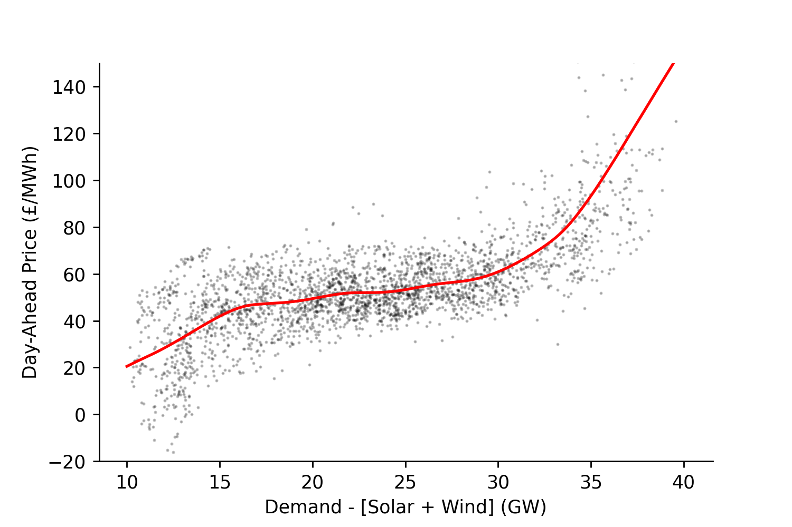
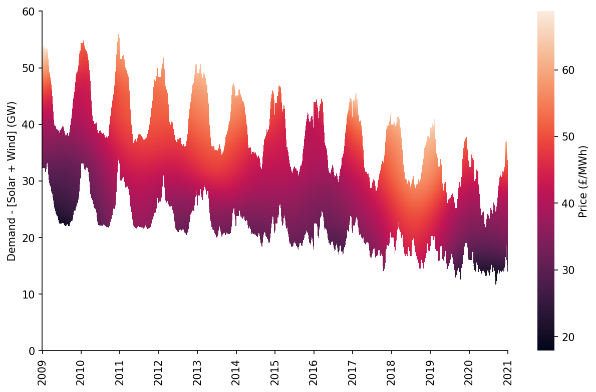
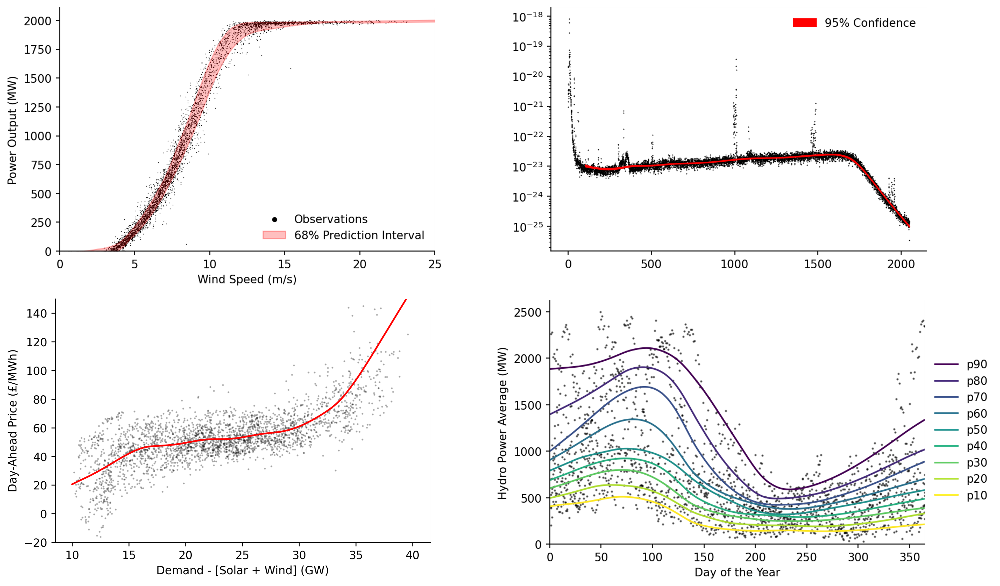
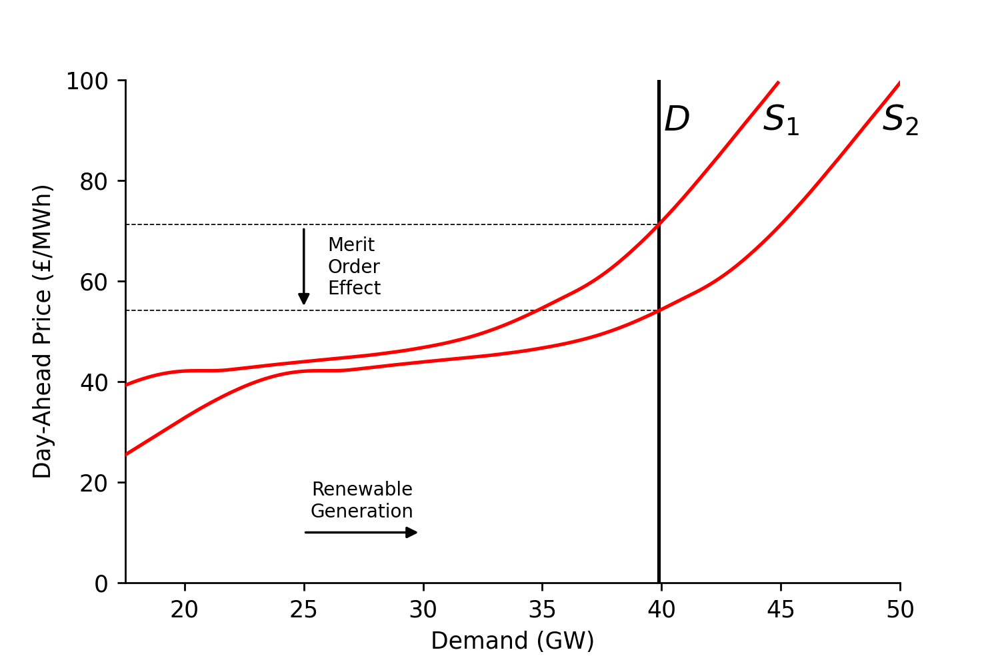
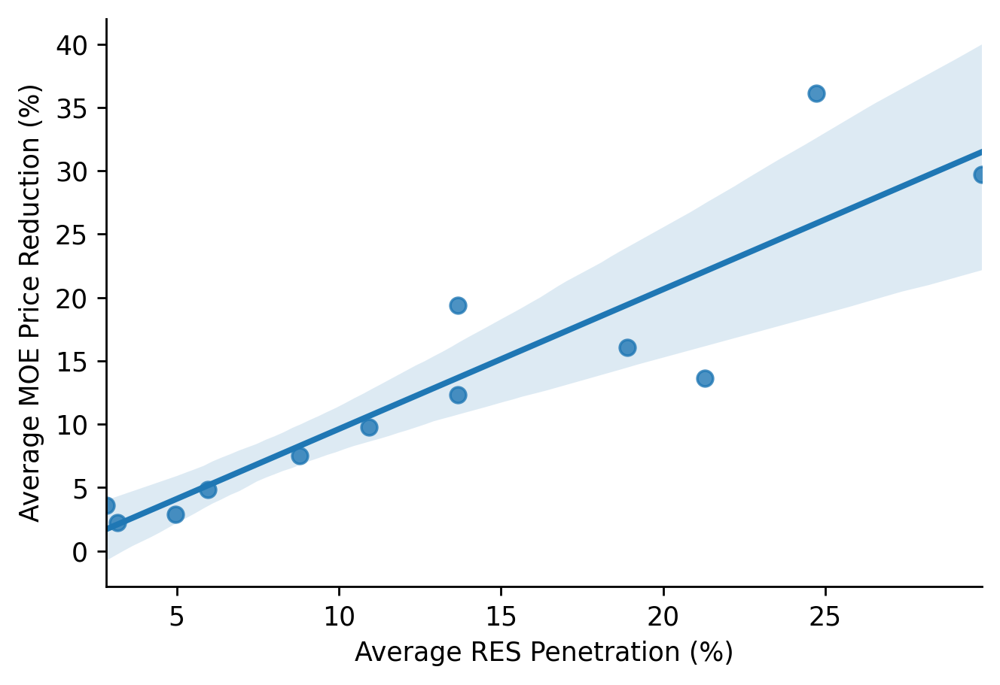

[](https://zenodo.org/badge/latestdoi/326810654) [](https://badge.fury.io/py/moepy) [](https://notebooks.gesis.org/binder/v2/gh/AyrtonB/Merit-Order-Effect/main?urlpath=lab)

# MOE-Py

### Installation

To reduce dependency bloat the `moepy` library can be installed in two ways. If you just wish to use the LOWESS curve fitting aspects of the library then you can install it using:

```bash
pip install moepy
```

If you wish to reproduce the analysis used for estimation of the Merit Order Effect in [this paper](https://github.com/AyrtonB/Merit-Order-Effect/blob/main/paper/Quantifying%20the%20Merit%20Order%20Effect%20of%20Renewables%20on%20Price%20and%20Carbon%20Intensity%20of%20the%20British%20and%20Germany%20Energy%20Systems.pdf) please run :

```bash
pip install moepy[research]
```

<br>

### Overview

This repository outlines the development and usage of code and analysis used in calculating the Merit-Order-Effect (MOE) of renewables on price and carbon intensity of electricity markets. Beyond MOE analysis the `moepy` library can be used more generally for standard, quantile, and bootstrapped LOWESS estimation. The particular implementation of LOWESS in this software has been extended to significantly reduce the computational resource required. 

The original LOWESS model was developed by W. S. Cleveland in 1979 and the FORTRAN code for it can be found [here](https://www.netlib.org/go/lowess). LOWESS is an acronym for Locally Weighted Scatterplot Smoothing, whereby multiple regressions are fitted over different regions of the data domain and then combined based on weightings linked to the distance between the prediction point and the data used to fit each of the local regressions.

`moepy` exposes several variants on the traditional LOWESS,  including estimation of confidence and prediction intervals, as well as the robust LOWESS proposed by Cleveland in 1988. Examples  of how to use each of these are shown in the [Quick-Start notebook](https://ayrtonb.github.io/Merit-Order-Effect/ug-08-lowess-quick-start/). An example of a LOWESS curve estimated by `moepy` can be seen below, the code to generate the plot can be found [here](https://ayrtonb.github.io/Merit-Order-Effect/ug-04-electricity-prices/).



<br>

The library also includes the option to ensemble LOWESS models together (very meta) and smooth them over time without including time within the regression itself. This is particularly useful when there are many exogenous factors changing over time but you don't have data for them, meaning it is therefore not easy to capture them within the regression. An example fit from the ensembled date-smoothing model is shown below, depicting the marginal price curve of dispatchable generation in Great Britain. For ease of use this model has been made to work directly with Pandas datetime indexes and is again exposed through a standard sklearn model API.



<br>

### Examples

Several notebooks have been created to show examples of how LOWESS estimations can be made using various data sources and for different analysis purposes, these include:

* Quantile estimation of hydro-power production in Portgual
* Confidence interval estimation of gravitational wave observations
* Cleaning of wind power curves
* Estimation of electricity price curves

Key plots from each of these can be seen below.



Get involved! If you have used `moepy` for something cool and want to share it with others please create a pull request containing a notebook with your self-contained example.

<br>

### Why MOE-Py?

LOWESS implementation in Python is relatively sparse compared to most regression methods. Statsmodels provides a [LOWESS model](https://www.statsmodels.org/dev/_modules/statsmodels/nonparametric/smoothers_lowess.html), however it exposes no predict method, forcing users to add wrappers on top that linearly interpolate between the results Statsmodels does return (e.g. [here](https://stackoverflow.com/a/37060980/8035710) and [here](https://towardsdatascience.com/lowess-regression-in-python-how-to-discover-clear-patterns-in-your-data-f26e523d7a35)). In contrast the `moepy` library is made specifically for LOWESS estimation and provides it through an `sklearn` compatible API, meaning that it works within the broader `sklearn` eco-system for model ensembling and tuning as well as reducing the learning barrier. 

<br>

### Paper

The `moepy` library was developed to enable new research into the Merit-Order-Effect of renewables in the British and German power systems. The full paper can be found [here](https://github.com/AyrtonB/Merit-Order-Effect/blob/main/paper/Quantifying%20the%20Merit%20Order%20Effect%20of%20Renewables%20on%20Price%20and%20Carbon%20Intensity%20of%20the%20British%20and%20Germany%20Energy%20Systems.pdf), the abstract is shown below:

> This paper presents an empirical analysis of the reduction in day-ahead market prices and CO<sub>2</sub> emissions due to increased renewable generation on both the British and German electricity markets. This Merit Order Effect is becoming more important as markets evolve to incorporate greater shares of renewable energy sources, driving renewable capture price cannibilisation and market volatility. However, explicitly determining its magnitude can be challenging due to the confidential nature of the data required. Existing statistical methods for inferring this effect have focused on linear parametric approaches. However, these have a number of disadvantages. In this work we propose a flexible non-parametric blended Locally Weighted Scatterplot Smoothing approach  that captures the non-linear relationship between electricity price and dispatchable generation. This is the first application of this method in this context. We found the accuracy of this approach comparable to methods used in modern price back-casting literature. Our results indicate that the Merit Order Effect has increased dramatically over the time period analysed, with a sharp and continuing increase from 2016 in Britain. We found that renewables delivered total reductions equal to 318M and 442M tonnes of CO<sub>2</sub>  and savings of €56B and £17B in Germany and Britain respectively.

The key premise behind the analysis is that intermittent renewables with no fuel costs displace high-cost dispatchable generation - this is called the Merit Order Effect (MOE). The effect can be visualised as a rightward shift in the marginal price curve of electricity, which combined with the inelasticity of demand results in a lower market clearing price (shown below).



In this work a time-adaptive LOWESS was used to estimate the marginal price curve, then simulate the MOE. We calculated significant CO2 emission and electricity price savings for Britain and Germany. Results for 2019 are shown in the table below.

|                       |   Germany |   Great Britain |
|:----------------------|----------:|----------------:|
| Price ([EUR,GBP]/MWh) |     20.53 |            9.8  |
| Price Reduction (%)   |     36.7  |           19.3  |
| Carbon (Tonnes/h)     |      5085 |           1637  |
| Carbon Reduction (%)  |     34.88 |           33.53 |

We identified a strong relationship between increasing renewable penetration and the Merit-Order-Effect. In Britain the MOE has seen a sharp increase since 2016, with an average 0.67% price reduction per percentage point increase in renewable penetration.



<br>

### Referencing

If you wish to reference a specific version of this software please use the following citation, changing the DOI to reflect the specific version you used (these are available through the Zenodo link at the top of this page):

```
@software{bourn_moepy_2021,
    title = {moepy},
    url = {https://ayrtonb.github.io/Merit-Order-Effect/},
    abstract = {This repository outlines the development and usage of code and analysis used in calculating the Merit-Order-Effect (MOE) of renewables on price and carbon intensity of electricity markets. Beyond MOE analysis the `moepy` library can be used more generally for standard, quantile, and bootstrapped LOWESS estimation. The particular implementation of LOWESS in this software has been extended to significantly reduce the computational resource required.},
    author = {Bourn, Ayrton},
    month = mar,
    year = {2021},
    doi = {10.5281/zenodo.4642896},
}
```