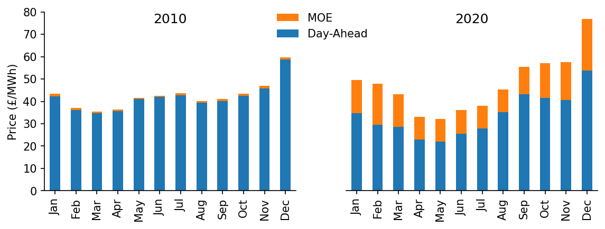
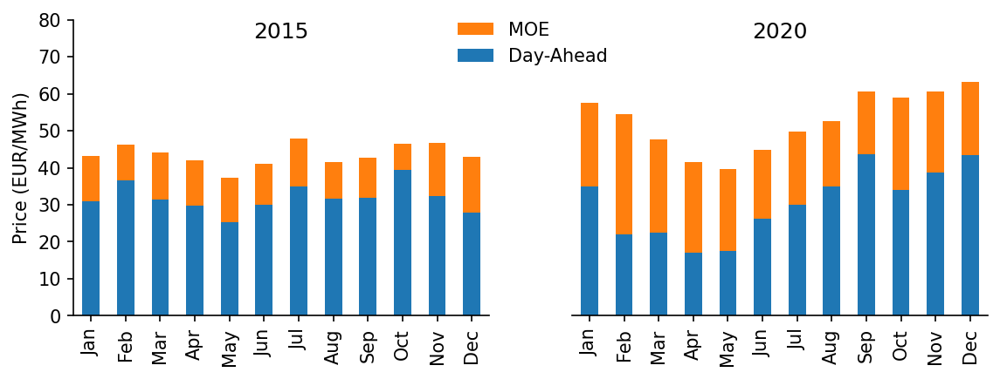

# Price Merit Order Effect Analysis


[](https://notebooks.gesis.org/binder/v2/gh/AyrtonB/Merit-Order-Effect/main?filepath=nbs%2Fdev-05-price-moe.ipynb)

This notebook outlines the analysis required to determine the price merit-order-effect of variable renewable generation in the GB and DE power markets.

<br>

### Imports

```python
#exports
import json
import pandas as pd
import numpy as np

import pickle
import scipy
from sklearn import linear_model
from sklearn.metrics import r2_score
from collections.abc import Iterable

import seaborn as sns
import matplotlib as mpl
import matplotlib.pyplot as plt
import matplotlib.dates as mdates

from ipypb import track
from IPython.display import JSON

from moepy import lowess, eda
from moepy.surface import PicklableFunction
```

<br>

### User Inputs

```python
GB_model_fp = '../data/models/DAM_price_GB_p50.pkl'
DE_model_fp = '../data/models/DAM_price_DE_p50.pkl'
load_existing_GB_model = True
load_existing_DE_model = True
```

<br>

### Estimating the Price Surface

We'll start by loading in the data

```python
%%time

df_EI = eda.load_EI_df('../data/raw/electric_insights.csv')

df_EI.head()
```

    Wall time: 1.76 s
    


| local_datetime            |   day_ahead_price |   SP |   imbalance_price |   valueSum |   temperature |   TCO2_per_h |   gCO2_per_kWh |   nuclear |   biomass |   coal | ...   |   demand |   pumped_storage |   wind_onshore |   wind_offshore |   belgian |   dutch |   french |   ireland |   northern_ireland |   irish |
|:--------------------------|------------------:|-----:|------------------:|-----------:|--------------:|-------------:|---------------:|----------:|----------:|-------:|:------|---------:|-----------------:|---------------:|----------------:|----------:|--------:|---------:|----------:|-------------------:|--------:|
| 2009-01-01 00:00:00+00:00 |             58.05 |    1 |             74.74 |      74.74 |          -0.6 |        21278 |            555 |     6.973 |         0 | 17.65  | ...   |   38.329 |           -0.404 |            nan |             nan |         0 |       0 |    1.977 |         0 |                  0 |  -0.161 |
| 2009-01-01 00:30:00+00:00 |             56.33 |    2 |             74.89 |      74.89 |          -0.6 |        21442 |            558 |     6.968 |         0 | 17.77  | ...   |   38.461 |           -0.527 |            nan |             nan |         0 |       0 |    1.977 |         0 |                  0 |  -0.16  |
| 2009-01-01 01:00:00+00:00 |             52.98 |    3 |             76.41 |      76.41 |          -0.6 |        21614 |            569 |     6.97  |         0 | 18.07  | ...   |   37.986 |           -1.018 |            nan |             nan |         0 |       0 |    1.977 |         0 |                  0 |  -0.16  |
| 2009-01-01 01:30:00+00:00 |             50.39 |    4 |             37.73 |      37.73 |          -0.6 |        21320 |            578 |     6.969 |         0 | 18.022 | ...   |   36.864 |           -1.269 |            nan |             nan |         0 |       0 |    1.746 |         0 |                  0 |  -0.16  |
| 2009-01-01 02:00:00+00:00 |             48.7  |    5 |             59    |      59    |          -0.6 |        21160 |            585 |     6.96  |         0 | 17.998 | ...   |   36.18  |           -1.566 |            nan |             nan |         0 |       0 |    1.73  |         0 |                  0 |  -0.16  |</div>


<br>

We'll do a quick plot of the average price

```python
fig, ax = plt.subplots(dpi=150)

df_EI['day_ahead_price'].resample('4W').mean().plot(ax=ax)

eda.hide_spines(ax)
ax.set_xlabel('')
ax.set_ylabel('Day-Ahead Price\nMonthly Average (£/MWh)')
```


    Text(0, 0.5, 'Day-Ahead Price\nMonthly Average (£/MWh)')


<br>

We'll also visualise individual half-hour periods for two different date ranges in the dataset

```python
df_EI_model = df_EI[['day_ahead_price', 'demand', 'solar', 'wind']].dropna()

s_price = df_EI_model['day_ahead_price']
s_dispatchable = df_EI_model['demand'] - df_EI_model[['solar', 'wind']].sum(axis=1)

# Plotting
fig, ax = plt.subplots(dpi=150)

ax.scatter(s_dispatchable['2010-03':'2010-09'], s_price['2010-03':'2010-09'], s=1)
ax.scatter(s_dispatchable['2020-03':'2020-09'], s_price['2020-03':'2020-09'], s=1)

eda.hide_spines(ax)
ax.set_xlim(8, 60)
ax.set_ylim(-25, 100)
ax.set_xlabel('Demand - [Wind + Solar] (GW)')
ax.set_ylabel('Price (£/MWh)')
```


    Text(0, 0.5, 'Price (£/MWh)')


<br>

Next we'll load in (or fit) one of the models trained in the previous notebook

```python
%%time

if load_existing_GB_model == True:
    smooth_dates = pickle.load(open(GB_model_fp, 'rb'))
else:
    reg_dates = pd.date_range('2009-01-01', '2021-01-01', freq='13W')

    smooth_dates = lowess.SmoothDates()
    smooth_dates.fit(s_dispatchable.values, s_price.values, dt_idx=s_dispatchable.index, 
                     reg_dates=reg_dates, frac=0.3, num_fits=31, threshold_value=26)
    
    pickle.dump(smooth_dates, open(model_fp, 'wb'))
```

    Wall time: 2.42 s
    

<br>

We're now ready to make our price curve predictions, we'll make one for each day that the model used in training

```python
%%time

x_pred = np.linspace(3, 61, 581)
dt_pred = pd.date_range('2009-01-01', '2020-12-31', freq='1D')

df_pred = smooth_dates.predict(x_pred=x_pred, dt_pred=dt_pred)
df_pred.index = np.round(df_pred.index, 1)

df_pred.head()
```

    Wall time: 469 ms
    


|   Unnamed: 0 |   2009-01-01 |   2009-01-02 |   2009-01-03 |   2009-01-04 |   2009-01-05 |   2009-01-06 |   2009-01-07 |   2009-01-08 |   2009-01-09 |   2009-01-10 | ...   |   2020-12-22 |   2020-12-23 |   2020-12-24 |   2020-12-25 |   2020-12-26 |   2020-12-27 |   2020-12-28 |   2020-12-29 |   2020-12-30 |   2020-12-31 |
|-------------:|-------------:|-------------:|-------------:|-------------:|-------------:|-------------:|-------------:|-------------:|-------------:|-------------:|:------|-------------:|-------------:|-------------:|-------------:|-------------:|-------------:|-------------:|-------------:|-------------:|-------------:|
|          3   |     -17.4948 |     -17.5178 |     -17.5406 |     -17.5632 |     -17.5856 |     -17.6077 |     -17.6297 |     -17.6514 |     -17.673  |     -17.6943 | ...   |     0.194247 |     0.203242 |     0.212319 |     0.221479 |     0.230719 |     0.240041 |     0.249444 |     0.258926 |     0.268489 |     0.278132 |
|          3.1 |     -17.2964 |     -17.3193 |     -17.3421 |     -17.3646 |     -17.3869 |     -17.409  |     -17.4309 |     -17.4525 |     -17.474  |     -17.4953 | ...   |     0.404498 |     0.413478 |     0.42254  |     0.431683 |     0.440907 |     0.450212 |     0.459598 |     0.469064 |     0.478609 |     0.488234 |
|          3.2 |     -17.0983 |     -17.1212 |     -17.1439 |     -17.1663 |     -17.1886 |     -17.2106 |     -17.2324 |     -17.254  |     -17.2754 |     -17.2966 | ...   |     0.614692 |     0.623656 |     0.632702 |     0.641829 |     0.651037 |     0.660326 |     0.669695 |     0.679143 |     0.688671 |     0.698278 |
|          3.3 |     -16.9006 |     -16.9234 |     -16.946  |     -16.9684 |     -16.9905 |     -17.0125 |     -17.0342 |     -17.0558 |     -17.0771 |     -17.0983 | ...   |     0.824815 |     0.833764 |     0.842794 |     0.851906 |     0.861097 |     0.87037  |     0.879722 |     0.889153 |     0.898664 |     0.908253 |
|          3.4 |     -16.7031 |     -16.7259 |     -16.7484 |     -16.7707 |     -16.7928 |     -16.8147 |     -16.8364 |     -16.8579 |     -16.8791 |     -16.9002 | ...   |     1.03486  |     1.04379  |     1.0528   |     1.0619   |     1.07108  |     1.08033  |     1.08967  |     1.09908  |     1.10858  |     1.11815  |</div>


<br>

### Visualising the Price Surface

We now want to actually visualise the results of our model, in particular the price surface it's fitted. We'll start by plotting all of the price curves overlapping each other.

```python
cmap = plt.get_cmap('viridis')
cbar_ticks = [0, 0.25, 0.5, 0.75, 1]

# Plotting
fig, ax = plt.subplots(dpi=250)

lp = df_pred.loc[:, ::7].plot(legend=False, cmap=cmap, linewidth=0.25, ax=ax)

cax = fig.add_axes([0.9, 0.2, 0.03, 0.55])
cbar = mpl.colorbar.ColorbarBase(cax, orientation='vertical', cmap=cmap, ticks=cbar_ticks)
cbar.ax.set_yticklabels([dt_pred[min(int(len(dt_pred)*tick_loc), len(dt_pred)-1)].strftime('%b %Y') for tick_loc in cbar_ticks])

eda.hide_spines(ax)
ax.set_xlabel('Demand - [Solar + Wind] (GW)')
ax.set_ylabel('Price (£/MWh)')
ax.set_xlim(df_pred.index[0])
ax.set_ylim(0, 75)
ax.set_title('Day-Ahead Market Average Price Curve')
```


    Text(0.5, 1.0, 'Day-Ahead Market Average Price Curve')


<br>

Whilst the previous plot might look quite nice it's rather difficult to interpret, an alternative way to visualise how the price curve evolves over time is using a heatmap

```python
#exports
def construct_dispatchable_lims_df(s_dispatchable, rolling_w=3, daily_quantiles=[0.001, 0.999]):
    """Identifies the rolling limits to be used in masking"""
    df_dispatchable_lims = (s_dispatchable
                            .resample('1d')
                            .quantile(daily_quantiles)
                            .unstack()
                            .rolling(rolling_w*7)
                            .mean()
                            .bfill()
                            .ffill()
                            .iloc[:-1, :]
                           )
    
    df_dispatchable_lims.index = pd.to_datetime(df_dispatchable_lims.index.strftime('%Y-%m-%d'))
    
    return df_dispatchable_lims

def construct_pred_mask_df(df_pred, df_dispatchable_lims):
    """Constructs a DataFrame mask for the prediction"""
    df_pred = df_pred[df_dispatchable_lims.index]
    df_pred_mask = pd.DataFrame(dict(zip(df_pred.columns, [df_pred.index]*df_pred.shape[1])), index=df_pred.index)
    df_pred_mask = (df_pred_mask > df_dispatchable_lims.iloc[:, 0].values) & (df_pred_mask < df_dispatchable_lims.iloc[:, 1].values)

    df_pred.columns = pd.to_datetime(df_pred.columns)
    df_pred_mask.columns = pd.to_datetime(df_pred_mask.columns)
    
    return df_pred_mask
```

```python
df_dispatchable_lims = construct_dispatchable_lims_df(s_dispatchable)
df_pred_mask = construct_pred_mask_df(df_pred, df_dispatchable_lims)

sns.heatmap(df_pred.where(df_pred_mask, np.nan).iloc[::-1])
```


    <AxesSubplot:>


<br>

The default output for `seaborn` heatmaps never looks great when one of the axis is a datetime, we'll write a custom class and wrapper to handle this

```python
#exports
class AxTransformer:
    """Helper class for cleaning axis tick locations and labels"""
    def __init__(self, datetime_vals=False):
        self.datetime_vals = datetime_vals
        self.lr = linear_model.LinearRegression()
        
        return
    
    def process_tick_vals(self, tick_vals):
        if not isinstance(tick_vals, Iterable) or isinstance(tick_vals, str):
            tick_vals = [tick_vals]
            
        if self.datetime_vals == True:
            tick_vals = pd.to_datetime(tick_vals).astype(int).values
            
        tick_vals = np.array(tick_vals)
            
        return tick_vals
    
    def fit(self, ax, axis='x'):
        axis = getattr(ax, f'get_{axis}axis')()
        
        tick_locs = axis.get_ticklocs()
        tick_vals = self.process_tick_vals([label._text for label in axis.get_ticklabels()])
        
        self.lr.fit(tick_vals.reshape(-1, 1), tick_locs)
        
        return
    
    def transform(self, tick_vals):        
        tick_vals = self.process_tick_vals(tick_vals)
        tick_locs = self.lr.predict(np.array(tick_vals).reshape(-1, 1))
        
        return tick_locs

def set_ticks(ax, tick_locs, tick_labels=None, axis='y'):
    """Sets ticks at standard numerical locations"""
    if tick_labels is None:
        tick_labels = tick_locs
    ax_transformer = AxTransformer()
    ax_transformer.fit(ax, axis=axis)
    
    getattr(ax, f'set_{axis}ticks')(ax_transformer.transform(tick_locs))
    getattr(ax, f'set_{axis}ticklabels')(tick_labels)
    
    ax.tick_params(axis=axis, which='both', bottom=True, top=False, labelbottom=True)
    
    return ax
    
def set_date_ticks(ax, start_date, end_date, axis='y', date_format='%Y-%m-%d', **date_range_kwargs):
    """Sets ticks at datetime locations"""
    dt_rng = pd.date_range(start_date, end_date, **date_range_kwargs)

    ax_transformer = AxTransformer(datetime_vals=True)
    ax_transformer.fit(ax, axis=axis)
    
    getattr(ax, f'set_{axis}ticks')(ax_transformer.transform(dt_rng))
    getattr(ax, f'set_{axis}ticklabels')(dt_rng.strftime(date_format))
    
    ax.tick_params(axis=axis, which='both', bottom=True, top=False, labelbottom=True)
    
    return ax
```

```python
%%time

fig, ax = plt.subplots(dpi=150, figsize=(10, 6))

htmp = sns.heatmap(df_pred[10:60].where(df_pred_mask[10:60], np.nan).iloc[::-1], ax=ax, cbar_kws={'label': 'Price (£/MWh)'})

set_ticks(ax, np.arange(0, 70, 10), axis='y')
set_date_ticks(ax, '2009-01-01', '2021-01-01', freq='1YS', date_format='%Y', axis='x')

for _, spine in htmp.spines.items():
    spine.set_visible(True)
eda.hide_spines(ax)

ax.set_ylabel('Demand - [Solar + Wind] (GW)')
```

    Wall time: 1.79 s
    

    C:\Users\Ayrto\anaconda3\envs\MOE\lib\site-packages\sklearn\utils\validation.py:63: FutureWarning: Arrays of bytes/strings is being converted to decimal numbers if dtype='numeric'. This behavior is deprecated in 0.24 and will be removed in 1.1 (renaming of 0.26). Please convert your data to numeric values explicitly instead.
      return f(*args, **kwargs)
    


    Text(144.58333333333331, 0.5, 'Demand - [Solar + Wind] (GW)')


<br>

We also want to visualise specific date ranges, here we'll look towards the end of 2020

```python
%%time

center_date = '2020-12-01'

dt_min = pd.to_datetime(center_date) - pd.Timedelta(weeks=4)
dt_max = pd.to_datetime(center_date) + pd.Timedelta(weeks=4)

x = s_dispatchable[dt_min:dt_max].values
y = s_price.loc[s_dispatchable.index][dt_min:dt_max].values

x_pred = np.linspace(11, 40, 41)
y_pred = lowess.lowess_fit_and_predict(x, y, frac=0.6, num_fits=25, x_pred=x_pred)

# Plotting
fig, ax = plt.subplots(dpi=150)

ax.plot(x_pred, y_pred, linewidth=1.5, color='r')
ax.scatter(x, y, color='k', s=1, alpha=0.2)

ax.set_title(f'November & December 2020') # remove in the LaTeX plot and just state in the caption
ax.set_xlim(11, 40)
ax.set_ylim(-20, 150)
eda.hide_spines(ax)
ax.set_xlabel('Demand - [Solar + Wind] (GW)')
ax.set_ylabel('Day-Ahead Price (£/MWh)')
```

    Wall time: 58.1 ms
    

    C:\Users\Ayrto\anaconda3\envs\MOE\lib\site-packages\pandas\core\indexes\base.py:5277: FutureWarning: Indexing a timezone-aware DatetimeIndex with a timezone-naive datetime is deprecated and will raise KeyError in a future version.  Use a timezone-aware object instead.
      start_slice, end_slice = self.slice_locs(start, end, step=step, kind=kind)
    


    Text(0, 0.5, 'Day-Ahead Price (£/MWh)')


<br>

### Evaluating the Price Curve Predictions

```python
#exports
def construct_df_pred(model_fp, x_pred=np.linspace(-2, 61, 631), dt_pred=pd.date_range('2009-01-01', '2020-12-31', freq='1D')):
    """Constructs the prediction surface for the specified pre-fitted model"""
    smooth_dates = pickle.load(open(model_fp, 'rb'))
    df_pred = smooth_dates.predict(x_pred=x_pred, dt_pred=dt_pred)
    df_pred.index = np.round(df_pred.index, 1)
    
    return df_pred
```

```python
model_fp = '../data/models/DAM_price_average.pkl'

df_pred = construct_df_pred(model_fp)

df_pred.head()
```


|   Unnamed: 0 |   2009-01-01 |   2009-01-02 |   2009-01-03 |   2009-01-04 |   2009-01-05 |   2009-01-06 |   2009-01-07 |   2009-01-08 |   2009-01-09 |   2009-01-10 | ...   |   2020-12-22 |   2020-12-23 |   2020-12-24 |   2020-12-25 |   2020-12-26 |   2020-12-27 |   2020-12-28 |   2020-12-29 |   2020-12-30 |   2020-12-31 |
|-------------:|-------------:|-------------:|-------------:|-------------:|-------------:|-------------:|-------------:|-------------:|-------------:|-------------:|:------|-------------:|-------------:|-------------:|-------------:|-------------:|-------------:|-------------:|-------------:|-------------:|-------------:|
|         -2   |     -28.4122 |     -28.4306 |     -28.4488 |     -28.4668 |     -28.4846 |     -28.5022 |     -28.5197 |     -28.5369 |     -28.554  |     -28.5708 | ...   |     -17.5465 |     -17.5399 |     -17.5331 |     -17.5263 |     -17.5194 |     -17.5125 |     -17.5054 |     -17.4982 |     -17.4909 |     -17.4836 |
|         -1.9 |     -28.2171 |     -28.2354 |     -28.2536 |     -28.2715 |     -28.2893 |     -28.3068 |     -28.3242 |     -28.3414 |     -28.3584 |     -28.3752 | ...   |     -17.2979 |     -17.2913 |     -17.2846 |     -17.2778 |     -17.2709 |     -17.2639 |     -17.2568 |     -17.2496 |     -17.2424 |     -17.235  |
|         -1.8 |     -28.022  |     -28.0403 |     -28.0583 |     -28.0762 |     -28.0939 |     -28.1115 |     -28.1288 |     -28.1459 |     -28.1629 |     -28.1796 | ...   |     -17.0494 |     -17.0427 |     -17.036  |     -17.0292 |     -17.0223 |     -17.0153 |     -17.0082 |     -17.001  |     -16.9938 |     -16.9864 |
|         -1.7 |     -27.8269 |     -27.8451 |     -27.8631 |     -27.881  |     -27.8986 |     -27.9161 |     -27.9334 |     -27.9504 |     -27.9673 |     -27.984  | ...   |     -16.8008 |     -16.7941 |     -16.7874 |     -16.7806 |     -16.7737 |     -16.7667 |     -16.7596 |     -16.7524 |     -16.7451 |     -16.7378 |
|         -1.6 |     -27.6318 |     -27.65   |     -27.6679 |     -27.6857 |     -27.7033 |     -27.7207 |     -27.7379 |     -27.7549 |     -27.7718 |     -27.7884 | ...   |     -16.5522 |     -16.5455 |     -16.5388 |     -16.532  |     -16.5251 |     -16.5181 |     -16.511  |     -16.5038 |     -16.4965 |     -16.4891 |</div>


<br>

Now we've created our prediction dataframe we can calculate a time-series for our price prediction

N.b. to speed things up every 100th half-hour has been sampled rather than using the full dataset

```python
#exports
def construct_pred_ts(s, df_pred):
    """Uses the time-adaptive LOWESS surface to generate time-series prediction"""
    s_pred_ts = pd.Series(index=s.index, dtype='float64')

    for dt_idx, val in track(s.iteritems(), total=s.size):
        s_pred_ts.loc[dt_idx] = df_pred.loc[round(val, 1), dt_idx.strftime('%Y-%m-%d')]
        
    return s_pred_ts
```

```python
s_dispatchable = (df_EI_model['demand'] - df_EI_model[['solar', 'wind']].sum(axis=1)).dropna().loc[:df_pred.columns.max()+pd.Timedelta(hours=23, minutes=30)]

s_pred_ts = construct_pred_ts(s_dispatchable.iloc[::100].iloc[:-1], df_pred)

s_pred_ts.head()
```

    C:\Users\Ayrto\anaconda3\envs\MOE\lib\site-packages\pandas\core\indexes\base.py:5277: FutureWarning: Indexing a timezone-aware DatetimeIndex with a timezone-naive datetime is deprecated and will raise KeyError in a future version.  Use a timezone-aware object instead.
      start_slice, end_slice = self.slice_locs(start, end, step=step, kind=kind)
    


<div><span class="Text-label" style="display:inline-block; overflow:hidden; white-space:nowrap; text-overflow:ellipsis; min-width:0; max-width:15ex; vertical-align:middle; text-align:right"></span>
<progress style="width:60ex" max="2095" value="2095" class="Progress-main"/></progress>
<span class="Progress-label"><strong>100%</strong></span>
<span class="Iteration-label">1600/2095</span>
<span class="Time-label">[00:02<00:00, 0.00s/it]</span></div>


    local_datetime
    2009-01-01 00:00:00+00:00    39.026220
    2009-01-03 02:00:00+00:00    34.314689
    2009-01-05 04:00:00+00:00    32.502689
    2009-01-07 06:00:00+00:00    42.705269
    2009-01-09 08:00:00+00:00    64.025113
    dtype: float64


<br>

We'll quickly inspect the error distribution

```python
s_price = df_EI['day_ahead_price']

s_err = s_pred_ts - s_price.loc[s_pred_ts.index]
print(s_err.abs().mean())

sns.histplot(s_err)
_ = plt.xlim(-75, 75)
```

    6.8625170828105615
    


<br>

We'll quickly calculate the r2 score for this model, for context the UK day-ahead price multiple linear regression model from the Staffell/Green group achieved an adjusted r2 of <b>0.451<b>

```python
r2_score(s_price.loc[s_pred_ts.index], s_pred_ts)
```


    0.46527623686663677


<br>

Now we'll calculate some error metrics, including the option to remove extreme error outliers

```python
#exports
def calc_error_metrics(s_err, max_err_quantile=1):
    """Calculates several error metrics using the passed error series"""
    if s_err.isnull().sum() > 0:
        s_err = s_err.dropna()
        
    max_err_cutoff = s_err.abs().quantile(max_err_quantile)
    s_err = s_err[s_err.abs()<=max_err_cutoff]
    
    metrics = {
        'median_abs_err': s_err.abs().median(),
        'mean_abs_err': s_err.abs().mean(),
        'root_mean_square_error': np.sqrt((s_err**2).mean())
    }
    
    return metrics
```

```python
metrics = calc_error_metrics(s_err)

metrics
```


    {'median_abs_err': 4.843738852384298,
     'mean_abs_err': 6.8625170828105615,
     'root_mean_square_error': 12.301327313943641}


<br>

We'll now create a wrapper for the last few steps and repeat the analysis for four variants of the model

```python
#exports
def get_model_pred_ts(s, model_fp, s_demand=None, x_pred=np.linspace(-2, 61, 631), dt_pred=pd.date_range('2009-01-01', '2020-12-31', freq='1D')):
    """Constructs the time-series prediction for the specified pre-fitted model"""
    df_pred = construct_df_pred(model_fp, x_pred=x_pred, dt_pred=dt_pred)
    s_cleaned = s.dropna().loc[df_pred.columns.min():df_pred.columns.max()+pd.Timedelta(hours=23, minutes=30)]
    s_pred_ts = construct_pred_ts(s_cleaned, df_pred)
    
    if s_demand is None:
        return s_pred_ts
    else:
        s_cleaned = s_demand.dropna().loc[df_pred.columns.min():df_pred.columns.max()+pd.Timedelta(hours=23, minutes=30)]
        s_pred_ts_demand = construct_pred_ts(s_cleaned, df_pred)
        return s_pred_ts, s_pred_ts_demand
```

```python
s_demand = df_EI['demand']
s_price = df_EI['day_ahead_price']
s_dispatchable = df_EI_model['demand'] - df_EI_model[['solar', 'wind']].sum(axis=1)

model_runs = {
    'demand_p50': {
        'model_fp': '../data/models/DAM_price_demand_p50.pkl',
        's': s_demand
    },
    'demand_avg': {
        'model_fp': '../data/models/DAM_price_demand_average.pkl',
        's': s_demand
    },
    'dispatch_p50': {
        'model_fp': '../data/models/DAM_price_p50.pkl',
        's': s_dispatchable
    },
    'dispatch_avg': {
        'model_fp': '../data/models/DAM_price_average.pkl',
        's': s_dispatchable
    },
}

model_outputs = dict()

for model_name, model_kwargs in track(model_runs.items()):
    s_pred_ts = get_model_pred_ts(**model_kwargs)
    s_err = s_pred_ts - s_price.loc[s_pred_ts.index]
    metrics = calc_error_metrics(s_err)
    
    model_outputs[model_name] = {
        's_pred_ts': s_pred_ts,
        's_err': s_err,
        'metrics': metrics
    }
```


<div><span class="Text-label" style="display:inline-block; overflow:hidden; white-space:nowrap; text-overflow:ellipsis; min-width:0; max-width:15ex; vertical-align:middle; text-align:right"></span>
<progress style="width:60ex" max="4" value="4" class="Progress-main"/></progress>
<span class="Progress-label"><strong>100%</strong></span>
<span class="Iteration-label">4/4</span>
<span class="Time-label">[11:27<02:57, 171.67s/it]</span></div>


    C:\Users\Ayrto\anaconda3\envs\MOE\lib\site-packages\pandas\core\indexes\base.py:5277: FutureWarning: Indexing a timezone-aware DatetimeIndex with a timezone-naive datetime is deprecated and will raise KeyError in a future version.  Use a timezone-aware object instead.
      start_slice, end_slice = self.slice_locs(start, end, step=step, kind=kind)
    


<div><span class="Text-label" style="display:inline-block; overflow:hidden; white-space:nowrap; text-overflow:ellipsis; min-width:0; max-width:15ex; vertical-align:middle; text-align:right"></span>
<progress style="width:60ex" max="209736" value="209736" class="Progress-main"/></progress>
<span class="Progress-label"><strong>100%</strong></span>
<span class="Iteration-label">192924/209736</span>
<span class="Time-label">[02:23<00:00, 0.00s/it]</span></div>


    C:\Users\Ayrto\anaconda3\envs\MOE\lib\site-packages\pandas\core\indexes\base.py:5277: FutureWarning: Indexing a timezone-aware DatetimeIndex with a timezone-naive datetime is deprecated and will raise KeyError in a future version.  Use a timezone-aware object instead.
      start_slice, end_slice = self.slice_locs(start, end, step=step, kind=kind)
    


<div><span class="Text-label" style="display:inline-block; overflow:hidden; white-space:nowrap; text-overflow:ellipsis; min-width:0; max-width:15ex; vertical-align:middle; text-align:right"></span>
<progress style="width:60ex" max="209736" value="209736" class="Progress-main"/></progress>
<span class="Progress-label"><strong>100%</strong></span>
<span class="Iteration-label">0/209736</span>
<span class="Time-label">[02:26<00:00, 0.00s/it]</span></div>


    C:\Users\Ayrto\anaconda3\envs\MOE\lib\site-packages\pandas\core\indexes\base.py:5277: FutureWarning: Indexing a timezone-aware DatetimeIndex with a timezone-naive datetime is deprecated and will raise KeyError in a future version.  Use a timezone-aware object instead.
      start_slice, end_slice = self.slice_locs(start, end, step=step, kind=kind)
    


<div><span class="Text-label" style="display:inline-block; overflow:hidden; white-space:nowrap; text-overflow:ellipsis; min-width:0; max-width:15ex; vertical-align:middle; text-align:right"></span>
<progress style="width:60ex" max="209533" value="209533" class="Progress-main"/></progress>
<span class="Progress-label"><strong>100%</strong></span>
<span class="Iteration-label">165505/209533</span>
<span class="Time-label">[03:30<00:00, 0.00s/it]</span></div>


    C:\Users\Ayrto\anaconda3\envs\MOE\lib\site-packages\pandas\core\indexes\base.py:5277: FutureWarning: Indexing a timezone-aware DatetimeIndex with a timezone-naive datetime is deprecated and will raise KeyError in a future version.  Use a timezone-aware object instead.
      start_slice, end_slice = self.slice_locs(start, end, step=step, kind=kind)
    


<div><span class="Text-label" style="display:inline-block; overflow:hidden; white-space:nowrap; text-overflow:ellipsis; min-width:0; max-width:15ex; vertical-align:middle; text-align:right"></span>
<progress style="width:60ex" max="209533" value="209533" class="Progress-main"/></progress>
<span class="Progress-label"><strong>100%</strong></span>
<span class="Iteration-label">0/209533</span>
<span class="Time-label">[02:53<00:00, 0.00s/it]</span></div>


<br>

Overall, the dispatch model fitted to the median price appears to be the most accurate

```python
df_metrics = pd.DataFrame({
    name: outputs['metrics'] 
    for name, outputs 
    in model_outputs.items()
})

df_metrics
```


| Unnamed: 0             |   demand_p50 |   demand_avg |   dispatch_p50 |   dispatch_avg |
|:-----------------------|-------------:|-------------:|---------------:|---------------:|
| median_abs_err         |      4.70534 |      5.04971 |        4.47311 |        4.77768 |
| mean_abs_err           |      6.97489 |      7.09014 |        6.55688 |        6.6518  |
| root_mean_square_error |     12.6323  |     12.41    |       12.0539  |       11.8075  |</div>


<br>

We'll quantify the difference against the standard LOWESS approach

```python
old_err = df_metrics.loc['mean_abs_err', 'dispatch_avg']
new_err = df_metrics.loc['mean_abs_err', 'dispatch_p50']

print(f'{-100*(new_err - old_err)/old_err:.2f}% mean absolute error reduction using the p50 model rather than the average model')
```

    1.43% mean absolute error reduction using the p50 model rather than the average model
    

<br>

And also look at the improvement in accuracy when regressing against dispatchable generation instead of total generation

```python
old_err = df_metrics.loc['mean_abs_err', 'demand_avg']
new_err = df_metrics.loc['mean_abs_err', 'dispatch_avg']

print(f'{-100*(new_err - old_err)/old_err:.2f}% mean absolute error reduction using the dispatchable demand model rather than just demand')
```

    6.18% mean absolute error reduction using the dispatchable demand model rather than just demand
    

<br>

### Quantifying & Visualising the Merit Order Effect

To begin we'll load up our dispatchable supply model and make an inference for each half-hour in the dataset, based on the results in the previous section we'll use the p50 model.

```python
%%time

s_GB_demand = df_EI_model['demand']
s_GB_price = df_EI_model['day_ahead_price']
s_GB_dispatchable = df_EI_model['demand'] - df_EI_model[['solar', 'wind']].sum(axis=1)

s_GB_pred_ts_dispatch, s_GB_pred_ts_demand = get_model_pred_ts(s_GB_dispatchable, GB_model_fp, s_demand=s_GB_demand)

s_dispatch_GB_err = s_GB_pred_ts_dispatch - s_GB_price.loc[s_GB_pred_ts_dispatch.index]
GB_dispatch_metrics = calc_error_metrics(s_dispatch_GB_err)

s_demand_GB_err = s_GB_pred_ts_demand - s_GB_price.loc[s_GB_pred_ts_demand.index]
GB_demand_metrics = calc_error_metrics(s_demand_GB_err)

s_GB_pred_ts_dispatch
```

    Wall time: 92.1 ms
    


    local_datetime
    2009-01-01 00:00:00+00:00    37.203441
    2009-01-01 00:30:00+00:00    37.313379
    2009-01-01 01:00:00+00:00    36.768513
    2009-01-01 01:30:00+00:00    35.595162
    2009-01-01 02:00:00+00:00    34.849422
                                   ...    
    2020-12-30 21:30:00+00:00    48.066638
    2020-12-30 22:00:00+00:00    45.268069
    2020-12-30 22:30:00+00:00    42.647597
    2020-12-30 23:00:00+00:00    39.520118
    2020-12-30 23:30:00+00:00    37.948852
    Length: 209533, dtype: float64


<br>

The difference between the price forecast when using the dispatchable generation and total generation is due to the merit order effect

```python
s_GB_MOE = s_GB_pred_ts_demand - s_GB_pred_ts_dispatch
s_GB_MOE = s_GB_MOE.dropna()

s_GB_MOE.plot()
```


    <AxesSubplot:xlabel='local_datetime'>


<br>

We'll quickly calculate the averages for 2010 and 2020

```python
s_GB_MOE['2010'].mean(), s_GB_MOE['2020'].mean()
```


    (0.8813580281178922, 13.888630517942211)


<br>

We'll also visualise the predictions for a sample day

```python
date = '2017-07-01'

# Plotting
fig, ax = plt.subplots(dpi=150)

s_GB_pred_ts_dispatch[date].plot(label='Prediction with RES', ax=ax)
s_GB_pred_ts_demand[date].plot(label='Prediction without RES', ax=ax)
s_GB_price[date].plot(label='Observed', ax=ax)

ax.legend(frameon=False, ncol=3, bbox_to_anchor=(1.075, -0.15))
ax.set_xlabel('')
ax.set_ylabel('Price (£/MWh)')
eda.hide_spines(ax)
```


<br>

We can see that there is a clear pattern in the bias over the course of the day

```python
s_GB_err.groupby(s_GB_err.index.hour+s_GB_err.index.minute/60).mean().plot.bar()
```


    <AxesSubplot:xlabel='local_datetime'>


<br>

We'll now calculate the half-hourly savings due to the merit order effect. The demand is expressed in terms of GW which we'll convert into MWh to be compatible with the units of the merit order effect.

```python
s_GB_saving = s_GB_MOE * s_GB_demand.loc[s_GB_MOE.index]*1000*0.5

s_GB_saving.resample('2W').mean().plot()
```


    <AxesSubplot:xlabel='local_datetime'>


<br>

The distribution of the price savings appears to follow a rough Pareto distribution

```python
sns.histplot(s_GB_saving)
plt.xlim(0, 750000)
eda.hide_spines(plt.gca())
```


<br>

We'll calculate the total savings over the dataset period

```python
start_date = '2010'
end_date = '2020'

total_saving = s_GB_saving[start_date:end_date].sum()

print(f"The total saving between {start_date} and {end_date} was £{total_saving:,.0f}")
```

    The total saving between 2010 and 2020 was £17,454,468,143
    

<br>

To add some context we'll calculate the average half-hourly market volume (note that the DAM volume will be smaller than demand but it acts as a good proxy to cover all markets)

```python
s_mkt_cost = df_EI['day_ahead_price']*df_EI['demand']*1000*0.5
avg_HH_mkt_cost = s_mkt_cost.mean()

avg_HH_mkt_cost
```


    784440.8559554707


<br>

We'll also calculate the long-term price reduction due to the merit order effect

```python
s_GB_MOE[start_date:end_date].mean()/(df_EI['day_ahead_price']+s_GB_MOE)[start_date:end_date].mean()
```


    0.15034496268274428


<br>

This only tells part of the story though, lets look at how this value evolves over time

```python
s_GB_DAM = s_GB_price.loc[s_GB_MOE.index]

s_GB_MOE_rolling = s_GB_MOE.rolling(48*28).mean().dropna()
s_GB_DAM_rolling = s_GB_DAM.rolling(48*28).mean().dropna()

s_GB_MOE_pct_reduction = s_GB_MOE_rolling/s_GB_DAM_rolling

s_GB_MOE_pct_reduction.plot()
```


    <AxesSubplot:xlabel='local_datetime'>


<br>

We're half-way to creating the metrics required for comparing between markets of different sizes, prices and RES penetration. We'll calculate the renewables penetration percentage and then aggregate it on an annual basis alongside the pct price reduction due to the MOE.

```python
%%time

s_GB_MOE_pct_annual_avg = (s_GB_MOE/(df_EI.loc[s_GB_MOE.index]['day_ahead_price']+s_GB_MOE)).replace(np.inf, np.nan).dropna().pipe(lambda s: s.groupby(s.index.year).mean())
s_GB_RES_pct_annual_avg = (df_EI[['wind', 'solar']].sum(axis=1)/df_EI['demand']).pipe(lambda s: s.groupby(s.index.year).mean())

# Plotting
fig, ax = plt.subplots(dpi=250)

sns.regplot(x=100*s_GB_RES_pct_annual_avg, y=100*s_GB_MOE_pct_annual_avg, ax=ax, label='Incl. 2020 (m=0.86)')
sns.regplot(x=100*s_GB_RES_pct_annual_avg.loc[:2019], y=100*s_GB_MOE_pct_annual_avg.loc[:2019], truncate=False, ax=ax, label='Excl. 2020 (m=0.67)')
ax.scatter(x=100*s_GB_RES_pct_annual_avg, y=100*s_GB_MOE_pct_annual_avg, color='k')

eda.hide_spines(ax)
ax.legend(frameon=False, loc='upper left')
ax.set_ylim(0)
ax.set_xlabel('Average RES Penetration (%)')
ax.set_ylabel('Average MOE Price Reduction (%)')
```

    Wall time: 753 ms
    


    Text(0, 0.5, 'Average MOE Price Reduction (%)')


<br>

We'll fit a linear regression that includes 2020

```python
linreg_results = scipy.stats.linregress(x=s_GB_RES_pct_annual_avg, y=s_GB_MOE_pct_annual_avg)

linreg_results
```


    LinregressResult(slope=0.8635390661954275, intercept=-0.01260770809733558, rvalue=0.9407770535093302, pvalue=5.192107447861512e-06, stderr=0.0984074783808127, intercept_stderr=0.01545140550162944)


<br>

And one that excludes 2020

```python
max_year = 2019
linreg_results = scipy.stats.linregress(x=s_GB_RES_pct_annual_avg.loc[:max_year], y=s_GB_MOE_pct_annual_avg.loc[:max_year])

linreg_results
```


    LinregressResult(slope=0.6675133238057994, intercept=0.004850800918389769, rvalue=0.9588281998847612, pvalue=3.215977627236812e-06, stderr=0.06590160431497857, intercept_stderr=0.009037033037260158)


<br>

We'll also visualise the how the MOE time-series and trend

```python
fig, ax = plt.subplots(dpi=150)

ax.scatter(s_GB_MOE.index, s_GB_MOE, s=0.01, alpha=0.1, color='k', label=None)
s_GB_MOE_rolling.plot(color='r', linewidth=1, ax=ax, label='28-Day Average')

eda.hide_spines(ax)
ax.set_ylim(0, 40)
ax.set_xlim(pd.to_datetime('2010'), pd.to_datetime('2021'))
ax.set_xlabel('')
ax.set_ylabel('Merit Order Effect (£/MWh)')
ax.legend(frameon=False)
```


    <matplotlib.legend.Legend at 0x22ccd2776d0>


<br>

We can also attribute specific savings from the MOE to the different RES technologies

```python
wind_weight = df_EI.loc[s_GB_MOE.index, 'wind']/df_EI.loc[s_GB_MOE.index][['wind', 'solar']].mean(axis=1)
solar_weight = df_EI.loc[s_GB_MOE.index, 'solar']/df_EI.loc[s_GB_MOE.index][['wind', 'solar']].mean(axis=1)

s_wind_MOE = s_GB_MOE*wind_weight
s_solar_MOE = s_GB_MOE*solar_weight

# Plotting
fig, ax = plt.subplots(dpi=150)

s_wind_MOE.rolling(48*28).mean().plot(ax=ax, label='Wind')
s_solar_MOE.rolling(48*28).mean().plot(ax=ax, label='Solar')

ax.set_ylim(0, 40)
ax.set_xlim(pd.to_datetime('2010'), pd.to_datetime('2021'))
ax.set_xlabel('')
ax.set_ylabel('Merit Order Effect (£/MWh)')
ax.legend(frameon=False)
eda.hide_spines(ax)
```


<br>

To add some context we'll plot the MOE alongside the actual price, we'll also do this for both years at the extremes of the dataset time range

```python
year_1 = '2010'
year_2 = '2020'

month_num_to_name = dict(zip(np.arange(1, 13), pd.date_range('2010-01-01', '2010-12-31', freq='M').strftime('%b')))

s_hourly_dam_10 = s_GB_DAM[year_1].groupby(s_GB_DAM[year_1].index.month).mean()
s_hourly_MOE_10 = s_GB_MOE[year_1].groupby(s_GB_MOE[year_1].index.month).mean()

s_hourly_dam_20 = s_GB_DAM[year_2].groupby(s_GB_DAM[year_2].index.month).mean()
s_hourly_MOE_20 = s_GB_MOE[year_2].groupby(s_GB_MOE[year_2].index.month).mean()

for s in [s_hourly_dam_10, s_hourly_MOE_10, s_hourly_dam_20, s_hourly_MOE_20]:
    s.index = s.index.map(month_num_to_name)

# Plotting
fig, axs = plt.subplots(dpi=150, ncols=2, figsize=(9, 3))

(s_hourly_dam_10+s_hourly_MOE_10).plot.bar(color='C1', label='MOE', ax=axs[0])
s_hourly_dam_10.plot.bar(label='Price', ax=axs[0])

(s_hourly_dam_20+s_hourly_MOE_20).plot.bar(color='C1', label='MOE', ax=axs[1])
s_hourly_dam_20.plot.bar(label='Day-Ahead', ax=axs[1])

axs[0].set_title(year_1, y=0.9)
axs[1].set_title(year_2, y=0.9)

for ax in axs:
    eda.hide_spines(ax)
    ax.set_ylim(0, 80)
    ax.set_xlabel('')
    
axs[1].legend(frameon=False, bbox_to_anchor=(0.125, 1.05))
axs[1].set_yticks([])
eda.hide_spines(axs[1], positions=['left'])

axs[0].set_ylabel('Price (£/MWh)')
```


    Text(0, 0.5, 'Price (£/MWh)')





<br>

We'll create a combined dataframe of the predicted and observed time-series 

```python
df_GB_results_ts = pd.DataFrame({
    'prediction': s_GB_pred_ts_dispatch,
    'counterfactual': s_GB_pred_ts_demand,
    'observed': s_GB_price,
    'moe': s_GB_MOE
})

df_GB_results_ts.head()
```


| local_datetime            |   prediction |   counterfactual |   observed |      moe |
|:--------------------------|-------------:|-----------------:|-----------:|---------:|
| 2009-01-01 00:00:00+00:00 |      37.2034 |          37.3134 |      58.05 | 0.109938 |
| 2009-01-01 00:30:00+00:00 |      37.3134 |          37.5351 |      56.33 | 0.221756 |
| 2009-01-01 01:00:00+00:00 |      36.7685 |          36.9851 |      52.98 | 0.216574 |
| 2009-01-01 01:30:00+00:00 |      35.5952 |          35.8076 |      50.39 | 0.212469 |
| 2009-01-01 02:00:00+00:00 |      34.8494 |          35.0631 |      48.7  | 0.213697 |</div>


<br>

Which we'll then save as a csv

```python
df_GB_results_ts.to_csv('../data/results/GB_price.csv')
```

<br>

### Wind Capture-Value Ratio

Now we'll turn our focus to calculating the capture-value ratio of wind over time

```python
s_wind = df_EI[['day_ahead_price', 'wind']].dropna()['wind']
s_dam = df_EI[['day_ahead_price', 'wind']].dropna()['day_ahead_price']
```

<br>

We'll do this by weighting the price time-series using the wind generation data

```python
#exports
def weighted_mean_s(s, s_weight=None, dt_rng=pd.date_range('2009-12-01', '2021-01-01', freq='W'), end_dt_delta_days=7):
    """Calculates the weighted average of a series"""
    capture_prices = dict()

    for start_dt in dt_rng:
        end_dt = start_dt + pd.Timedelta(days=end_dt_delta_days)
        
        if s_weight is not None:
            weights = s_weight[start_dt:end_dt]
        else:
            weights=None
            
        capture_prices[start_dt] = np.average(s[start_dt:end_dt], weights=weights)

    s_capture_prices = pd.Series(capture_prices)
    s_capture_prices.index = pd.to_datetime(s_capture_prices.index)

    return s_capture_prices
```

```python
s_wind_capture_prices = weighted_mean_s(s_dam, s_wind)
s_dam_prices = weighted_mean_s(s_dam)

s_wind_capture_prices.plot()
```

    C:\Users\Ayrto\anaconda3\envs\MOE\lib\site-packages\pandas\core\indexes\base.py:5277: FutureWarning: Indexing a timezone-aware DatetimeIndex with a timezone-naive datetime is deprecated and will raise KeyError in a future version.  Use a timezone-aware object instead.
      start_slice, end_slice = self.slice_locs(start, end, step=step, kind=kind)
    


    <AxesSubplot:>


<br>

We'll look at the distribution of the wind capture value ratio

```python
s_wind_capture_value_ratio = (s_wind_capture_prices - s_dam_prices)/s_dam_prices

print(round(s_wind_capture_value_ratio.mean(), 4))
sns.histplot(s_wind_capture_value_ratio)
```

    -0.028
    


    <AxesSubplot:ylabel='Count'>


<br>

We'll look at how this has changed on an annual basis

```python
fig, ax = plt.subplots(dpi=150)

(-100*s_wind_capture_value_ratio.groupby(s_wind_capture_value_ratio.index.year).mean()).plot.bar(ax=ax)

eda.hide_spines(ax)
ax.set_ylabel('Wind Capture Price Suppression (%)')
```


    Text(0, 0.5, 'Wind Capture Price Suppression (%)')


<br>

It could be interesting to look at the effect of price suppression on specific wind farms that have CfDs, and then estimate the increased burden on the tax-payer.

<br>

### German Model

We'll now repeat the price MOE calculations for Germany, starting by loading in the relevant data

```python
%%time

df_DE = eda.load_DE_df('../data/raw/energy_charts.csv', '../data/raw/ENTSOE_DE_price.csv')

df_DE.head()
```

    Wall time: 2.29 s
    


| local_datetime            |   Biomass |   Brown Coal |   Gas |   Hard Coal |   Hydro Power |   Oil |   Others |   Pumped Storage |   Seasonal Storage |   Solar |   Uranium |   Wind |   net_balance |   demand |   price |
|:--------------------------|----------:|-------------:|------:|------------:|--------------:|------:|---------:|-----------------:|-------------------:|--------:|----------:|-------:|--------------:|---------:|--------:|
| 2010-01-03 23:00:00+00:00 |     3.637 |       16.533 | 4.726 |      10.078 |         2.331 | 0     |        0 |            0.052 |              0.068 |       0 |    16.826 |  0.635 |        -1.229 |   53.657 |     nan |
| 2010-01-04 00:00:00+00:00 |     3.637 |       16.544 | 4.856 |       8.816 |         2.293 | 0     |        0 |            0.038 |              0.003 |       0 |    16.841 |  0.528 |        -1.593 |   51.963 |     nan |
| 2010-01-04 01:00:00+00:00 |     3.637 |       16.368 | 5.275 |       7.954 |         2.299 | 0     |        0 |            0.032 |              0     |       0 |    16.846 |  0.616 |        -1.378 |   51.649 |     nan |
| 2010-01-04 02:00:00+00:00 |     3.637 |       15.837 | 5.354 |       7.681 |         2.299 | 0     |        0 |            0.027 |              0     |       0 |    16.699 |  0.63  |        -1.624 |   50.54  |     nan |
| 2010-01-04 03:00:00+00:00 |     3.637 |       15.452 | 5.918 |       7.498 |         2.301 | 0.003 |        0 |            0.02  |              0     |       0 |    16.635 |  0.713 |        -0.731 |   51.446 |     nan |</div>


<br>

We'll clean up the data and do a quick plot

```python
df_DE_model = df_DE[['price', 'demand', 'Solar', 'Wind']].dropna()

s_DE_price = df_DE_model['price']
s_DE_demand = df_DE_model['demand']
s_DE_dispatchable = df_DE_model['demand'] - df_DE_model[['Solar', 'Wind']].sum(axis=1)

# Plotting
fig, ax = plt.subplots(dpi=150)

ax.scatter(s_DE_dispatchable['2015-03':'2015-09'], s_DE_price['2015-03':'2015-09'], s=1)
ax.scatter(s_DE_dispatchable['2020-03':'2020-09'], s_DE_price['2020-03':'2020-09'], s=1)

eda.hide_spines(ax)
ax.set_xlabel('Demand - [Wind + Solar] (GW)')
ax.set_ylabel('Price (EUR/MWh)')
```


    Text(0, 0.5, 'Price (EUR/MWh)')


<br>

Let's create a visualisation that highlights the importance of regressing against dispatchable instead of total load

```python
%%time

dt_min = '2020-10'
dt_max = '2020-12'

# Dispatchable
x_dispatch = s_DE_dispatchable[dt_min:dt_max].values
y_dispatch = s_DE_price.loc[s_DE_dispatchable.index][dt_min:dt_max].values

x_pred_dispatch = np.linspace(18, 67, 41)
y_pred_dispatch = lowess.lowess_fit_and_predict(x_dispatch, y_dispatch, frac=0.25, num_fits=50, x_pred=x_pred_dispatch)

# Demand
x_demand = s_DE_demand[dt_min:dt_max].values
y_demand = s_DE_price.loc[s_DE_dispatchable.index][dt_min:dt_max].values

x_pred_demand = np.linspace(35, 85, 51)
y_pred_demand = lowess.lowess_fit_and_predict(x_demand, y_demand, frac=0.25, num_fits=50, x_pred=x_pred_demand)

# Plotting
fig, axs = plt.subplots(dpi=250, ncols=2, figsize=(12, 5))

ax = axs[0]
ax.plot(x_pred_demand, y_pred_demand, linewidth=1.5, color='r')
ax.scatter(x_demand, y_demand, color='k', s=0.5, alpha=0.5)
eda.hide_spines(ax)
ax.set_xlabel('Demand (GW)')
ax.set_ylabel('Day-Ahead Price (£/MWh)')

ax = axs[1]
ax.plot(x_pred_dispatch, y_pred_dispatch, linewidth=1.5, color='r')
ax.scatter(x_dispatch, y_dispatch, color='k', s=0.5, alpha=0.5)
ax.set_xlim(10, 80)
eda.hide_spines(ax, positions=['top', 'left', 'right'])
ax.set_yticks([])
ax.set_xlabel('Demand - [Solar + Wind] (GW)')

for ax in axs:
    ax.set_ylim(-20, 120)
    
fig.tight_layout()
```

    Wall time: 236 ms
    


<br>

We'll load in our model

```python
%%time

if load_existing_DE_model == True:
    smooth_dates = pickle.load(open(DE_model_fp, 'rb'))
else:
    reg_dates = pd.date_range('2015-01-01', '2021-01-01', freq='13W')

    smooth_dates = lowess.SmoothDates()
    smooth_dates.fit(s_DE_dispatchable.values, s_DE_price.values, dt_idx=s_DE_dispatchable.index, 
                     reg_dates=reg_dates, frac=0.3, num_fits=31, threshold_value=26)
    
    pickle.dump(smooth_dates, open(model_fp, 'wb'))
```

    Wall time: 364 ms
    

<br>

Generate the regression surface prediction

```python
%%time

x_pred = np.linspace(-5, 90, 951)
dt_pred = pd.date_range('2015-01-01', '2020-12-31', freq='1D')

df_DE_pred = smooth_dates.predict(x_pred=x_pred, dt_pred=dt_pred)
df_DE_pred.index = np.round(df_DE_pred.index, 1)

df_DE_pred.head()
```

    Wall time: 276 ms
    


|   Unnamed: 0 |   2015-01-01 |   2015-01-02 |   2015-01-03 |   2015-01-04 |   2015-01-05 |   2015-01-06 |   2015-01-07 |   2015-01-08 |   2015-01-09 |   2015-01-10 | ...   |   2020-12-22 |   2020-12-23 |   2020-12-24 |   2020-12-25 |   2020-12-26 |   2020-12-27 |   2020-12-28 |   2020-12-29 |   2020-12-30 |   2020-12-31 |
|-------------:|-------------:|-------------:|-------------:|-------------:|-------------:|-------------:|-------------:|-------------:|-------------:|-------------:|:------|-------------:|-------------:|-------------:|-------------:|-------------:|-------------:|-------------:|-------------:|-------------:|-------------:|
|         -5   |     -38.4761 |     -38.4242 |     -38.3727 |     -38.3215 |     -38.2708 |     -38.2205 |     -38.1705 |     -38.1208 |     -38.0715 |     -38.0225 | ...   |     -48.2642 |     -48.2766 |     -48.289  |     -48.3016 |     -48.3144 |     -48.3272 |     -48.3402 |     -48.3534 |     -48.3667 |     -48.3801 |
|         -4.9 |     -38.3167 |     -38.2649 |     -38.2136 |     -38.1626 |     -38.112  |     -38.0618 |     -38.012  |     -37.9625 |     -37.9133 |     -37.8644 | ...   |     -48.0285 |     -48.0407 |     -48.0531 |     -48.0657 |     -48.0783 |     -48.0911 |     -48.104  |     -48.1171 |     -48.1304 |     -48.1437 |
|         -4.8 |     -38.1572 |     -38.1056 |     -38.0544 |     -38.0036 |     -37.9532 |     -37.9031 |     -37.8534 |     -37.8041 |     -37.7551 |     -37.7064 | ...   |     -47.7926 |     -47.8048 |     -47.8172 |     -47.8296 |     -47.8422 |     -47.8549 |     -47.8678 |     -47.8808 |     -47.894  |     -47.9073 |
|         -4.7 |     -37.9977 |     -37.9463 |     -37.8952 |     -37.8446 |     -37.7943 |     -37.7444 |     -37.6949 |     -37.6457 |     -37.5968 |     -37.5482 | ...   |     -47.5568 |     -47.5689 |     -47.5812 |     -47.5936 |     -47.6061 |     -47.6188 |     -47.6316 |     -47.6445 |     -47.6576 |     -47.6709 |
|         -4.6 |     -37.8382 |     -37.7869 |     -37.736  |     -37.6855 |     -37.6354 |     -37.5857 |     -37.5363 |     -37.4872 |     -37.4385 |     -37.3901 | ...   |     -47.3209 |     -47.333  |     -47.3452 |     -47.3575 |     -47.3699 |     -47.3825 |     -47.3953 |     -47.4082 |     -47.4212 |     -47.4344 |</div>


<br>

As with the GB market you can see what is likely the effect of higher gas prices in 2018

```python
df_DE_dispatchable_lims = construct_dispatchable_lims_df(s_DE_dispatchable, rolling_w=6)
df_DE_pred_mask = construct_pred_mask_df(df_DE_pred, df_DE_dispatchable_lims)

# Plotting
min_y = 10
max_y = 70
fig, ax = plt.subplots(dpi=150)

htmp = sns.heatmap(df_DE_pred[min_y:max_y].where(df_DE_pred_mask[min_y:max_y], np.nan).iloc[::-1], ax=ax, cbar_kws={'label': 'Price (EUR/MWh)'})

set_ticks(ax, np.arange(min_y, max_y, 10), axis='y')
set_date_ticks(ax, '2015-01-01', '2021-01-01', freq='1YS', date_format='%Y', axis='x')

for _, spine in htmp.spines.items():
    spine.set_visible(True)
eda.hide_spines(ax)

ax.set_ylabel('Demand - [Solar + Wind] (GW)')
```

    C:\Users\Ayrto\anaconda3\envs\MOE\lib\site-packages\sklearn\utils\validation.py:63: FutureWarning: Arrays of bytes/strings is being converted to decimal numbers if dtype='numeric'. This behavior is deprecated in 0.24 and will be removed in 1.1 (renaming of 0.26). Please convert your data to numeric values explicitly instead.
      return f(*args, **kwargs)
    


    Text(69.58333333333334, 0.5, 'Demand - [Solar + Wind] (GW)')


<br>

We'll calculate some metrics for our model

```python
s_DE_pred_ts_dispatch, s_DE_pred_ts_demand = get_model_pred_ts(s_DE_dispatchable, DE_model_fp, s_demand=s_DE_demand, x_pred=x_pred, dt_pred=dt_pred)

s_DE_dispatch_err = s_DE_pred_ts_dispatch - s_DE_price.loc[s_DE_pred_ts_dispatch.index]
DE_dispatch_metrics = calc_error_metrics(s_DE_dispatch_err)

s_DE_demand_err = s_DE_pred_ts_demand - s_DE_price.loc[s_DE_pred_ts_demand.index]
DE_demand_metrics = calc_error_metrics(s_DE_demand_err)

DE_dispatch_metrics
```


    {'median_abs_err': 4.257075090332123,
     'mean_abs_err': 5.852023979176648,
     'root_mean_square_error': 8.705711313706535}


<br>

As well as the $r^{2}$ score

```python
# 0.733 for Halttunen2021
r2_score(s_DE_price.loc[s_DE_pred_ts_dispatch.index], s_DE_pred_ts_dispatch)
```


    0.7244797152665161


<br>

We'll now calculate the total savings

```python
start_date = '2015'
end_date = '2020'

s_DE_MOE = s_DE_pred_ts_demand - s_DE_pred_ts_dispatch
s_DE_MOE = s_DE_MOE.dropna()

s_DE_saving = s_DE_MOE * df_DE['demand'].loc[s_DE_MOE.index]*1000
total_saving = s_DE_saving[start_date:end_date].sum()

print(f"The total saving between {start_date} and {end_date} was £{total_saving:,.0f}")
```

    The total saving between 2015 and 2020 was £55,856,316,374
    

<br>

And get some context for the market average and total volumes over the same period

```python
s_DE_mkt_cost = df_DE['price']*df_DE['demand']*1000

avg_DE_HH_mkt_cost = s_DE_mkt_cost.mean()
total_DE_mkt_cost = s_DE_mkt_cost[start_date:end_date].sum()

avg_DE_HH_mkt_cost, total_DE_mkt_cost
```


    (2076614.8441243432, 109047198694.6575)


<br>

When we plot the percentage MOE over time we can see the large influence of lowered demand in 2020

```python
s_DE_MOE_rolling = s_DE_MOE.rolling(48*28).mean().dropna()
s_DE_DAM_rolling = df_DE.loc[s_DE_MOE.index]['price'].rolling(48*28).mean().dropna()

s_DE_MOE_pct_reduction = s_DE_MOE_rolling/s_DE_DAM_rolling

s_DE_MOE_pct_reduction.plot()
```


    <AxesSubplot:xlabel='local_datetime'>


<br>

We'll quickly calculate the average percentage price suppresion

```python
s_DE_MOE[start_date:end_date].mean()/(df_DE['price']+s_DE_MOE)[start_date:end_date].mean()
```


    0.3316044469891089


<br>

Of note there appeared to be relatively little impact on the MOE from the effects of the covid-19 response

```python
fig, ax = plt.subplots(dpi=150)

ax.scatter(s_DE_MOE.index, s_DE_MOE, s=0.05, alpha=0.3, color='k', label=None)
ax.plot(s_DE_MOE_rolling.index, s_DE_MOE_rolling, color='r', linewidth=1.5, label='28-Day Average')

eda.hide_spines(ax)
ax.set_ylim(0, 80)
ax.set_xlim(pd.to_datetime('2015'), pd.to_datetime('2021'))
ax.set_xlabel('')
ax.set_ylabel('Merit Order Effect (EUR/MWh)')
ax.legend(frameon=False)
```


    <matplotlib.legend.Legend at 0x22ccaf82700>


<br>

Interestingly, the forecast made in 2011 by Traber et al as to the German MOE in 2020 was quite close.
> "In the absence of expanded deployment of renewable energy, a higher price increase of 20% can be expected" in 2020 - [source](https://www.econstor.eu/handle/10419/57678)

```python
s_DE_MOE['2015'].mean(), s_DE_MOE['2020'].mean()
```


    (11.657604746082448, 22.174503965250132)


<br>

We'll now disaggregate the MOE based on the wind and solar drivers

```python
wind_weight = df_DE.loc[s_DE_MOE.index, 'Wind']/df_DE.loc[s_DE_MOE.index][['Wind', 'Solar']].mean(axis=1)
solar_weight = df_DE.loc[s_DE_MOE.index, 'Solar']/df_DE.loc[s_DE_MOE.index][['Wind', 'Solar']].mean(axis=1)

s_wind_MOE = (s_DE_MOE*wind_weight).dropna()
s_solar_MOE = (s_DE_MOE*solar_weight).dropna()

# Plotting
fig, ax = plt.subplots(dpi=150)

s_wind_MOE.rolling(48*28).mean().plot(ax=ax, label='Wind')
s_solar_MOE.rolling(48*28).mean().plot(ax=ax, label='Solar')

ax.set_ylim(0, 55)
ax.set_xlim(pd.to_datetime('2015'), pd.to_datetime('2021'))
ax.set_xlabel('')
ax.set_ylabel('Merit Order Effect (EUR/MWh)')
ax.legend(frameon=False)
eda.hide_spines(ax)
```


<br>

We'll look at how the MOE has changed over time in terms of the seasonal effect

```python
year_1 = '2015'
year_2 = '2020'

s_DE_DAM = df_DE.loc[s_DE_MOE.index, 'price']

month_num_to_name = dict(zip(np.arange(1, 13), pd.date_range('2010-01-01', '2010-12-31', freq='M').strftime('%b')))

s_DE_hourly_dam_10 = s_DE_DAM[year_1].groupby(s_DE_DAM[year_1].index.month).mean()
s_DE_hourly_MOE_10 = s_DE_MOE[year_1].groupby(s_DE_MOE[year_1].index.month).mean()

s_DE_hourly_dam_20 = s_DE_DAM[year_2].groupby(s_DE_DAM[year_2].index.month).mean()
s_DE_hourly_MOE_20 = s_DE_MOE[year_2].groupby(s_DE_MOE[year_2].index.month).mean()

for s in [s_DE_hourly_dam_10, s_DE_hourly_MOE_10, s_DE_hourly_dam_20, s_DE_hourly_MOE_20]:
    s.index = s.index.map(month_num_to_name)

# Plotting
fig, axs = plt.subplots(dpi=150, ncols=2, figsize=(9, 3))

(s_DE_hourly_dam_10+s_DE_hourly_MOE_10).plot.bar(color='C1', label='MOE', ax=axs[0])
s_DE_hourly_dam_10.plot.bar(label='Price', ax=axs[0])

(s_DE_hourly_dam_20+s_DE_hourly_MOE_20).plot.bar(color='C1', label='MOE', ax=axs[1])
s_DE_hourly_dam_20.plot.bar(label='Day-Ahead', ax=axs[1])

axs[0].set_title(year_1, y=0.9)
axs[1].set_title(year_2, y=0.9)

for ax in axs:
    eda.hide_spines(ax)
    ax.set_ylim(0, 80)
    ax.set_xlabel('')
    
axs[1].legend(frameon=False, bbox_to_anchor=(0.125, 1.05))
axs[1].set_yticks([])
eda.hide_spines(axs[1], positions=['left'])

axs[0].set_ylabel('Price (EUR/MWh)')
```


    Text(0, 0.5, 'Price (EUR/MWh)')





<br>

We'll also inspect the predictions on a sample day

```python
date = '2020-04-11'

# Plotting
fig, ax = plt.subplots(dpi=150)

s_DE_pred_ts_dispatch[date].plot(label='Prediction with RES', ax=ax)
s_DE_pred_ts_demand[date].plot(label='Prediction without RES', ax=ax)
s_DE_price[date].plot(label='Observed', ax=ax)

ax.legend(frameon=False, ncol=3, bbox_to_anchor=(1.075, -0.15))
ax.set_xlabel('')
ax.set_ylabel('Price (EUR/MWh)')
eda.hide_spines(ax)
```


<br>

There's clearly a correlation between the annual MOE average and the RES percentage penetration

```python
%%time

s_DE_MOE_annual_avg = s_DE_MOE.replace(np.inf, np.nan).dropna().pipe(lambda s: s.groupby(s.index.year).mean())
s_DE_RES_pct_annual_avg = 100*(df_DE[['Wind', 'Solar']].sum(axis=1)/df_DE['demand']).pipe(lambda s: s.groupby(s.index.year).mean()).loc[2015:].dropna()

plt.scatter(s_DE_MOE_annual_avg, s_DE_RES_pct_annual_avg)
```

    Wall time: 51 ms
    


    <matplotlib.collections.PathCollection at 0x22c405d2dc0>


<br>

We'll quickly calculate the gradient

```python
linreg_results = scipy.stats.linregress(x=s_DE_RES_pct_annual_avg, y=s_DE_MOE_annual_avg)

linreg_results
```


    LinregressResult(slope=0.7365449501368756, intercept=-3.832555184231513, rvalue=0.9793888213890273, pvalue=0.0006328529981050964, stderr=0.07595057880689415, intercept_stderr=2.196641338586976)


<br>

We'll get some context from the literature

```python
imperial_paper_slope = 0.63

pct_diff = round(100*(linreg_results.slope-imperial_paper_slope)/imperial_paper_slope)

print(f'In this work the MOE increase per percentage penetration of RES was {pct_diff}% higher (for Germany) than the Imperial study')
```

    In this work the MOE increase per percentage penetration of RES was 17% higher (for Germany) than the Imperial study
    

<br>

### Plots

In this section we'll generate some of the plots needed for the paper, starting with the heatmap of the price surfaces

```python
fig, axs = plt.subplots(dpi=150, ncols=2, figsize=(14, 5))

# GB
ax = axs[0]
min_y = 0
max_y = 60

htmp = sns.heatmap(df_pred[min_y:max_y].where(df_pred_mask[min_y:max_y], np.nan).iloc[::-1], ax=ax, cbar_kws={'label': 'Half-Hourly CO2 Emissions (Tonnes)'})

set_ticks(ax, np.arange(min_y, max_y, 10), axis='y')
set_date_ticks(ax, '2010-01-01', '2021-01-01', freq='1YS', date_format='%Y', axis='x')

for _, spine in htmp.spines.items():
    spine.set_visible(True)
eda.hide_spines(ax)

ax.set_ylabel('Demand - [Solar + Wind] (GW)')

# DE
ax = axs[1]
min_y = 10
max_y = 80

htmp = sns.heatmap(df_DE_pred[min_y:max_y].where(df_DE_pred_mask[min_y:max_y], np.nan).iloc[::-1], ax=ax, cbar_kws={'label': 'Hourly CO2 Emissions (Tonnes)'})

set_ticks(ax, np.arange(min_y, max_y, 10), axis='y')
set_date_ticks(ax, '2015-01-01', '2021-01-01', freq='1YS', date_format='%Y', axis='x')

for _, spine in htmp.spines.items():
    spine.set_visible(True)
eda.hide_spines(ax)

ax.set_ylabel('Demand - [Solar + Wind] (GW)')

fig.tight_layout()
```

    C:\Users\Ayrto\anaconda3\envs\MOE\lib\site-packages\sklearn\utils\validation.py:63: FutureWarning: Arrays of bytes/strings is being converted to decimal numbers if dtype='numeric'. This behavior is deprecated in 0.24 and will be removed in 1.1 (renaming of 0.26). Please convert your data to numeric values explicitly instead.
      return f(*args, **kwargs)
    C:\Users\Ayrto\anaconda3\envs\MOE\lib\site-packages\sklearn\utils\validation.py:63: FutureWarning: Arrays of bytes/strings is being converted to decimal numbers if dtype='numeric'. This behavior is deprecated in 0.24 and will be removed in 1.1 (renaming of 0.26). Please convert your data to numeric values explicitly instead.
      return f(*args, **kwargs)
    


<br>

We'll also plot the MOE time-series

```python
fig, axs = plt.subplots(dpi=150, ncols=2, figsize=(14, 5))

# GB
ax = axs[0]

ax.scatter(s_GB_MOE.index, s_GB_MOE, s=0.01, alpha=0.1, color='k', label=None)
s_GB_MOE_rolling.plot(color='r', linewidth=1, ax=ax, label='28-Day Average')

eda.hide_spines(ax)
ax.set_ylim(0, 40)
ax.set_xlim(pd.to_datetime('2010'), pd.to_datetime('2021'))
ax.set_xlabel('')
ax.set_ylabel('Merit Order Effect (£/MWh)')
ax.legend(frameon=False)

# DE
ax = axs[1]

ax.scatter(s_DE_MOE.index, s_DE_MOE, s=0.05, alpha=0.3, color='k', label=None)
ax.plot(s_DE_MOE_rolling.index, s_DE_MOE_rolling, color='r', linewidth=1.5, label='28-Day Average')

eda.hide_spines(ax)
ax.set_ylim(0, 80)
ax.set_xlim(pd.to_datetime('2015'), pd.to_datetime('2021'))
ax.set_xlabel('')
ax.set_ylabel('Merit Order Effect (EUR/MWh)')
ax.legend(frameon=False)
```


    <matplotlib.legend.Legend at 0x22c22be1040>


<br>

### Saving Results

Additionaly we'll save the time-series predictions and model metrics, starting with the GB time-series

```python
df_GB_results_ts = pd.DataFrame({
    'prediction': s_GB_pred_ts_dispatch,
    'counterfactual': s_GB_pred_ts_demand,
    'observed': s_GB_price,
    'moe': s_GB_MOE
})

df_GB_results_ts.head()
```


| local_datetime            |   prediction |   counterfactual |   observed |      moe |
|:--------------------------|-------------:|-----------------:|-----------:|---------:|
| 2009-01-01 00:00:00+00:00 |      37.2034 |          37.3134 |      58.05 | 0.109938 |
| 2009-01-01 00:30:00+00:00 |      37.3134 |          37.5351 |      56.33 | 0.221756 |
| 2009-01-01 01:00:00+00:00 |      36.7685 |          36.9851 |      52.98 | 0.216574 |
| 2009-01-01 01:30:00+00:00 |      35.5952 |          35.8076 |      50.39 | 0.212469 |
| 2009-01-01 02:00:00+00:00 |      34.8494 |          35.0631 |      48.7  | 0.213697 |</div>


<br>

Which we'll save to csv

```python
df_GB_results_ts.to_csv('../data/results/GB_price.csv')
```

<br>

Then the DE time-series

```python
df_DE_results_ts = pd.DataFrame({
    'prediction': s_DE_pred_ts_dispatch,
    'counterfactual': s_DE_pred_ts_demand,
    'observed': s_DE_price,
    'moe': s_DE_MOE
})

df_DE_results_ts.to_csv('../data/results/DE_price.csv')

df_DE_results_ts.head()
```


| local_datetime            |   prediction |   counterfactual |   observed |      moe |
|:--------------------------|-------------:|-----------------:|-----------:|---------:|
| 2015-01-04 23:00:00+00:00 |      24.4963 |          34.5304 |      22.34 | 10.0341  |
| 2015-01-05 00:00:00+00:00 |      23.7584 |          33.626  |      17.93 |  9.86759 |
| 2015-01-05 01:00:00+00:00 |      23.6626 |          33.9245 |      15.17 | 10.2619  |
| 2015-01-05 02:00:00+00:00 |      24.1342 |          34.5315 |      16.38 | 10.3973  |
| 2015-01-05 03:00:00+00:00 |      24.9343 |          36.2104 |      17.38 | 11.276   |</div>


<br>

And finally the model metrics for both

```python
model_accuracy_metrics = {
    'DE_dispatch': DE_dispatch_metrics,
    'DE_demand': DE_demand_metrics,
    'GB_dispatch': GB_dispatch_metrics,
    'GB_demand': GB_demand_metrics
}

with open('../data/results/price_model_accuracy_metrics.json', 'w') as fp:
    json.dump(model_accuracy_metrics, fp)

JSON(model_accuracy_metrics)
```


    <IPython.core.display.JSON object>


