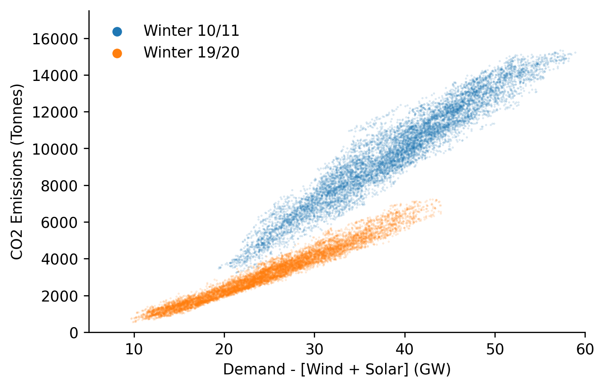

# Carbon Merit Order Effect Analysis


[](https://notebooks.gesis.org/binder/v2/gh/AyrtonB/Merit-Order-Effect/main?filepath=nbs%2Fdev-06-carbon-surface-estimation-and-moe.ipynb)

This notebook outlines the analysis required to determine the carbon merit-order-effect of variable renewable generation in the GB and DE power markets.

<br>

### Imports

```python
import pandas as pd
import numpy as np

import seaborn as sns
import matplotlib.pyplot as plt

from moepy import surface, moe, eda

import pickle
from sklearn.metrics import r2_score
from moepy.surface import PicklableFunction
```

<br>

### User Inputs

```python
models_dir = '../data/models'
```

<br>

### Germany

We'll start by loading in the data

```python
df_fuels_DE = pd.read_csv('../data/raw/energy_charts.csv')

df_fuels_DE = df_fuels_DE.set_index('local_datetime')
df_fuels_DE.index = pd.to_datetime(df_fuels_DE.index, utc=True).tz_convert('Europe/Berlin')

df_fuels_DE.head()
```


| local_datetime            |   Biomass |   Brown Coal |   Gas |   Hard Coal |   Hydro Power |   Oil |   Others |   Pumped Storage |   Seasonal Storage |   Solar |   Uranium |   Wind |   net_balance |
|:--------------------------|----------:|-------------:|------:|------------:|--------------:|------:|---------:|-----------------:|-------------------:|--------:|----------:|-------:|--------------:|
| 2010-01-04 00:00:00+01:00 |     3.637 |       16.533 | 4.726 |      10.078 |         2.331 | 0     |        0 |            0.052 |              0.068 |       0 |    16.826 |  0.635 |        -1.229 |
| 2010-01-04 01:00:00+01:00 |     3.637 |       16.544 | 4.856 |       8.816 |         2.293 | 0     |        0 |            0.038 |              0.003 |       0 |    16.841 |  0.528 |        -1.593 |
| 2010-01-04 02:00:00+01:00 |     3.637 |       16.368 | 5.275 |       7.954 |         2.299 | 0     |        0 |            0.032 |              0     |       0 |    16.846 |  0.616 |        -1.378 |
| 2010-01-04 03:00:00+01:00 |     3.637 |       15.837 | 5.354 |       7.681 |         2.299 | 0     |        0 |            0.027 |              0     |       0 |    16.699 |  0.63  |        -1.624 |
| 2010-01-04 04:00:00+01:00 |     3.637 |       15.452 | 5.918 |       7.498 |         2.301 | 0.003 |        0 |            0.02  |              0     |       0 |    16.635 |  0.713 |        -0.731 |</div>


<br>

We now need to conver the fuel generation time-series into a carbon intensity time-series. We'll use data provided by [volker-quaschning](https://www.volker-quaschning.de/datserv/CO2-spez/index_e.php). The units are kgCO2 / kWh, equivalent to Tonnes/MWh.

N.b. We are looking at the fuel emissions (not avg over lifecycle incl. CAPEX)

```python
DE_fuel_to_co2_intensity = {
    'Biomass': 0.39, 
    'Brown Coal': 0.36, 
    'Gas': 0.23, 
    'Hard Coal': 0.34, 
    'Hydro Power': 0, 
    'Oil': 0.28,
    'Others': 0, 
    'Pumped Storage': 0, 
    'Seasonal Storage': 0, 
    'Solar': 0, 
    'Uranium': 0,
    'Wind': 0, 
    'net_balance': 0 
}

s_DE_emissions_tonnes = (df_fuels_DE
                         .multiply(1e3) # converting to MWh
                         [DE_fuel_to_co2_intensity.keys()]
                         .multiply(DE_fuel_to_co2_intensity.values())
                         .sum(axis=1)
                        )

s_DE_emissions_tonnes = s_DE_emissions_tonnes[s_DE_emissions_tonnes>2000]

sns.histplot(s_DE_emissions_tonnes)
```


    <AxesSubplot:ylabel='Count'>


<br>

We'll do a quick plot of the change over time

```python
df_DE = pd.DataFrame({
    'demand': df_fuels_DE.sum(axis=1),
    'dispatchable': df_fuels_DE.drop(columns=['Solar', 'Wind']).sum(axis=1),
    'emissions': s_DE_emissions_tonnes
}).dropna()

# Plotting
fig, ax = plt.subplots(dpi=150)

ax.scatter(df_DE.loc['2010-09':'2011-03', 'dispatchable'], df_DE.loc['2010-09':'2011-03', 'emissions'], s=0.1, alpha=0.25, label='Winter 10/11')
ax.scatter(df_DE.loc['2019-09':'2020-03', 'dispatchable'], df_DE.loc['2019-09':'2020-03', 'emissions'], s=0.1, alpha=0.25, label='Winter 19/20')

eda.hide_spines(ax)
ax.set_xlim(10, 80)
ax.set_ylim(3000, 20000)
ax.set_xlabel('Demand - [Wind + Solar] (GW)')
ax.set_ylabel('CO2 Emissions (Tonnes)')

lgnd = ax.legend(frameon=False) # Need to increase the legend marker size
lgnd.legendHandles[0]._sizes = [30]
lgnd.legendHandles[1]._sizes = [30]

for lh in lgnd.legendHandles: 
    lh.set_alpha(1)
```


<br>

### Great Britain 

We'll now do the same for the GB system

```python
df_fuels_GB = pd.read_csv('../data/raw/electric_insights.csv')

df_fuels_GB = df_fuels_GB.set_index('local_datetime')
df_fuels_GB.index = pd.to_datetime(df_fuels_GB.index, utc=True).tz_convert('Europe/Berlin')

df_fuels_GB.head()
```


| local_datetime            |   day_ahead_price |   SP |   imbalance_price |   valueSum |   temperature |   TCO2_per_h |   gCO2_per_kWh |   nuclear |   biomass |   coal | ...   |   demand |   pumped_storage |   wind_onshore |   wind_offshore |   belgian |   dutch |   french |   ireland |   northern_ireland |   irish |
|:--------------------------|------------------:|-----:|------------------:|-----------:|--------------:|-------------:|---------------:|----------:|----------:|-------:|:------|---------:|-----------------:|---------------:|----------------:|----------:|--------:|---------:|----------:|-------------------:|--------:|
| 2009-01-01 01:00:00+01:00 |             58.05 |    1 |             74.74 |      74.74 |          -0.6 |        21278 |            555 |     6.973 |         0 | 17.65  | ...   |   38.329 |           -0.404 |            nan |             nan |         0 |       0 |    1.977 |         0 |                  0 |  -0.161 |
| 2009-01-01 01:30:00+01:00 |             56.33 |    2 |             74.89 |      74.89 |          -0.6 |        21442 |            558 |     6.968 |         0 | 17.77  | ...   |   38.461 |           -0.527 |            nan |             nan |         0 |       0 |    1.977 |         0 |                  0 |  -0.16  |
| 2009-01-01 02:00:00+01:00 |             52.98 |    3 |             76.41 |      76.41 |          -0.6 |        21614 |            569 |     6.97  |         0 | 18.07  | ...   |   37.986 |           -1.018 |            nan |             nan |         0 |       0 |    1.977 |         0 |                  0 |  -0.16  |
| 2009-01-01 02:30:00+01:00 |             50.39 |    4 |             37.73 |      37.73 |          -0.6 |        21320 |            578 |     6.969 |         0 | 18.022 | ...   |   36.864 |           -1.269 |            nan |             nan |         0 |       0 |    1.746 |         0 |                  0 |  -0.16  |
| 2009-01-01 03:00:00+01:00 |             48.7  |    5 |             59    |      59    |          -0.6 |        21160 |            585 |     6.96  |         0 | 17.998 | ...   |   36.18  |           -1.566 |            nan |             nan |         0 |       0 |    1.73  |         0 |                  0 |  -0.16  |</div>


<br>

We'll source the carbon intensity data from DUKES where possible and Electric Insights where it isn't.


```python
GB_fuel_to_co2_intensity = {
    'nuclear': 0, 
    'biomass': 0.121, # from EI 
    'coal': 0.921, # DUKES 2018 value
    'gas': 0.377, # DUKES 2018 value (lower than many CCGT estimates, let alone OCGT)
    'hydro': 0, 
    'pumped_storage': 0, 
    'solar': 0,
    'wind': 0,
    'belgian': 0.4,  
    'dutch': 0.474, # from EI 
    'french': 0.053, # from EI 
    'ireland': 0.458, # from EI 
    'northern_ireland': 0.458 # from EI 
}

s_GB_emissions_tonnes = (df_fuels_GB
                         .multiply(1e3*0.5) # converting to MWh
                         [GB_fuel_to_co2_intensity.keys()]
                         .multiply(GB_fuel_to_co2_intensity.values())
                         .sum(axis=1)
                        )

sns.histplot(s_GB_emissions_tonnes)
```


    <AxesSubplot:ylabel='Count'>


<br>

We'll do the same visualisation for GB of how the carbon intensity has changed over time.

Interestly we can see a clear fall in the carbon intensity of the GB dispatchable fleet, whereas with Germany the difference is negligible and if anything has slightly increased.

```python
df_GB = pd.DataFrame({
    'demand': df_fuels_GB[GB_fuel_to_co2_intensity.keys()].sum(axis=1),
    'dispatchable': df_fuels_GB[GB_fuel_to_co2_intensity.keys()].drop(columns=['solar', 'wind']).sum(axis=1),
    'emissions': s_GB_emissions_tonnes
}).dropna()

# Plotting
fig, ax = plt.subplots(dpi=250)

ax.scatter(df_GB.loc['2010-09':'2011-03', 'dispatchable'], df_GB.loc['2010-09':'2011-03', 'emissions'], s=0.1, alpha=0.25, label='Winter 10/11')
ax.scatter(df_GB.loc['2019-09':'2020-03', 'dispatchable'], df_GB.loc['2019-09':'2020-03', 'emissions'], s=0.1, alpha=0.25, label='Winter 19/20')

eda.hide_spines(ax)
ax.set_xlim(5, 60)
ax.set_ylim(0, 17500)
ax.set_xlabel('Demand - [Wind + Solar] (GW)')
ax.set_ylabel('CO2 Emissions (Tonnes)')

lgnd = ax.legend(frameon=False) # Need to increase the legend marker size
lgnd.legendHandles[0]._sizes = [30]
lgnd.legendHandles[1]._sizes = [30]

for lh in lgnd.legendHandles: 
    lh.set_alpha(1)
```





<br>

### Model Fitting

We're ready to define and fit our models

```python
model_definitions = {
    'carbon_emissions_DE': {
        'dt_idx': df_DE.index,
        'x': df_DE['dispatchable'].values,
        'y': df_DE['emissions'].values,
        'reg_dates_start': '2010-01-04',
        'reg_dates_end': '2021-01-01',
        'reg_dates_freq': '13W',  
        'frac': 0.3, 
        'num_fits': 31, 
        'dates_smoothing_value': 26, 
        'dates_smoothing_units': 'W',
        'fit_kwarg_sets': surface.get_fit_kwarg_sets(qs=[0.16, 0.5, 0.84])
    },
    'carbon_emissions_GB': {
        'dt_idx': df_GB.index,
        'x': df_GB['dispatchable'].values,
        'y': df_GB['emissions'].values,
        'reg_dates_start': '2010-01-04',
        'reg_dates_end': '2021-01-01',
        'reg_dates_freq': '13W',  
        'frac': 0.3, 
        'num_fits': 31, 
        'dates_smoothing_value': 26,
        'dates_smoothing_units': 'W',
        'fit_kwarg_sets': surface.get_fit_kwarg_sets(qs=[0.16, 0.5, 0.84])
    }
}

surface.fit_models(model_definitions, models_dir)
```


<div><span class="Text-label" style="display:inline-block; overflow:hidden; white-space:nowrap; text-overflow:ellipsis; min-width:15ex; max-width:15ex; vertical-align:middle; text-align:right">carbon_emissions_DE</span>
<progress style="width:45ex" max="4" value="4" class="Progress-main"/></progress>
<span class="Progress-label"><strong>100%</strong></span>
<span class="Iteration-label">4/4</span>
<span class="Time-label">[00:00<00:00, 0.00s/it]</span></div>


<div><span class="Text-label" style="display:inline-block; overflow:hidden; white-space:nowrap; text-overflow:ellipsis; min-width:15ex; max-width:15ex; vertical-align:middle; text-align:right">carbon_emissions_GB</span>
<progress style="width:45ex" max="4" value="4" class="Progress-main"/></progress>
<span class="Progress-label"><strong>100%</strong></span>
<span class="Iteration-label">4/4</span>
<span class="Time-label">[00:00<00:00, 0.00s/it]</span></div>


<br>

### German Model Evaluation & Carbon Savings Calculations

We'll start by loading in the model

```python
%%time

DE_model_fp = '../data/models/carbon_emissions_DE_p50.pkl'
DE_smooth_dates = pickle.load(open(DE_model_fp, 'rb'))

DE_x_pred = np.linspace(-5, 91, 961)
DE_dt_pred = pd.date_range('2010-01-01', '2020-12-31', freq='D')

df_DE_pred = DE_smooth_dates.predict(x_pred=DE_x_pred, dt_pred=DE_dt_pred)
df_DE_pred.index = np.round(df_DE_pred.index, 1)

df_DE_pred.head()
```

    Wall time: 3.22 s
    


|   Unnamed: 0 |   2010-01-01 |   2010-01-02 |   2010-01-03 |   2010-01-04 |   2010-01-05 |   2010-01-06 |   2010-01-07 |   2010-01-08 |   2010-01-09 |   2010-01-10 | ...   |   2020-12-22 |   2020-12-23 |   2020-12-24 |   2020-12-25 |   2020-12-26 |   2020-12-27 |   2020-12-28 |   2020-12-29 |   2020-12-30 |   2020-12-31 |
|-------------:|-------------:|-------------:|-------------:|-------------:|-------------:|-------------:|-------------:|-------------:|-------------:|-------------:|:------|-------------:|-------------:|-------------:|-------------:|-------------:|-------------:|-------------:|-------------:|-------------:|-------------:|
|         -5   |      3886.65 |      3879.82 |      3873.02 |      3866.24 |      3859.49 |      3852.78 |      3846.09 |      3839.43 |      3832.81 |      3826.22 | ...   |      90.9967 |      89.6073 |      88.2112 |      86.8081 |      85.3975 |      83.9787 |      82.5515 |      81.1158 |      79.6717 |      78.2193 |
|         -4.9 |      3892.08 |      3885.26 |      3878.48 |      3871.72 |      3864.99 |      3858.3  |      3851.63 |      3844.99 |      3838.39 |      3831.82 | ...   |     109.687  |     108.304  |     106.915  |     105.518  |     104.113  |     102.701  |     101.28   |      99.8512 |      98.4136 |      96.9678 |
|         -4.8 |      3897.58 |      3890.78 |      3884.01 |      3877.28 |      3870.57 |      3863.89 |      3857.24 |      3850.62 |      3844.04 |      3837.48 | ...   |     128.39   |     127.013  |     125.63   |     124.24   |     122.842  |     121.436  |     120.021  |     118.599  |     117.168  |     115.728  |
|         -4.7 |      3903.14 |      3896.36 |      3889.62 |      3882.89 |      3876.2  |      3869.54 |      3862.91 |      3856.31 |      3849.75 |      3843.21 | ...   |     147.105  |     145.734  |     144.357  |     142.973  |     141.581  |     140.182  |     138.774  |     137.358  |     135.933  |     134.501  |
|         -4.6 |      3908.73 |      3901.97 |      3895.24 |      3888.54 |      3881.86 |      3875.22 |      3868.61 |      3862.03 |      3855.48 |      3848.96 | ...   |     165.828  |     164.463  |     163.092  |     161.715  |     160.33   |     158.936  |     157.535  |     156.125  |     154.707  |     153.281  |</div>


<br>

We'll then visualise the surface prediction as a heatmap

```python
df_DE_dispatchable_lims = moe.construct_dispatchable_lims_df(df_DE['dispatchable'], rolling_w=6)
df_DE_pred_mask = moe.construct_pred_mask_df(df_DE_pred, df_DE_dispatchable_lims)

# Plotting
min_y = 10
max_y = 80
fig, ax = plt.subplots(dpi=150)

htmp = sns.heatmap(df_DE_pred[min_y:max_y].where(df_DE_pred_mask[min_y:max_y], np.nan).iloc[::-1], ax=ax, cbar_kws={'label': 'Hourly CO2 Emissions (Tonnes)'})

moe.set_ticks(ax, np.arange(min_y, max_y, 10), axis='y')
moe.set_date_ticks(ax, '2010-01-01', '2021-01-01', freq='1YS', date_format='%Y', axis='x')

for _, spine in htmp.spines.items():
    spine.set_visible(True)
eda.hide_spines(ax)

ax.set_ylabel('Demand - [Solar + Wind] (GW)')
```

    C:\Users\Ayrto\anaconda3\envs\MOE\lib\site-packages\sklearn\utils\validation.py:63: FutureWarning: Arrays of bytes/strings is being converted to decimal numbers if dtype='numeric'. This behavior is deprecated in 0.24 and will be removed in 1.1 (renaming of 0.26). Please convert your data to numeric values explicitly instead.
      return f(*args, **kwargs)
    


    Text(69.58333333333334, 0.5, 'Demand - [Solar + Wind] (GW)')


<br>

We'll calculate the model metrics

```python
s_DE_pred_ts_dispatch, s_DE_pred_ts_demand = moe.get_model_pred_ts(df_DE['dispatchable'], DE_model_fp, s_demand=df_DE['demand'], x_pred=DE_x_pred, dt_pred=DE_dt_pred)
s_DE_err = s_DE_pred_ts_dispatch - df_DE.loc[s_DE_pred_ts_dispatch.index, 'emissions']
metrics = moe.calc_error_metrics(s_DE_err)

metrics
```

    C:\Users\Ayrto\anaconda3\envs\MOE\lib\site-packages\pandas\core\indexes\base.py:5277: FutureWarning: Indexing a timezone-aware DatetimeIndex with a timezone-naive datetime is deprecated and will raise KeyError in a future version.  Use a timezone-aware object instead.
      start_slice, end_slice = self.slice_locs(start, end, step=step, kind=kind)
    


<div><span class="Text-label" style="display:inline-block; overflow:hidden; white-space:nowrap; text-overflow:ellipsis; min-width:0; max-width:15ex; vertical-align:middle; text-align:right"></span>
<progress style="width:60ex" max="96191" value="96191" class="Progress-main"/></progress>
<span class="Progress-label"><strong>100%</strong></span>
<span class="Iteration-label">48050/96191</span>
<span class="Time-label">[01:28<00:00, 0.00s/it]</span></div>


<div><span class="Text-label" style="display:inline-block; overflow:hidden; white-space:nowrap; text-overflow:ellipsis; min-width:0; max-width:15ex; vertical-align:middle; text-align:right"></span>
<progress style="width:60ex" max="96191" value="96191" class="Progress-main"/></progress>
<span class="Progress-label"><strong>100%</strong></span>
<span class="Iteration-label">0/96191</span>
<span class="Time-label">[01:20<00:00, 0.00s/it]</span></div>


    {'median_abs_err': 603.7669189236494,
     'mean_abs_err': 750.7665511092414,
     'root_mean_square_error': 967.8069705064318}


<br>

And $r^{2}$ score

```python
r2_score(df_DE.loc[s_DE_pred_ts_dispatch.index, 'emissions'], s_DE_pred_ts_dispatch)
```


    0.9139682818721121


<br>

We're now ready to calculate the total savings

```python
start_date = '2010'
end_date = '2020'

s_DE_MOE = s_DE_pred_ts_demand - s_DE_pred_ts_dispatch
s_DE_MOE = s_DE_MOE.dropna()

total_saving = s_DE_MOE[start_date:end_date].sum()

print(f"The total saving between {start_date} and {end_date} was {total_saving:,.0f} Tonnes")
```

    The total saving between 2010 and 2020 was 318,923,308 Tonnes
    

<br>

And get some context for the average and total emissions over the same period

```python
s_DE_emissions = df_DE['emissions'].loc[s_DE_MOE.index]

avg_DE_HH_emissions = s_DE_emissions.mean()
total_DE_emissions = s_DE_emissions[start_date:end_date].sum()

avg_DE_HH_emissions, total_DE_emissions
```


    (11870.320551662837, 1141818004.185)


<br>

We'll calculate the average percentage emissions reduction due to the MOE

```python
total_saving/(total_DE_emissions+total_saving)
```


    0.21832976535024085


<br>

Finally we'll generate the MOE percentage time-series

```python
s_DE_emissions_rolling = s_DE_emissions.rolling(48*28).mean().dropna()
s_DE_MOE_rolling = s_DE_MOE.rolling(48*28).mean().dropna()

s_DE_MOE_pct_reduction = s_DE_MOE_rolling/s_DE_emissions_rolling

s_DE_MOE_pct_reduction.plot()
```


    <AxesSubplot:xlabel='local_datetime'>


<br>

### British Model Evaluation & Carbon Savings Calculations

We'll start by loading in the model

```python
%%time

start_date = '2010-01-01'
end_date = '2020-12-31'

GB_model_fp = '../data/models/carbon_emissions_GB_p50.pkl'
GB_smooth_dates = pickle.load(open(GB_model_fp, 'rb'))

GB_x_pred = np.linspace(-5, 91, 961)
GB_dt_pred = pd.date_range(start_date, end_date, freq='D')

df_GB_pred = GB_smooth_dates.predict(x_pred=GB_x_pred, dt_pred=GB_dt_pred)
df_GB_pred.index = np.round(df_GB_pred.index, 1)

df_GB_pred.head()
```

    Wall time: 3.73 s
    


|   Unnamed: 0 |   2010-01-01 |   2010-01-02 |   2010-01-03 |   2010-01-04 |   2010-01-05 |   2010-01-06 |   2010-01-07 |   2010-01-08 |   2010-01-09 |   2010-01-10 | ...   |   2020-12-22 |   2020-12-23 |   2020-12-24 |   2020-12-25 |   2020-12-26 |   2020-12-27 |   2020-12-28 |   2020-12-29 |   2020-12-30 |   2020-12-31 |
|-------------:|-------------:|-------------:|-------------:|-------------:|-------------:|-------------:|-------------:|-------------:|-------------:|-------------:|:------|-------------:|-------------:|-------------:|-------------:|-------------:|-------------:|-------------:|-------------:|-------------:|-------------:|
|         -5   |     -3464.32 |     -3464.5  |     -3464.68 |     -3464.85 |     -3465.03 |     -3465.2  |     -3465.38 |     -3465.55 |     -3465.72 |     -3465.89 | ...   |     -1132.67 |     -1132.65 |     -1132.62 |     -1132.59 |     -1132.57 |     -1132.54 |     -1132.52 |     -1132.49 |     -1132.46 |     -1132.44 |
|         -4.9 |     -3440    |     -3440.17 |     -3440.33 |     -3440.49 |     -3440.66 |     -3440.82 |     -3440.98 |     -3441.14 |     -3441.29 |     -3441.45 | ...   |     -1119.73 |     -1119.7  |     -1119.67 |     -1119.65 |     -1119.62 |     -1119.6  |     -1119.57 |     -1119.55 |     -1119.52 |     -1119.49 |
|         -4.8 |     -3415.64 |     -3415.79 |     -3415.94 |     -3416.1  |     -3416.24 |     -3416.39 |     -3416.54 |     -3416.68 |     -3416.83 |     -3416.97 | ...   |     -1106.78 |     -1106.75 |     -1106.73 |     -1106.7  |     -1106.68 |     -1106.65 |     -1106.63 |     -1106.6  |     -1106.57 |     -1106.55 |
|         -4.7 |     -3391.24 |     -3391.38 |     -3391.52 |     -3391.66 |     -3391.79 |     -3391.93 |     -3392.06 |     -3392.2  |     -3392.33 |     -3392.46 | ...   |     -1093.84 |     -1093.81 |     -1093.78 |     -1093.76 |     -1093.73 |     -1093.71 |     -1093.68 |     -1093.66 |     -1093.63 |     -1093.6  |
|         -4.6 |     -3366.81 |     -3366.93 |     -3367.06 |     -3367.18 |     -3367.31 |     -3367.43 |     -3367.55 |     -3367.67 |     -3367.79 |     -3367.91 | ...   |     -1080.89 |     -1080.87 |     -1080.84 |     -1080.82 |     -1080.79 |     -1080.77 |     -1080.74 |     -1080.71 |     -1080.69 |     -1080.66 |</div>


<br>

We'll then visualise the surface prediction as a heatmap

```python
df_GB_dispatchable_lims = moe.construct_dispatchable_lims_df(df_GB.loc[start_date:end_date, 'dispatchable'], rolling_w=6)
df_GB_pred_mask = moe.construct_pred_mask_df(df_GB_pred, df_GB_dispatchable_lims)

# Plotting
min_y = 0
max_y = 60
fig, ax = plt.subplots(dpi=150)

htmp = sns.heatmap(df_GB_pred[min_y:max_y].where(df_GB_pred_mask[min_y:max_y], np.nan).iloc[::-1], ax=ax, cbar_kws={'label': 'Half-Hourly CO2 Emissions (Tonnes)'})

moe.set_ticks(ax, np.arange(min_y, max_y, 10), axis='y')
moe.set_date_ticks(ax, '2010-01-01', '2021-01-01', freq='1YS', date_format='%Y', axis='x')

for _, spine in htmp.spines.items():
    spine.set_visible(True)
eda.hide_spines(ax)

ax.set_ylabel('Demand - [Solar + Wind] (GW)')
```

    C:\Users\Ayrto\anaconda3\envs\MOE\lib\site-packages\sklearn\utils\validation.py:63: FutureWarning: Arrays of bytes/strings is being converted to decimal numbers if dtype='numeric'. This behavior is deprecated in 0.24 and will be removed in 1.1 (renaming of 0.26). Please convert your data to numeric values explicitly instead.
      return f(*args, **kwargs)
    


    Text(69.58333333333334, 0.5, 'Demand - [Solar + Wind] (GW)')


<br>

We'll calculate the model metrics

```python
s_GB_pred_ts_dispatch, s_GB_pred_ts_demand = moe.get_model_pred_ts(df_GB['dispatchable'], GB_model_fp, s_demand=df_GB['demand'], x_pred=GB_x_pred, dt_pred=GB_dt_pred)
s_GB_err = s_GB_pred_ts_dispatch - df_GB.loc[s_GB_pred_ts_dispatch.index, 'emissions']
metrics = moe.calc_error_metrics(s_GB_err)

metrics
```

    C:\Users\Ayrto\anaconda3\envs\MOE\lib\site-packages\pandas\core\indexes\base.py:5277: FutureWarning: Indexing a timezone-aware DatetimeIndex with a timezone-naive datetime is deprecated and will raise KeyError in a future version.  Use a timezone-aware object instead.
      start_slice, end_slice = self.slice_locs(start, end, step=step, kind=kind)
    


<div><span class="Text-label" style="display:inline-block; overflow:hidden; white-space:nowrap; text-overflow:ellipsis; min-width:0; max-width:15ex; vertical-align:middle; text-align:right"></span>
<progress style="width:60ex" max="192336" value="192336" class="Progress-main"/></progress>
<span class="Progress-label"><strong>100%</strong></span>
<span class="Iteration-label">130764/192336</span>
<span class="Time-label">[02:32<00:00, 0.00s/it]</span></div>


<div><span class="Text-label" style="display:inline-block; overflow:hidden; white-space:nowrap; text-overflow:ellipsis; min-width:0; max-width:15ex; vertical-align:middle; text-align:right"></span>
<progress style="width:60ex" max="192336" value="192336" class="Progress-main"/></progress>
<span class="Progress-label"><strong>100%</strong></span>
<span class="Iteration-label">0/192336</span>
<span class="Time-label">[02:11<00:00, 0.00s/it]</span></div>


    {'median_abs_err': 330.24369388573996,
     'mean_abs_err': 476.21722650533655,
     'root_mean_square_error': 661.7182203091455}


<br>

And $r^{2}$ score

```python
r2_score(df_GB.loc[s_GB_pred_ts_dispatch.index, 'emissions'], s_GB_pred_ts_dispatch)
```


    0.9557674211115541


<br>

We're now ready to calculate the total savings

```python
s_GB_MOE = s_GB_pred_ts_demand - s_GB_pred_ts_dispatch
s_GB_MOE = s_GB_MOE.dropna()

total_saving = s_GB_MOE[start_date:end_date].sum()

print(f"The total saving between {start_date} and {end_date} was {total_saving:,.0f} Tonnes")
```

    The total saving between 2010-01-01 and 2020-12-31 was 221,069,470 Tonnes
    

<br>

And get some context for the average and total emissions over the same period

```python
s_GB_emissions = df_GB['emissions'].loc[s_GB_MOE.index]

avg_GB_HH_emissions = s_GB_emissions.mean()
total_GB_emissions = s_GB_emissions[start_date:end_date].sum()

avg_GB_HH_emissions, total_GB_emissions
```


    (6034.469929827791, 1160645808.423358)


<br>

We'll calculate the average percentage emissions reduction due to the MOE

```python
total_saving/(total_GB_emissions+total_saving)
```


    0.15999639957299291


<br>

Finally we'll generate the MOE percentage time-series

```python
s_GB_emissions_rolling = s_GB_emissions.rolling(48*28).mean().dropna()
s_GB_MOE_rolling = s_GB_MOE.rolling(48*28).mean().dropna()

s_GB_MOE_pct_reduction = s_GB_MOE_rolling/s_GB_emissions_rolling

s_GB_MOE_pct_reduction.plot()
```


    <AxesSubplot:xlabel='local_datetime'>


<br>

### Plots

In this section we'll generate some of the plots needed for the paper, starting with the heatmap of the emissions surfaces

```python
fig, axs = plt.subplots(dpi=150, ncols=2, figsize=(14, 5))

# GB
ax = axs[0]
min_y = 0
max_y = 60

htmp = sns.heatmap(df_GB_pred[min_y:max_y].where(df_GB_pred_mask[min_y:max_y], np.nan).iloc[::-1], ax=ax, cbar_kws={'label': 'Half-Hourly CO2 Emissions (Tonnes)'})

moe.set_ticks(ax, np.arange(min_y, max_y, 10), axis='y')
moe.set_date_ticks(ax, '2010-01-01', '2021-01-01', freq='1YS', date_format='%Y', axis='x')

for _, spine in htmp.spines.items():
    spine.set_visible(True)
eda.hide_spines(ax)

ax.set_ylabel('Demand - [Solar + Wind] (GW)')

# DE
ax = axs[1]
min_y = 10
max_y = 80

htmp = sns.heatmap(df_DE_pred[min_y:max_y].where(df_DE_pred_mask[min_y:max_y], np.nan).iloc[::-1], ax=ax, cbar_kws={'label': 'Hourly CO2 Emissions (Tonnes)'})

moe.set_ticks(ax, np.arange(min_y, max_y, 10), axis='y')
moe.set_date_ticks(ax, '2010-01-01', '2021-01-01', freq='1YS', date_format='%Y', axis='x')

for _, spine in htmp.spines.items():
    spine.set_visible(True)
eda.hide_spines(ax)

ax.set_ylabel('Demand - [Solar + Wind] (GW)')

fig.tight_layout()
```

    C:\Users\Ayrto\anaconda3\envs\MOE\lib\site-packages\sklearn\utils\validation.py:63: FutureWarning: Arrays of bytes/strings is being converted to decimal numbers if dtype='numeric'. This behavior is deprecated in 0.24 and will be removed in 1.1 (renaming of 0.26). Please convert your data to numeric values explicitly instead.
      return f(*args, **kwargs)
    C:\Users\Ayrto\anaconda3\envs\MOE\lib\site-packages\sklearn\utils\validation.py:63: FutureWarning: Arrays of bytes/strings is being converted to decimal numbers if dtype='numeric'. This behavior is deprecated in 0.24 and will be removed in 1.1 (renaming of 0.26). Please convert your data to numeric values explicitly instead.
      return f(*args, **kwargs)
    


<br>

We'll also plot the MOE time-series

```python
fig, axs = plt.subplots(dpi=150, ncols=2, figsize=(14, 5))

# GB
ax = axs[0]

ax.scatter(s_GB_MOE.index, s_GB_MOE, s=0.01, alpha=0.2, color='k', label=None)
s_GB_MOE_rolling.plot(color='r', linewidth=1, ax=ax, label='28-Day Average')

eda.hide_spines(ax)
# ax.set_ylim(0, 40)
ax.set_xlim(pd.to_datetime('2010'), pd.to_datetime('2021'))
ax.set_xlabel('')
ax.set_ylabel('Merit Order Effect (Tonnes CO2)')
ax.legend(frameon=False)

# DE
ax = axs[1]

ax.scatter(s_DE_MOE.index, s_DE_MOE, s=0.05, alpha=0.2, color='k', label=None)
ax.plot(s_DE_MOE_rolling.index, s_DE_MOE_rolling, color='r', linewidth=1.5, label='28-Day Average')

eda.hide_spines(ax)
ax.set_xlim(pd.to_datetime('2010'), pd.to_datetime('2021'))
ax.set_xlabel('')
ax.set_ylabel('Merit Order Effect (Tonnes CO2)')
ax.legend(frameon=False)
```


    <matplotlib.legend.Legend at 0x181ff7c1af0>


<br>

Finally we'll visualise the changing emissions from dispatchable generation between the two countries

```python
fig, axs = plt.subplots(dpi=250, ncols=2, figsize=(12, 5))

# GB
ax = axs[0]
ax.scatter(df_GB.loc['2010-09':'2011-03', 'dispatchable'], df_GB.loc['2010-09':'2011-03', 'emissions'], s=0.25, linewidth=0, alpha=1, label='Winter 10/11')
ax.scatter(df_GB.loc['2019-09':'2020-03', 'dispatchable'], df_GB.loc['2019-09':'2020-03', 'emissions'], s=0.25, linewidth=0, alpha=1, label='Winter 19/20')

eda.hide_spines(ax)
ax.set_xlim(5, 60)
ax.set_xlabel('Demand - [Wind + Solar] (GW) in Britain')
ax.set_ylabel('CO2 Emissions (Tonnes)')
    
# DE
ax = axs[1]
ax.scatter(df_DE.loc['2010-09':'2011-03', 'dispatchable'], df_DE.loc['2010-09':'2011-03', 'emissions'], s=0.5, linewidth=0, alpha=1, label='Winter 10/11')
ax.scatter(df_DE.loc['2019-09':'2020-03', 'dispatchable'], df_DE.loc['2019-09':'2020-03', 'emissions'], s=0.5, linewidth=0, alpha=1, label='Winter 19/20')

eda.hide_spines(ax, positions=['top', 'left', 'right'])
ax.set_yticks([])
ax.set_xlim(10, 80)
ax.set_xlabel('Demand - [Wind + Solar] (GW) in Germany')

lgnd = ax.legend(frameon=False, bbox_to_anchor=(0.2, 0.95)) 
lgnd.legendHandles[0]._sizes = [30]
lgnd.legendHandles[1]._sizes = [30]

for lh in lgnd.legendHandles: 
    lh.set_alpha(1)

for ax in axs:
    ax.set_ylim(0, 20000)
```


<br>

### Saving Results

Additionaly we'll save the time-series predictions and model metrics, starting with the GB time-series

```python
df_GB_results_ts = pd.DataFrame({
    'prediction': s_GB_pred_ts_dispatch,
    'counterfactual': s_GB_pred_ts_demand,
    'observed': df_GB.loc[s_GB_pred_ts_dispatch.index, 'emissions'],
    'moe': s_GB_MOE
})

df_GB_results_ts.head()
```


| local_datetime            |   prediction |   counterfactual |   observed |     moe |
|:--------------------------|-------------:|-----------------:|-----------:|--------:|
| 2010-01-01 01:00:00+01:00 |      8414.72 |          8861.95 |    7949.28 | 447.23  |
| 2010-01-01 01:30:00+01:00 |      8535.22 |          8986.13 |    8030.29 | 450.914 |
| 2010-01-01 02:00:00+01:00 |      8414.72 |          8820.73 |    7974.91 | 406.012 |
| 2010-01-01 02:30:00+01:00 |      7983.82 |          8454.75 |    7707.51 | 470.937 |
| 2010-01-01 03:00:00+01:00 |      7645.47 |          8060.81 |    7456.2  | 415.345 |</div>


<br>

Which we'll save to csv

```python
df_GB_results_ts.to_csv('../data/results/GB_carbon.csv')
```

<br>

Then the DE time-series

```python
df_DE_results_ts = pd.DataFrame({
    'prediction': s_DE_pred_ts_dispatch,
    'counterfactual': s_DE_pred_ts_demand,
    'observed': df_DE.loc[s_DE_pred_ts_dispatch.index, 'emissions'],
    'moe': s_DE_MOE
})

df_DE_results_ts.to_csv('../data/results/DE_carbon.csv')

df_DE_results_ts.head()
```


| local_datetime            |   prediction |   counterfactual |   observed |     moe |
|:--------------------------|-------------:|-----------------:|-----------:|--------:|
| 2010-01-04 00:00:00+01:00 |      11981.6 |          12179   |    11883.8 | 197.359 |
| 2010-01-04 01:00:00+01:00 |      11518.7 |          11694.3 |    11488.6 | 175.594 |
| 2010-01-04 02:00:00+01:00 |      11400.5 |          11577.4 |    11228.5 | 176.903 |
| 2010-01-04 03:00:00+01:00 |      11071.5 |          11251.9 |    10962.7 | 180.385 |
| 2010-01-04 04:00:00+01:00 |      11311.5 |          11518.7 |    10892.5 | 207.187 |</div>


