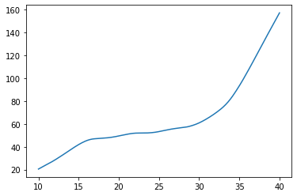
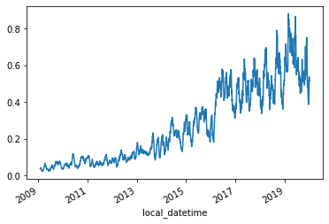

# Carbon Merit Order Effect Analysis


[](https://notebooks.gesis.org/binder/v2/gh/AyrtonB/Merit-Order-Effect/main?filepath=nbs%2Fdev-06-carbon-surface-estimation-and-moe.ipynb)

This notebook outlines the analysis required to determine the carbon merit-order-effect of variable renewable generation in the GB and DE power markets.

<br>

### Imports

```python
import pandas as pd
import numpy as np

import seaborn as sns
import matplotlib.pyplot as plt

from moepy import surface, moe, eda

import pickle
from sklearn.metrics import r2_score
from moepy.surface import PicklableFunction
```

<br>

### User Inputs

```python
models_dir = '../data/models'
```

<br>

### Germany

We'll start by loading in the data

```python
df_fuels_DE = pd.read_csv('../data/raw/energy_charts.csv')

df_fuels_DE = df_fuels_DE.set_index('local_datetime')
df_fuels_DE.index = pd.to_datetime(df_fuels_DE.index, utc=True).tz_convert('Europe/Berlin')

df_fuels_DE.head()
```


<div>
<style scoped>
    .dataframe tbody tr th:only-of-type {
        vertical-align: middle;
    }

    .dataframe tbody tr th {
        vertical-align: top;
    }

    .dataframe thead th {
        text-align: right;
    }
</style>
<table border="1" class="dataframe">
  <thead>
    <tr style="text-align: right;">
      <th></th>
      <th>Biomass</th>
      <th>Brown Coal</th>
      <th>Gas</th>
      <th>Hard Coal</th>
      <th>Hydro Power</th>
      <th>Oil</th>
      <th>Others</th>
      <th>Pumped Storage</th>
      <th>Seasonal Storage</th>
      <th>Solar</th>
      <th>Uranium</th>
      <th>Wind</th>
      <th>net_balance</th>
    </tr>
    <tr>
      <th>local_datetime</th>
      <th></th>
      <th></th>
      <th></th>
      <th></th>
      <th></th>
      <th></th>
      <th></th>
      <th></th>
      <th></th>
      <th></th>
      <th></th>
      <th></th>
      <th></th>
    </tr>
  </thead>
  <tbody>
    <tr>
      <th>2010-01-04 00:00:00+01:00</th>
      <td>3.637</td>
      <td>16.533</td>
      <td>4.726</td>
      <td>10.078</td>
      <td>2.331</td>
      <td>0.000</td>
      <td>0.0</td>
      <td>0.052</td>
      <td>0.068</td>
      <td>0.0</td>
      <td>16.826</td>
      <td>0.635</td>
      <td>-1.229</td>
    </tr>
    <tr>
      <th>2010-01-04 01:00:00+01:00</th>
      <td>3.637</td>
      <td>16.544</td>
      <td>4.856</td>
      <td>8.816</td>
      <td>2.293</td>
      <td>0.000</td>
      <td>0.0</td>
      <td>0.038</td>
      <td>0.003</td>
      <td>0.0</td>
      <td>16.841</td>
      <td>0.528</td>
      <td>-1.593</td>
    </tr>
    <tr>
      <th>2010-01-04 02:00:00+01:00</th>
      <td>3.637</td>
      <td>16.368</td>
      <td>5.275</td>
      <td>7.954</td>
      <td>2.299</td>
      <td>0.000</td>
      <td>0.0</td>
      <td>0.032</td>
      <td>0.000</td>
      <td>0.0</td>
      <td>16.846</td>
      <td>0.616</td>
      <td>-1.378</td>
    </tr>
    <tr>
      <th>2010-01-04 03:00:00+01:00</th>
      <td>3.637</td>
      <td>15.837</td>
      <td>5.354</td>
      <td>7.681</td>
      <td>2.299</td>
      <td>0.000</td>
      <td>0.0</td>
      <td>0.027</td>
      <td>0.000</td>
      <td>0.0</td>
      <td>16.699</td>
      <td>0.630</td>
      <td>-1.624</td>
    </tr>
    <tr>
      <th>2010-01-04 04:00:00+01:00</th>
      <td>3.637</td>
      <td>15.452</td>
      <td>5.918</td>
      <td>7.498</td>
      <td>2.301</td>
      <td>0.003</td>
      <td>0.0</td>
      <td>0.020</td>
      <td>0.000</td>
      <td>0.0</td>
      <td>16.635</td>
      <td>0.713</td>
      <td>-0.731</td>
    </tr>
  </tbody>
</table>
</div>


<br>

We now need to conver the fuel generation time-series into a carbon intensity time-series. We'll use data provided by [volker-quaschning](https://www.volker-quaschning.de/datserv/CO2-spez/index_e.php). The units are kgCO2 / kWh, equivalent to Tonnes/MWh.

N.b. We are looking at the fuel emissions (not avg over lifecycle incl. CAPEX)

```python
DE_fuel_to_co2_intensity = {
    'Biomass': 0.39, 
    'Brown Coal': 0.36, 
    'Gas': 0.23, 
    'Hard Coal': 0.34, 
    'Hydro Power': 0, 
    'Oil': 0.28,
    'Others': 0, 
    'Pumped Storage': 0, 
    'Seasonal Storage': 0, 
    'Solar': 0, 
    'Uranium': 0,
    'Wind': 0, 
    'net_balance': 0 
}

s_DE_emissions_tonnes = (df_fuels_DE
                         .multiply(1e3) # converting to MWh
                         [DE_fuel_to_co2_intensity.keys()]
                         .multiply(DE_fuel_to_co2_intensity.values())
                         .sum(axis=1)
                        )

s_DE_emissions_tonnes = s_DE_emissions_tonnes[s_DE_emissions_tonnes>2000]

sns.histplot(s_DE_emissions_tonnes)
```


    <AxesSubplot:ylabel='Count'>





<br>

We'll do a quick plot of the change over time

```python
df_DE = pd.DataFrame({
    'demand': df_fuels_DE.sum(axis=1),
    'dispatchable': df_fuels_DE.drop(columns=['Solar', 'Wind']).sum(axis=1),
    'emissions': s_DE_emissions_tonnes
}).dropna()

# Plotting
fig, ax = plt.subplots(dpi=150)

ax.scatter(df_DE.loc['2010-09':'2011-03', 'dispatchable'], df_DE.loc['2010-09':'2011-03', 'emissions'], s=0.1, alpha=0.25, label='Winter 10/11')
ax.scatter(df_DE.loc['2019-09':'2020-03', 'dispatchable'], df_DE.loc['2019-09':'2020-03', 'emissions'], s=0.1, alpha=0.25, label='Winter 19/20')

eda.hide_spines(ax)
ax.set_xlim(10, 80)
ax.set_ylim(3000, 20000)
ax.set_xlabel('Demand - [Wind + Solar] (GW)')
ax.set_ylabel('CO2 Emissions (Tonnes)')

lgnd = ax.legend(frameon=False) # Need to increase the legend marker size
lgnd.legendHandles[0]._sizes = [30]
lgnd.legendHandles[1]._sizes = [30]

for lh in lgnd.legendHandles: 
    lh.set_alpha(1)
```


<br>

### Great Britain 

We'll now do the same for the GB system

```python
df_fuels_GB = pd.read_csv('../data/raw/electric_insights.csv')

df_fuels_GB = df_fuels_GB.set_index('local_datetime')
df_fuels_GB.index = pd.to_datetime(df_fuels_GB.index, utc=True).tz_convert('Europe/Berlin')

df_fuels_GB.head()
```


<div>
<style scoped>
    .dataframe tbody tr th:only-of-type {
        vertical-align: middle;
    }

    .dataframe tbody tr th {
        vertical-align: top;
    }

    .dataframe thead th {
        text-align: right;
    }
</style>
<table border="1" class="dataframe">
  <thead>
    <tr style="text-align: right;">
      <th></th>
      <th>day_ahead_price</th>
      <th>SP</th>
      <th>imbalance_price</th>
      <th>valueSum</th>
      <th>temperature</th>
      <th>TCO2_per_h</th>
      <th>gCO2_per_kWh</th>
      <th>nuclear</th>
      <th>biomass</th>
      <th>coal</th>
      <th>...</th>
      <th>demand</th>
      <th>pumped_storage</th>
      <th>wind_onshore</th>
      <th>wind_offshore</th>
      <th>belgian</th>
      <th>dutch</th>
      <th>french</th>
      <th>ireland</th>
      <th>northern_ireland</th>
      <th>irish</th>
    </tr>
    <tr>
      <th>local_datetime</th>
      <th></th>
      <th></th>
      <th></th>
      <th></th>
      <th></th>
      <th></th>
      <th></th>
      <th></th>
      <th></th>
      <th></th>
      <th></th>
      <th></th>
      <th></th>
      <th></th>
      <th></th>
      <th></th>
      <th></th>
      <th></th>
      <th></th>
      <th></th>
      <th></th>
    </tr>
  </thead>
  <tbody>
    <tr>
      <th>2009-01-01 01:00:00+01:00</th>
      <td>58.05</td>
      <td>1</td>
      <td>74.74</td>
      <td>74.74</td>
      <td>-0.6</td>
      <td>21278.0</td>
      <td>555.0</td>
      <td>6.973</td>
      <td>0.0</td>
      <td>17.650</td>
      <td>...</td>
      <td>38.329</td>
      <td>-0.404</td>
      <td>NaN</td>
      <td>NaN</td>
      <td>0.0</td>
      <td>0.0</td>
      <td>1.977</td>
      <td>0.0</td>
      <td>0.0</td>
      <td>-0.161</td>
    </tr>
    <tr>
      <th>2009-01-01 01:30:00+01:00</th>
      <td>56.33</td>
      <td>2</td>
      <td>74.89</td>
      <td>74.89</td>
      <td>-0.6</td>
      <td>21442.0</td>
      <td>558.0</td>
      <td>6.968</td>
      <td>0.0</td>
      <td>17.770</td>
      <td>...</td>
      <td>38.461</td>
      <td>-0.527</td>
      <td>NaN</td>
      <td>NaN</td>
      <td>0.0</td>
      <td>0.0</td>
      <td>1.977</td>
      <td>0.0</td>
      <td>0.0</td>
      <td>-0.160</td>
    </tr>
    <tr>
      <th>2009-01-01 02:00:00+01:00</th>
      <td>52.98</td>
      <td>3</td>
      <td>76.41</td>
      <td>76.41</td>
      <td>-0.6</td>
      <td>21614.0</td>
      <td>569.0</td>
      <td>6.970</td>
      <td>0.0</td>
      <td>18.070</td>
      <td>...</td>
      <td>37.986</td>
      <td>-1.018</td>
      <td>NaN</td>
      <td>NaN</td>
      <td>0.0</td>
      <td>0.0</td>
      <td>1.977</td>
      <td>0.0</td>
      <td>0.0</td>
      <td>-0.160</td>
    </tr>
    <tr>
      <th>2009-01-01 02:30:00+01:00</th>
      <td>50.39</td>
      <td>4</td>
      <td>37.73</td>
      <td>37.73</td>
      <td>-0.6</td>
      <td>21320.0</td>
      <td>578.0</td>
      <td>6.969</td>
      <td>0.0</td>
      <td>18.022</td>
      <td>...</td>
      <td>36.864</td>
      <td>-1.269</td>
      <td>NaN</td>
      <td>NaN</td>
      <td>0.0</td>
      <td>0.0</td>
      <td>1.746</td>
      <td>0.0</td>
      <td>0.0</td>
      <td>-0.160</td>
    </tr>
    <tr>
      <th>2009-01-01 03:00:00+01:00</th>
      <td>48.70</td>
      <td>5</td>
      <td>59.00</td>
      <td>59.00</td>
      <td>-0.6</td>
      <td>21160.0</td>
      <td>585.0</td>
      <td>6.960</td>
      <td>0.0</td>
      <td>17.998</td>
      <td>...</td>
      <td>36.180</td>
      <td>-1.566</td>
      <td>NaN</td>
      <td>NaN</td>
      <td>0.0</td>
      <td>0.0</td>
      <td>1.730</td>
      <td>0.0</td>
      <td>0.0</td>
      <td>-0.160</td>
    </tr>
  </tbody>
</table>
<p>5 rows × 24 columns</p>
</div>


<br>

We'll source the carbon intensity data from DUKES where possible and Electric Insights where it isn't.


```python
GB_fuel_to_co2_intensity = {
    'nuclear': 0, 
    'biomass': 0.121, # from EI 
    'coal': 0.921, # DUKES 2018 value
    'gas': 0.377, # DUKES 2018 value (lower than many CCGT estimates, let alone OCGT)
    'hydro': 0, 
    'pumped_storage': 0, 
    'solar': 0,
    'wind': 0,
    'belgian': 0.4,  
    'dutch': 0.474, # from EI 
    'french': 0.053, # from EI 
    'ireland': 0.458, # from EI 
    'northern_ireland': 0.458 # from EI 
}

s_GB_emissions_tonnes = (df_fuels_GB
                         .multiply(1e3*0.5) # converting to MWh
                         [GB_fuel_to_co2_intensity.keys()]
                         .multiply(GB_fuel_to_co2_intensity.values())
                         .sum(axis=1)
                        )

sns.histplot(s_GB_emissions_tonnes)
```


    <AxesSubplot:ylabel='Count'>


<br>

We'll do the same visualisation for GB of how the carbon intensity has changed over time.

Interestly we can see a clear fall in the carbon intensity of the GB dispatchable fleet, whereas with Germany the difference is negligible and if anything has slightly increased.

```python
df_GB = pd.DataFrame({
    'demand': df_fuels_GB[GB_fuel_to_co2_intensity.keys()].sum(axis=1),
    'dispatchable': df_fuels_GB[GB_fuel_to_co2_intensity.keys()].drop(columns=['solar', 'wind']).sum(axis=1),
    'emissions': s_GB_emissions_tonnes
}).dropna()

# Plotting
fig, ax = plt.subplots(dpi=250)

ax.scatter(df_GB.loc['2010-09':'2011-03', 'dispatchable'], df_GB.loc['2010-09':'2011-03', 'emissions'], s=0.1, alpha=0.25, label='Winter 10/11')
ax.scatter(df_GB.loc['2019-09':'2020-03', 'dispatchable'], df_GB.loc['2019-09':'2020-03', 'emissions'], s=0.1, alpha=0.25, label='Winter 19/20')

eda.hide_spines(ax)
ax.set_xlim(5, 60)
ax.set_ylim(0, 17500)
ax.set_xlabel('Demand - [Wind + Solar] (GW)')
ax.set_ylabel('CO2 Emissions (Tonnes)')

lgnd = ax.legend(frameon=False) # Need to increase the legend marker size
lgnd.legendHandles[0]._sizes = [30]
lgnd.legendHandles[1]._sizes = [30]

for lh in lgnd.legendHandles: 
    lh.set_alpha(1)
```


<br>

### Model Fitting

We're ready to define and fit our models

```python
model_definitions = {
    'carbon_emissions_DE': {
        'dt_idx': df_DE.index,
        'x': df_DE['dispatchable'].values,
        'y': df_DE['emissions'].values,
        'reg_dates_start': '2010-01-04',
        'reg_dates_end': '2021-01-01',
        'reg_dates_freq': '13W',  
        'frac': 0.3, 
        'num_fits': 31, 
        'dates_smoothing_value': 26, 
        'dates_smoothing_units': 'W',
        'fit_kwarg_sets': surface.get_fit_kwarg_sets(qs=[0.16, 0.5, 0.84])
    },
    'carbon_emissions_GB': {
        'dt_idx': df_GB.index,
        'x': df_GB['dispatchable'].values,
        'y': df_GB['emissions'].values,
        'reg_dates_start': '2010-01-04',
        'reg_dates_end': '2021-01-01',
        'reg_dates_freq': '13W',  
        'frac': 0.3, 
        'num_fits': 31, 
        'dates_smoothing_value': 26,
        'dates_smoothing_units': 'W',
        'fit_kwarg_sets': surface.get_fit_kwarg_sets(qs=[0.16, 0.5, 0.84])
    }
}

surface.fit_models(model_definitions, models_dir)
```


<div><span class="Text-label" style="display:inline-block; overflow:hidden; white-space:nowrap; text-overflow:ellipsis; min-width:15ex; max-width:15ex; vertical-align:middle; text-align:right">carbon_emissions_DE</span>
<progress style="width:45ex" max="4" value="4" class="Progress-main"/></progress>
<span class="Progress-label"><strong>100%</strong></span>
<span class="Iteration-label">4/4</span>
<span class="Time-label">[00:00<00:00, 0.00s/it]</span></div>


<div><span class="Text-label" style="display:inline-block; overflow:hidden; white-space:nowrap; text-overflow:ellipsis; min-width:15ex; max-width:15ex; vertical-align:middle; text-align:right">carbon_emissions_GB</span>
<progress style="width:45ex" max="4" value="4" class="Progress-main"/></progress>
<span class="Progress-label"><strong>100%</strong></span>
<span class="Iteration-label">4/4</span>
<span class="Time-label">[00:00<00:00, 0.00s/it]</span></div>


<br>

### German Model Evaluation & Carbon Savings Calculations

We'll start by loading in the model

```python
%%time

DE_model_fp = '../data/models/carbon_emissions_DE_p50.pkl'
DE_smooth_dates = pickle.load(open(DE_model_fp, 'rb'))

DE_x_pred = np.linspace(-5, 91, 961)
DE_dt_pred = pd.date_range('2010-01-01', '2020-12-31', freq='D')

df_DE_pred = DE_smooth_dates.predict(x_pred=DE_x_pred, dt_pred=DE_dt_pred)
df_DE_pred.index = np.round(df_DE_pred.index, 1)

df_DE_pred.head()
```

    Wall time: 2.94 s
    


<div>
<style scoped>
    .dataframe tbody tr th:only-of-type {
        vertical-align: middle;
    }

    .dataframe tbody tr th {
        vertical-align: top;
    }

    .dataframe thead th {
        text-align: right;
    }
</style>
<table border="1" class="dataframe">
  <thead>
    <tr style="text-align: right;">
      <th></th>
      <th>2010-01-01</th>
      <th>2010-01-02</th>
      <th>2010-01-03</th>
      <th>2010-01-04</th>
      <th>2010-01-05</th>
      <th>2010-01-06</th>
      <th>2010-01-07</th>
      <th>2010-01-08</th>
      <th>2010-01-09</th>
      <th>2010-01-10</th>
      <th>...</th>
      <th>2020-12-22</th>
      <th>2020-12-23</th>
      <th>2020-12-24</th>
      <th>2020-12-25</th>
      <th>2020-12-26</th>
      <th>2020-12-27</th>
      <th>2020-12-28</th>
      <th>2020-12-29</th>
      <th>2020-12-30</th>
      <th>2020-12-31</th>
    </tr>
  </thead>
  <tbody>
    <tr>
      <th>-5.0</th>
      <td>3886.653832</td>
      <td>3879.821665</td>
      <td>3873.016902</td>
      <td>3866.240361</td>
      <td>3859.492840</td>
      <td>3852.775114</td>
      <td>3846.087938</td>
      <td>3839.432046</td>
      <td>3832.808148</td>
      <td>3826.216939</td>
      <td>...</td>
      <td>90.996727</td>
      <td>89.607262</td>
      <td>88.211213</td>
      <td>86.808112</td>
      <td>85.397465</td>
      <td>83.978746</td>
      <td>82.551516</td>
      <td>81.115786</td>
      <td>79.671679</td>
      <td>78.219325</td>
    </tr>
    <tr>
      <th>-4.9</th>
      <td>3892.076989</td>
      <td>3885.264247</td>
      <td>3878.478942</td>
      <td>3871.721888</td>
      <td>3864.993880</td>
      <td>3858.295688</td>
      <td>3851.628062</td>
      <td>3844.991733</td>
      <td>3838.387409</td>
      <td>3831.815777</td>
      <td>...</td>
      <td>109.687487</td>
      <td>108.304289</td>
      <td>106.914538</td>
      <td>105.517769</td>
      <td>104.113489</td>
      <td>102.701176</td>
      <td>101.280394</td>
      <td>99.851151</td>
      <td>98.413572</td>
      <td>96.967786</td>
    </tr>
    <tr>
      <th>-4.8</th>
      <td>3897.575235</td>
      <td>3890.781146</td>
      <td>3884.014533</td>
      <td>3877.276206</td>
      <td>3870.566953</td>
      <td>3863.887542</td>
      <td>3857.238720</td>
      <td>3850.621212</td>
      <td>3844.035723</td>
      <td>3837.482937</td>
      <td>...</td>
      <td>128.390414</td>
      <td>127.013480</td>
      <td>125.630025</td>
      <td>124.239585</td>
      <td>122.841670</td>
      <td>121.435761</td>
      <td>120.021423</td>
      <td>118.598666</td>
      <td>117.167613</td>
      <td>115.728392</td>
    </tr>
    <tr>
      <th>-4.7</th>
      <td>3903.139760</td>
      <td>3896.363657</td>
      <td>3889.615072</td>
      <td>3882.894811</td>
      <td>3876.203659</td>
      <td>3869.542378</td>
      <td>3862.911712</td>
      <td>3856.312382</td>
      <td>3849.745088</td>
      <td>3843.210513</td>
      <td>...</td>
      <td>147.104928</td>
      <td>145.734256</td>
      <td>144.357093</td>
      <td>142.972980</td>
      <td>141.581429</td>
      <td>140.181921</td>
      <td>138.774026</td>
      <td>137.357751</td>
      <td>135.933222</td>
      <td>134.500564</td>
    </tr>
    <tr>
      <th>-4.6</th>
      <td>3908.729326</td>
      <td>3901.970862</td>
      <td>3895.239960</td>
      <td>3888.537422</td>
      <td>3881.864029</td>
      <td>3875.220541</td>
      <td>3868.607694</td>
      <td>3862.026209</td>
      <td>3855.476780</td>
      <td>3848.960087</td>
      <td>...</td>
      <td>165.827770</td>
      <td>164.463359</td>
      <td>163.092488</td>
      <td>161.714700</td>
      <td>160.329510</td>
      <td>158.936402</td>
      <td>157.534947</td>
      <td>156.125155</td>
      <td>154.707147</td>
      <td>153.281051</td>
    </tr>
  </tbody>
</table>
<p>5 rows × 4018 columns</p>
</div>


<br>

We'll then visualise the surface prediction as a heatmap

```python
df_DE_dispatchable_lims = moe.construct_dispatchable_lims_df(df_DE['dispatchable'], rolling_w=6)
df_DE_pred_mask = moe.construct_pred_mask_df(df_DE_pred, df_DE_dispatchable_lims)

# Plotting
min_y = 10
max_y = 80
fig, ax = plt.subplots(dpi=150)

htmp = sns.heatmap(df_DE_pred[min_y:max_y].where(df_DE_pred_mask[min_y:max_y], np.nan).iloc[::-1], ax=ax, cbar_kws={'label': 'Hourly CO2 Emissions (Tonnes)'})

moe.set_ticks(ax, np.arange(min_y, max_y, 10), axis='y')
moe.set_date_ticks(ax, '2010-01-01', '2021-01-01', freq='1YS', date_format='%Y', axis='x')

for _, spine in htmp.spines.items():
    spine.set_visible(True)
eda.hide_spines(ax)

ax.set_ylabel('Demand - [Solar + Wind] (GW)')
```

    C:\Users\Ayrto\anaconda3\envs\MOE\lib\site-packages\sklearn\utils\validation.py:63: FutureWarning: Arrays of bytes/strings is being converted to decimal numbers if dtype='numeric'. This behavior is deprecated in 0.24 and will be removed in 1.1 (renaming of 0.26). Please convert your data to numeric values explicitly instead.
      return f(*args, **kwargs)
    


    Text(69.58333333333334, 0.5, 'Demand - [Solar + Wind] (GW)')


<br>

We'll calculate the model metrics

```python
s_DE_pred_ts_dispatch, s_DE_pred_ts_demand = moe.get_model_pred_ts(df_DE['dispatchable'], DE_model_fp, s_demand=df_DE['demand'], x_pred=DE_x_pred, dt_pred=DE_dt_pred)
s_DE_err = s_DE_pred_ts_dispatch - df_DE.loc[s_DE_pred_ts_dispatch.index, 'emissions']
metrics = moe.calc_error_metrics(s_DE_err)

metrics
```

    C:\Users\Ayrto\anaconda3\envs\MOE\lib\site-packages\pandas\core\indexes\base.py:5277: FutureWarning: Indexing a timezone-aware DatetimeIndex with a timezone-naive datetime is deprecated and will raise KeyError in a future version.  Use a timezone-aware object instead.
      start_slice, end_slice = self.slice_locs(start, end, step=step, kind=kind)
    


<div><span class="Text-label" style="display:inline-block; overflow:hidden; white-space:nowrap; text-overflow:ellipsis; min-width:0; max-width:15ex; vertical-align:middle; text-align:right"></span>
<progress style="width:60ex" max="96191" value="96191" class="Progress-main"/></progress>
<span class="Progress-label"><strong>100%</strong></span>
<span class="Iteration-label">0/96191</span>
<span class="Time-label">[01:24<00:00, 0.00s/it]</span></div>


<div><span class="Text-label" style="display:inline-block; overflow:hidden; white-space:nowrap; text-overflow:ellipsis; min-width:0; max-width:15ex; vertical-align:middle; text-align:right"></span>
<progress style="width:60ex" max="96191" value="96191" class="Progress-main"/></progress>
<span class="Progress-label"><strong>100%</strong></span>
<span class="Iteration-label">0/96191</span>
<span class="Time-label">[01:15<00:00, 0.00s/it]</span></div>


    {'median_abs_err': 603.7669189236494,
     'mean_abs_err': 750.7665511092414,
     'root_mean_square_error': 967.8069705064318}


<br>

And $r^{2}$ score

```python
r2_score(df_DE.loc[s_DE_pred_ts_dispatch.index, 'emissions'], s_DE_pred_ts_dispatch)
```


    0.9139682818721121


<br>

We're now ready to calculate the total savings

```python
start_date = '2010'
end_date = '2020'

s_DE_MOE = s_DE_pred_ts_demand - s_DE_pred_ts_dispatch
s_DE_MOE = s_DE_MOE.dropna()

total_saving = s_DE_MOE[start_date:end_date].sum()

print(f"The total saving between {start_date} and {end_date} was {total_saving:,.0f} Tonnes")
```

    The total saving between 2010 and 2020 was 318,923,308 Tonnes
    

<br>

And get some context for the average and total emissions over the same period

```python
s_DE_emissions = df_DE['emissions'].loc[s_DE_MOE.index]

avg_DE_HH_emissions = s_DE_emissions.mean()
total_DE_emissions = s_DE_emissions[start_date:end_date].sum()

avg_DE_HH_emissions, total_DE_emissions
```


    (11870.320551662837, 1141818004.185)


<br>

We'll calculate the average percentage emissions reduction due to the MOE

```python
total_saving/(total_DE_emissions+total_saving)
```


    0.21832976535024085


<br>

Finally we'll generate the MOE percentage time-series

```python
s_DE_emissions_rolling = s_DE_emissions.rolling(48*28).mean().dropna()
s_DE_MOE_rolling = s_DE_MOE.rolling(48*28).mean().dropna()

s_DE_MOE_pct_reduction = s_DE_MOE_rolling/s_DE_emissions_rolling

s_DE_MOE_pct_reduction.plot()
```


    <AxesSubplot:xlabel='local_datetime'>


<br>

### British Model Evaluation & Carbon Savings Calculations

We'll start by loading in the model

```python
%%time

start_date = '2010-01-01'
end_date = '2020-12-31'

GB_model_fp = '../data/models/carbon_emissions_GB_p50.pkl'
GB_smooth_dates = pickle.load(open(GB_model_fp, 'rb'))

GB_x_pred = np.linspace(-5, 91, 961)
GB_dt_pred = pd.date_range(start_date, end_date, freq='D')

df_GB_pred = GB_smooth_dates.predict(x_pred=GB_x_pred, dt_pred=GB_dt_pred)
df_GB_pred.index = np.round(df_GB_pred.index, 1)

df_GB_pred.head()
```

    Wall time: 3.42 s
    


<div>
<style scoped>
    .dataframe tbody tr th:only-of-type {
        vertical-align: middle;
    }

    .dataframe tbody tr th {
        vertical-align: top;
    }

    .dataframe thead th {
        text-align: right;
    }
</style>
<table border="1" class="dataframe">
  <thead>
    <tr style="text-align: right;">
      <th></th>
      <th>2010-01-01</th>
      <th>2010-01-02</th>
      <th>2010-01-03</th>
      <th>2010-01-04</th>
      <th>2010-01-05</th>
      <th>2010-01-06</th>
      <th>2010-01-07</th>
      <th>2010-01-08</th>
      <th>2010-01-09</th>
      <th>2010-01-10</th>
      <th>...</th>
      <th>2020-12-22</th>
      <th>2020-12-23</th>
      <th>2020-12-24</th>
      <th>2020-12-25</th>
      <th>2020-12-26</th>
      <th>2020-12-27</th>
      <th>2020-12-28</th>
      <th>2020-12-29</th>
      <th>2020-12-30</th>
      <th>2020-12-31</th>
    </tr>
  </thead>
  <tbody>
    <tr>
      <th>-5.0</th>
      <td>-3464.318328</td>
      <td>-3464.498638</td>
      <td>-3464.677421</td>
      <td>-3464.854668</td>
      <td>-3465.030374</td>
      <td>-3465.204532</td>
      <td>-3465.377135</td>
      <td>-3465.548177</td>
      <td>-3465.717654</td>
      <td>-3465.885560</td>
      <td>...</td>
      <td>-1132.671694</td>
      <td>-1132.645477</td>
      <td>-1132.619826</td>
      <td>-1132.594469</td>
      <td>-1132.569124</td>
      <td>-1132.543491</td>
      <td>-1132.517311</td>
      <td>-1132.490526</td>
      <td>-1132.463132</td>
      <td>-1132.435123</td>
    </tr>
    <tr>
      <th>-4.9</th>
      <td>-3439.998589</td>
      <td>-3440.165216</td>
      <td>-3440.330434</td>
      <td>-3440.494235</td>
      <td>-3440.656614</td>
      <td>-3440.817564</td>
      <td>-3440.977080</td>
      <td>-3441.135157</td>
      <td>-3441.291788</td>
      <td>-3441.446970</td>
      <td>...</td>
      <td>-1119.725619</td>
      <td>-1119.699568</td>
      <td>-1119.674080</td>
      <td>-1119.648887</td>
      <td>-1119.623704</td>
      <td>-1119.598235</td>
      <td>-1119.572221</td>
      <td>-1119.545603</td>
      <td>-1119.518379</td>
      <td>-1119.490541</td>
    </tr>
    <tr>
      <th>-4.8</th>
      <td>-3415.639932</td>
      <td>-3415.793033</td>
      <td>-3415.944841</td>
      <td>-3416.095351</td>
      <td>-3416.244555</td>
      <td>-3416.392450</td>
      <td>-3416.539028</td>
      <td>-3416.684287</td>
      <td>-3416.828220</td>
      <td>-3416.970823</td>
      <td>...</td>
      <td>-1106.780192</td>
      <td>-1106.754304</td>
      <td>-1106.728978</td>
      <td>-1106.703945</td>
      <td>-1106.678922</td>
      <td>-1106.653614</td>
      <td>-1106.627762</td>
      <td>-1106.601309</td>
      <td>-1106.574251</td>
      <td>-1106.546582</td>
    </tr>
    <tr>
      <th>-4.7</th>
      <td>-3391.243054</td>
      <td>-3391.382783</td>
      <td>-3391.521334</td>
      <td>-3391.658702</td>
      <td>-3391.794883</td>
      <td>-3391.929870</td>
      <td>-3392.063659</td>
      <td>-3392.196245</td>
      <td>-3392.327625</td>
      <td>-3392.457792</td>
      <td>...</td>
      <td>-1093.835446</td>
      <td>-1093.809719</td>
      <td>-1093.784551</td>
      <td>-1093.759675</td>
      <td>-1093.734810</td>
      <td>-1093.709660</td>
      <td>-1093.683967</td>
      <td>-1093.657676</td>
      <td>-1093.630782</td>
      <td>-1093.603278</td>
    </tr>
    <tr>
      <th>-4.6</th>
      <td>-3366.808409</td>
      <td>-3366.934917</td>
      <td>-3367.060362</td>
      <td>-3367.184739</td>
      <td>-3367.308043</td>
      <td>-3367.430270</td>
      <td>-3367.551415</td>
      <td>-3367.671473</td>
      <td>-3367.790442</td>
      <td>-3367.908316</td>
      <td>...</td>
      <td>-1080.891348</td>
      <td>-1080.865779</td>
      <td>-1080.840767</td>
      <td>-1080.816046</td>
      <td>-1080.791335</td>
      <td>-1080.766340</td>
      <td>-1080.740805</td>
      <td>-1080.714672</td>
      <td>-1080.687938</td>
      <td>-1080.660597</td>
    </tr>
  </tbody>
</table>
<p>5 rows × 4018 columns</p>
</div>


<br>

We'll then visualise the surface prediction as a heatmap

```python
df_GB_dispatchable_lims = moe.construct_dispatchable_lims_df(df_GB.loc[start_date:end_date, 'dispatchable'], rolling_w=6)
df_GB_pred_mask = moe.construct_pred_mask_df(df_GB_pred, df_GB_dispatchable_lims)

# Plotting
min_y = 0
max_y = 60
fig, ax = plt.subplots(dpi=150)

htmp = sns.heatmap(df_GB_pred[min_y:max_y].where(df_GB_pred_mask[min_y:max_y], np.nan).iloc[::-1], ax=ax, cbar_kws={'label': 'Half-Hourly CO2 Emissions (Tonnes)'})

moe.set_ticks(ax, np.arange(min_y, max_y, 10), axis='y')
moe.set_date_ticks(ax, '2010-01-01', '2021-01-01', freq='1YS', date_format='%Y', axis='x')

for _, spine in htmp.spines.items():
    spine.set_visible(True)
eda.hide_spines(ax)

ax.set_ylabel('Demand - [Solar + Wind] (GW)')
```

    C:\Users\Ayrto\anaconda3\envs\MOE\lib\site-packages\sklearn\utils\validation.py:63: FutureWarning: Arrays of bytes/strings is being converted to decimal numbers if dtype='numeric'. This behavior is deprecated in 0.24 and will be removed in 1.1 (renaming of 0.26). Please convert your data to numeric values explicitly instead.
      return f(*args, **kwargs)
    


    Text(69.58333333333334, 0.5, 'Demand - [Solar + Wind] (GW)')


<br>

We'll calculate the model metrics

```python
s_GB_pred_ts_dispatch, s_GB_pred_ts_demand = moe.get_model_pred_ts(df_GB['dispatchable'], GB_model_fp, s_demand=df_GB['demand'], x_pred=GB_x_pred, dt_pred=GB_dt_pred)
s_GB_err = s_GB_pred_ts_dispatch - df_GB.loc[s_GB_pred_ts_dispatch.index, 'emissions']
metrics = moe.calc_error_metrics(s_GB_err)

metrics
```

    C:\Users\Ayrto\anaconda3\envs\MOE\lib\site-packages\pandas\core\indexes\base.py:5277: FutureWarning: Indexing a timezone-aware DatetimeIndex with a timezone-naive datetime is deprecated and will raise KeyError in a future version.  Use a timezone-aware object instead.
      start_slice, end_slice = self.slice_locs(start, end, step=step, kind=kind)
    


<div><span class="Text-label" style="display:inline-block; overflow:hidden; white-space:nowrap; text-overflow:ellipsis; min-width:0; max-width:15ex; vertical-align:middle; text-align:right"></span>
<progress style="width:60ex" max="192336" value="75555" class="Progress-main"/></progress>
<span class="Progress-label"><strong>39%</strong></span>
<span class="Iteration-label">0/192336</span>
<span class="Time-label">[01:00<00:00, 0.00s/it]</span></div>


<br>

And $r^{2}$ score

```python
r2_score(df_GB.loc[s_GB_pred_ts_dispatch.index, 'emissions'], s_GB_pred_ts_dispatch)
```


    0.9557674211115541


<br>

We're now ready to calculate the total savings

```python
s_GB_MOE = s_GB_pred_ts_demand - s_GB_pred_ts_dispatch
s_GB_MOE = s_GB_MOE.dropna()

total_saving = s_GB_MOE[start_date:end_date].sum()

print(f"The total saving between {start_date} and {end_date} was {total_saving:,.0f} Tonnes")
```

    The total saving between 2010-01-01 and 2020-12-31 was 221,069,470 Tonnes
    

<br>

And get some context for the average and total emissions over the same period

```python
s_GB_emissions = df_GB['emissions'].loc[s_GB_MOE.index]

avg_GB_HH_emissions = s_GB_emissions.mean()
total_GB_emissions = s_GB_emissions[start_date:end_date].sum()

avg_GB_HH_emissions, total_GB_emissions
```


    (6034.469929827791, 1160645808.423358)


<br>

We'll calculate the average percentage emissions reduction due to the MOE

```python
total_saving/(total_GB_emissions+total_saving)
```


    0.15999639957299291


<br>

Finally we'll generate the MOE percentage time-series

```python
s_GB_emissions_rolling = s_GB_emissions.rolling(48*28).mean().dropna()
s_GB_MOE_rolling = s_GB_MOE.rolling(48*28).mean().dropna()

s_GB_MOE_pct_reduction = s_GB_MOE_rolling/s_GB_emissions_rolling

s_GB_MOE_pct_reduction.plot()
```


    <AxesSubplot:xlabel='local_datetime'>





<br>

### Plots

In this section we'll generate some of the plots needed for the paper, starting with the heatmap of the emissions surfaces

```python
fig, axs = plt.subplots(dpi=150, ncols=2, figsize=(14, 5))

# GB
ax = axs[0]
min_y = 0
max_y = 60

htmp = sns.heatmap(df_GB_pred[min_y:max_y].where(df_GB_pred_mask[min_y:max_y], np.nan).iloc[::-1], ax=ax, cbar_kws={'label': 'Half-Hourly CO2 Emissions (Tonnes)'})

moe.set_ticks(ax, np.arange(min_y, max_y, 10), axis='y')
moe.set_date_ticks(ax, '2010-01-01', '2021-01-01', freq='1YS', date_format='%Y', axis='x')

for _, spine in htmp.spines.items():
    spine.set_visible(True)
eda.hide_spines(ax)

ax.set_ylabel('Demand - [Solar + Wind] (GW)')

# DE
ax = axs[1]
min_y = 10
max_y = 80

htmp = sns.heatmap(df_DE_pred[min_y:max_y].where(df_DE_pred_mask[min_y:max_y], np.nan).iloc[::-1], ax=ax, cbar_kws={'label': 'Hourly CO2 Emissions (Tonnes)'})

moe.set_ticks(ax, np.arange(min_y, max_y, 10), axis='y')
moe.set_date_ticks(ax, '2010-01-01', '2021-01-01', freq='1YS', date_format='%Y', axis='x')

for _, spine in htmp.spines.items():
    spine.set_visible(True)
eda.hide_spines(ax)

ax.set_ylabel('Demand - [Solar + Wind] (GW)')

fig.tight_layout()
```

    C:\Users\Ayrto\anaconda3\envs\MOE\lib\site-packages\sklearn\utils\validation.py:63: FutureWarning: Arrays of bytes/strings is being converted to decimal numbers if dtype='numeric'. This behavior is deprecated in 0.24 and will be removed in 1.1 (renaming of 0.26). Please convert your data to numeric values explicitly instead.
      return f(*args, **kwargs)
    C:\Users\Ayrto\anaconda3\envs\MOE\lib\site-packages\sklearn\utils\validation.py:63: FutureWarning: Arrays of bytes/strings is being converted to decimal numbers if dtype='numeric'. This behavior is deprecated in 0.24 and will be removed in 1.1 (renaming of 0.26). Please convert your data to numeric values explicitly instead.
      return f(*args, **kwargs)
    


<br>

We'll also plot the MOE time-series

```python
fig, axs = plt.subplots(dpi=150, ncols=2, figsize=(14, 5))

# GB
ax = axs[0]

ax.scatter(s_GB_MOE.index, s_GB_MOE, s=0.01, alpha=0.2, color='k', label=None)
s_GB_MOE_rolling.plot(color='r', linewidth=1, ax=ax, label='28-Day Average')

eda.hide_spines(ax)
# ax.set_ylim(0, 40)
ax.set_xlim(pd.to_datetime('2010'), pd.to_datetime('2021'))
ax.set_xlabel('')
ax.set_ylabel('Merit Order Effect (Tonnes CO2)')
ax.legend(frameon=False)

# DE
ax = axs[1]

ax.scatter(s_DE_MOE.index, s_DE_MOE, s=0.05, alpha=0.2, color='k', label=None)
ax.plot(s_DE_MOE_rolling.index, s_DE_MOE_rolling, color='r', linewidth=1.5, label='28-Day Average')

eda.hide_spines(ax)
ax.set_xlim(pd.to_datetime('2010'), pd.to_datetime('2021'))
ax.set_xlabel('')
ax.set_ylabel('Merit Order Effect (Tonnes CO2)')
ax.legend(frameon=False)
```


    <matplotlib.legend.Legend at 0x1fc9fa1f130>


<br>

### Saving Results

Additionaly we'll save the time-series predictions and model metrics, starting with the GB time-series

```python
df_GB_results_ts = pd.DataFrame({
    'prediction': s_GB_pred_ts_dispatch,
    'counterfactual': s_GB_pred_ts_demand,
    'observed': df_GB.loc[s_GB_pred_ts_dispatch.index, 'emissions'],
    'moe': s_GB_MOE
})

df_GB_results_ts.head()
```


<div>
<style scoped>
    .dataframe tbody tr th:only-of-type {
        vertical-align: middle;
    }

    .dataframe tbody tr th {
        vertical-align: top;
    }

    .dataframe thead th {
        text-align: right;
    }
</style>
<table border="1" class="dataframe">
  <thead>
    <tr style="text-align: right;">
      <th></th>
      <th>prediction</th>
      <th>counterfactual</th>
      <th>observed</th>
      <th>moe</th>
    </tr>
    <tr>
      <th>local_datetime</th>
      <th></th>
      <th></th>
      <th></th>
      <th></th>
    </tr>
  </thead>
  <tbody>
    <tr>
      <th>2010-01-01 01:00:00+01:00</th>
      <td>8414.720348</td>
      <td>8861.950761</td>
      <td>7949.2830</td>
      <td>447.230413</td>
    </tr>
    <tr>
      <th>2010-01-01 01:30:00+01:00</th>
      <td>8535.217907</td>
      <td>8986.131900</td>
      <td>8030.2885</td>
      <td>450.913993</td>
    </tr>
    <tr>
      <th>2010-01-01 02:00:00+01:00</th>
      <td>8414.720348</td>
      <td>8820.732472</td>
      <td>7974.9055</td>
      <td>406.012124</td>
    </tr>
    <tr>
      <th>2010-01-01 02:30:00+01:00</th>
      <td>7983.815220</td>
      <td>8454.751788</td>
      <td>7707.5075</td>
      <td>470.936568</td>
    </tr>
    <tr>
      <th>2010-01-01 03:00:00+01:00</th>
      <td>7645.468637</td>
      <td>8060.813306</td>
      <td>7456.1955</td>
      <td>415.344669</td>
    </tr>
  </tbody>
</table>
</div>


<br>

Which we'll save to csv

```python
df_GB_results_ts.to_csv('../data/results/GB_carbon.csv')
```

<br>

Then the DE time-series

```python
df_DE_results_ts = pd.DataFrame({
    'prediction': s_DE_pred_ts_dispatch,
    'counterfactual': s_DE_pred_ts_demand,
    'observed': df_DE.loc[s_DE_pred_ts_dispatch.index, 'emissions'],
    'moe': s_DE_MOE
})

df_DE_results_ts.to_csv('../data/results/DE_carbon.csv')

df_DE_results_ts.head()
```


<div>
<style scoped>
    .dataframe tbody tr th:only-of-type {
        vertical-align: middle;
    }

    .dataframe tbody tr th {
        vertical-align: top;
    }

    .dataframe thead th {
        text-align: right;
    }
</style>
<table border="1" class="dataframe">
  <thead>
    <tr style="text-align: right;">
      <th></th>
      <th>prediction</th>
      <th>counterfactual</th>
      <th>observed</th>
      <th>moe</th>
    </tr>
    <tr>
      <th>local_datetime</th>
      <th></th>
      <th></th>
      <th></th>
      <th></th>
    </tr>
  </thead>
  <tbody>
    <tr>
      <th>2010-01-04 00:00:00+01:00</th>
      <td>11981.637073</td>
      <td>12178.996294</td>
      <td>11883.81</td>
      <td>197.359221</td>
    </tr>
    <tr>
      <th>2010-01-04 01:00:00+01:00</th>
      <td>11518.670361</td>
      <td>11694.264437</td>
      <td>11488.59</td>
      <td>175.594076</td>
    </tr>
    <tr>
      <th>2010-01-04 02:00:00+01:00</th>
      <td>11400.534410</td>
      <td>11577.437238</td>
      <td>11228.52</td>
      <td>176.902828</td>
    </tr>
    <tr>
      <th>2010-01-04 03:00:00+01:00</th>
      <td>11071.487432</td>
      <td>11251.872193</td>
      <td>10962.71</td>
      <td>180.384761</td>
    </tr>
    <tr>
      <th>2010-01-04 04:00:00+01:00</th>
      <td>11311.483341</td>
      <td>11518.670361</td>
      <td>10892.45</td>
      <td>207.187020</td>
    </tr>
  </tbody>
</table>
</div>


