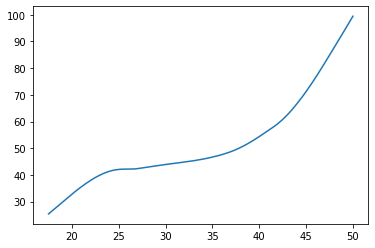
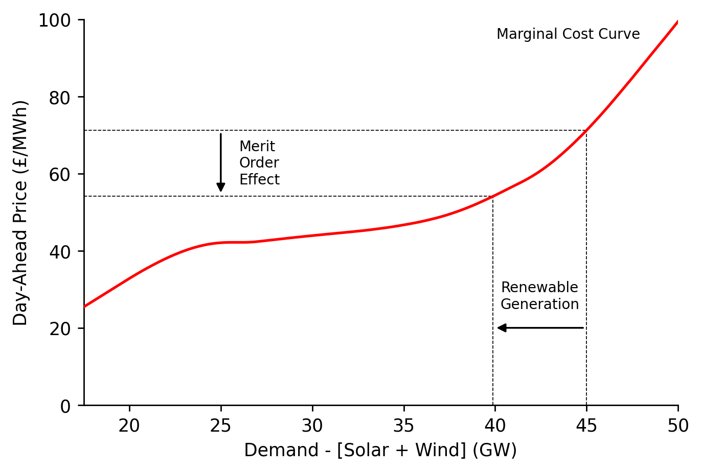

# Tables & Figures Generation


[](https://notebooks.gesis.org/binder/v2/gh/AyrtonB/Merit-Order-Effect/main?filepath=nbs%2Fdev-09-tables-and-figures.ipynb)

This notebook provides a programmatic workflow for generating the tables used in the MOE paper, as well as the diagram to show the time-adaptive smoothing weights.

<br>

### Imports

```python
import json
import numpy as np
import pandas as pd

import seaborn as sns
import matplotlib.pyplot as plt

from IPython.display import Latex, JSON

from moepy import eda, lowess
```

<br>

### Tables

##### Power Systems Overview

We'll first load in the DE data

```python
df_DE = eda.load_DE_df('../data/raw/energy_charts.csv', '../data/raw/ENTSOE_DE_price.csv')

df_DE.head()
```


| local_datetime            |   Biomass |   Brown Coal |   Gas |   Hard Coal |   Hydro Power |   Oil |   Others |   Pumped Storage |   Seasonal Storage |   Solar |   Uranium |   Wind |   Net Balance |   demand |   price |
|:--------------------------|----------:|-------------:|------:|------------:|--------------:|------:|---------:|-----------------:|-------------------:|--------:|----------:|-------:|--------------:|---------:|--------:|
| 2010-01-03 23:00:00+00:00 |     3.637 |       16.533 | 4.726 |      10.078 |         2.331 | 0     |        0 |            0.052 |              0.068 |       0 |    16.826 |  0.635 |        -1.229 |   53.657 |     nan |
| 2010-01-04 00:00:00+00:00 |     3.637 |       16.544 | 4.856 |       8.816 |         2.293 | 0     |        0 |            0.038 |              0.003 |       0 |    16.841 |  0.528 |        -1.593 |   51.963 |     nan |
| 2010-01-04 01:00:00+00:00 |     3.637 |       16.368 | 5.275 |       7.954 |         2.299 | 0     |        0 |            0.032 |              0     |       0 |    16.846 |  0.616 |        -1.378 |   51.649 |     nan |
| 2010-01-04 02:00:00+00:00 |     3.637 |       15.837 | 5.354 |       7.681 |         2.299 | 0     |        0 |            0.027 |              0     |       0 |    16.699 |  0.63  |        -1.624 |   50.54  |     nan |
| 2010-01-04 03:00:00+00:00 |     3.637 |       15.452 | 5.918 |       7.498 |         2.301 | 0.003 |        0 |            0.02  |              0     |       0 |    16.635 |  0.713 |        -0.731 |   51.446 |     nan |</div>


<br>

Clean it up then calculate the relevant summary statistics

```python
year = '2019'

s_DE_RES_output = df_DE[['Wind', 'Solar']].sum(axis=1)
s_DE_demand = df_DE['demand']
s_DE_price = df_DE['price']

s_DE_RES_pct = s_DE_RES_output/s_DE_demand

DE_annual_RES_pct = s_DE_RES_pct[year].mean()
DE_annual_demand_avg = s_DE_demand[year].mean()
DE_annual_price_avg = s_DE_price[year].mean()
DE_annual_price_min = s_DE_price[year].min()
DE_annual_price_max = s_DE_price[year].max()

DE_annual_RES_pct, DE_annual_demand_avg, DE_annual_price_avg
```


    (0.325151836935705, 59.04589823059361, 37.668148401826485)


<br>

We'll also estimate the carbon intensity

```python
DE_fuel_to_co2_intensity = {
    'Biomass': 0.39, 
    'Brown Coal': 0.36, 
    'Gas': 0.23, 
    'Hard Coal': 0.34, 
    'Hydro Power': 0, 
    'Oil': 0.28,
    'Others': 0, 
    'Pumped Storage': 0, 
    'Seasonal Storage': 0, 
    'Solar': 0, 
    'Uranium': 0,
    'Wind': 0, 
    'Net Balance': 0 
}

s_DE_emissions_tonnes = (df_DE
                         [DE_fuel_to_co2_intensity.keys()]
                         .multiply(1e3) # converting to MWh
                         .multiply(DE_fuel_to_co2_intensity.values())
                         .sum(axis=1)
                        )

s_DE_emissions_tonnes = s_DE_emissions_tonnes[s_DE_emissions_tonnes>2000]
s_DE_carbon_intensity = s_DE_emissions_tonnes/s_DE_demand.loc[s_DE_emissions_tonnes.index]

DE_annual_emissions_tonnes = s_DE_emissions_tonnes[year].mean()
DE_annual_ci_avg = s_DE_carbon_intensity[year].mean()

DE_annual_emissions_tonnes, DE_annual_ci_avg
```


    (9496.454279394979, 163.22025761797656)


<br>

We'll do the same for GB

```python
# Loading in
df_EI = pd.read_csv('../data/raw/electric_insights.csv')

df_EI = df_EI.set_index('local_datetime')
df_EI.index = pd.to_datetime(df_EI.index, utc=True)

# Extracting RES, demand, and price series
s_GB_RES = df_EI[['wind', 'solar']].sum(axis=1)
s_GB_demand = df_EI['demand']
s_GB_price = df_EI['day_ahead_price']

# Generating carbon intensity series
GB_fuel_to_co2_intensity = {
    'nuclear': 0, 
    'biomass': 0.121, # from EI 
    'coal': 0.921, # DUKES 2018 value
    'gas': 0.377, # DUKES 2018 value (lower than many CCGT estimates, let alone OCGT)
    'hydro': 0, 
    'pumped_storage': 0, 
    'solar': 0,
    'wind': 0,
    'belgian': 0.4,  
    'dutch': 0.474, # from EI 
    'french': 0.053, # from EI 
    'ireland': 0.458, # from EI 
    'northern_ireland': 0.458 # from EI 
}

s_GB_emissions_tonnes = (df_EI
                         [GB_fuel_to_co2_intensity.keys()]
                         .multiply(1e3*0.5) # converting to MWh
                         .multiply(GB_fuel_to_co2_intensity.values())
                         .sum(axis=1)
                        )

s_GB_emissions_tonnes = s_GB_emissions_tonnes[s_GB_emissions_tonnes>2000]
s_GB_carbon_intensity = s_GB_emissions_tonnes/s_GB_demand.loc[s_GB_emissions_tonnes.index]

# Calculating annual averages
GB_annual_emissions_tonnes = s_GB_emissions_tonnes[year].mean()
GB_annual_ci_avg = s_GB_carbon_intensity[year].mean()
GB_annual_RES_pct = (s_GB_RES[year]/s_GB_demand[year]).mean()
GB_annual_demand_avg = s_GB_demand[year].mean()
GB_annual_price_avg = s_GB_price[year].mean()
GB_annual_price_min = s_GB_price[year].min()
GB_annual_price_max = s_GB_price[year].max()
```

<br>

Then combine the results in a single table

```python
system_overview_data = {
    'Germany': {
        'Average Solar/Wind Generation (%)': round(100*DE_annual_RES_pct, 2),
        'Average Demand (GW)': round(DE_annual_demand_avg, 2),
        'Average Price ([EUR,GBP]/MWh)': round(DE_annual_price_avg, 2),
        'Minimum Price ([EUR,GBP]/MWh)': round(DE_annual_price_min, 2),
        'Maximum Price ([EUR,GBP]/MWh)': round(DE_annual_price_max, 2),
        'Average Carbon Intensity  (gCO2/kWh)': round(DE_annual_ci_avg, 2),
    },
    'Great Britain': {
        'Average Solar/Wind Generation (%)': round(100*GB_annual_RES_pct, 2),
        'Average Demand (GW)': round(GB_annual_demand_avg, 2),
        'Average Price ([EUR,GBP]/MWh)': round(GB_annual_price_avg, 2),
        'Minimum Price ([EUR,GBP]/MWh)': round(GB_annual_price_min, 2),
        'Maximum Price ([EUR,GBP]/MWh)': round(GB_annual_price_max, 2),
        'Average Carbon Intensity  (gCO2/kWh)': round(GB_annual_ci_avg, 2),
    }
}

df_system_overview = pd.DataFrame(system_overview_data)

df_system_overview.head()
```


| Unnamed: 0                        |   Germany |   Great Britain |
|:----------------------------------|----------:|----------------:|
| Average Solar/Wind Generation (%) |     32.52 |           24.71 |
| Average Demand (GW)               |     59.05 |           32.58 |
| Average Price ([EUR,GBP]/MWh)     |     37.67 |           41.81 |
| Minimum Price ([EUR,GBP]/MWh)     |    -90.01 |          -72.84 |
| Maximum Price ([EUR,GBP]/MWh)     |    121.46 |          152    |</div>


<br>

Which we'll then output as a LaTeX table

```python
get_lined_column_format = lambda n_cols:''.join(n_cols*['|l']) + '|'

caption = f'Markets overview for {year}'
label = 'table:overview_table'
column_format = get_lined_column_format(df_system_overview.shape[1]+1)

latex_str = df_system_overview.to_latex(column_format=column_format, caption=caption, label=label)

latex_replacements = {
    'CO2': 'CO\\textsubscript{2}',
    '\\\\\n': '\\\\ \\midrule\n',
    'midrule': 'hline',
    'toprule': 'hline',
    'bottomrule': '',
    '\n\\\n': '\n',
    '\\hline\n\\hline': '\\hline'
}

for old, new in latex_replacements.items():
    latex_str = latex_str.replace(old, new)

Latex(latex_str)
```


\begin{table}
\centering
\caption{Markets overview for 2019}
\label{table:overview_table}
\begin{tabular}{|l|l|l|}
\hline
{} &  Germany &  Great Britain \\ \hline
Average Solar/Wind Generation (\%)    &    32.52 &          24.71 \\ \hline
Average Demand (GW)                  &    59.05 &          32.58 \\ \hline
Average Price ([EUR,GBP]/MWh)        &    37.67 &          41.81 \\ \hline
Minimum Price ([EUR,GBP]/MWh)        &   -90.01 &         -72.84 \\ \hline
Maximum Price ([EUR,GBP]/MWh)        &   121.46 &         152.00 \\ \hline
Average Carbon Intensity  (gCO\textsubscript{2}/kWh) &   163.22 &         105.55 \\ \hline
\end{tabular}
\end{table}


<br>

##### Carbon Intensity Estimates

We'll clean up our GB carbon intensity estimates

```python
def clean_idxs(s):
    s.index = s.index.str.replace('_', ' ').str.title()
    return s

df_GB_non0_co2_intensity = (pd
                            .Series(GB_fuel_to_co2_intensity)
                            .replace(0, np.nan)
                            .dropna()
                            .drop(['belgian', 'northern_ireland'])
                            .pipe(clean_idxs)
                            .multiply(1e3)
                            .astype(int)
                            .to_frame()
                            .T
                            .rename({0: 'gCO2/kWh'})
                           )

df_GB_non0_co2_intensity
```


| Unnamed: 0   |   Biomass |   Coal |   Gas |   Dutch |   French |   Ireland |
|:-------------|----------:|-------:|------:|--------:|---------:|----------:|
| gCO2/kWh     |       121 |    921 |   377 |     474 |       53 |       458 |</div>


<br>

And output them as a LaTeX table

```python
caption = 'Carbon intensity factors for fuel-types and interconnection on the GB power system'
label = 'table:GB_co2_intensity_table'
column_format = get_lined_column_format(df_GB_non0_co2_intensity.shape[1]+1)

latex_str = df_GB_non0_co2_intensity.to_latex(column_format=column_format, caption=caption, label=label)

latex_replacements = {
    'CO2': 'CO\\textsubscript{2}',
    '\\\\\n': '\\\\ \\midrule\n',
    'midrule': 'hline',
    'toprule': 'hline',
    'bottomrule': '',
    '\n\\\n': '\n',
    '\\hline\n\\hline': '\\hline'
}

for old, new in latex_replacements.items():
    latex_str = latex_str.replace(old, new)

Latex(latex_str)
```


\begin{table}
\centering
\caption{Carbon intensity factors for fuel-types and interconnection on the GB power system}
\label{table:GB_co2_intensity_table}
\begin{tabular}{|l|l|l|l|l|l|l|}
\hline
{} &  Biomass &  Coal &  Gas &  Dutch &  French &  Ireland \\ \hline
gCO\textsubscript{2}/kWh &      121 &   921 &  377 &    474 &      53 &      458 \\ \hline
\end{tabular}
\end{table}


<br>

We'll then do the same for DE

```python
df_DE_non0_co2_intensity = (pd
                            .Series(DE_fuel_to_co2_intensity)
                            .replace(0, np.nan)
                            .dropna()
                            [['Biomass', 'Brown Coal', 'Hard Coal', 'Gas', 'Oil']]
                            .pipe(clean_idxs)
                            .multiply(1e3)
                            .astype(int)
                            .to_frame()
                            .T
                            .rename({0: 'gCO2/kWh'})
                           )

df_DE_non0_co2_intensity
```


| Unnamed: 0   |   Biomass |   Brown Coal |   Hard Coal |   Gas |   Oil |
|:-------------|----------:|-------------:|------------:|------:|------:|
| gCO2/kWh     |       390 |          360 |         340 |   230 |   280 |</div>


```python
caption = 'Carbon intensity factors for fuel-types and interconnection on the DE power system'
label = 'table:DE_co2_intensity_table'
column_format = get_lined_column_format(df_DE_non0_co2_intensity.shape[1]+1)

latex_str = df_DE_non0_co2_intensity.to_latex(column_format=column_format, caption=caption, label=label)

for old, new in latex_replacements.items():
    latex_str = latex_str.replace(old, new)

Latex(latex_str)
```


\begin{table}
\centering
\caption{Carbon intensity factors for fuel-types and interconnection on the DE power system}
\label{table:DE_co2_intensity_table}
\begin{tabular}{|l|l|l|l|l|l|}
\hline
{} &  Biomass &  Brown Coal &  Hard Coal &  Gas &  Oil \\ \hline
gCO\textsubscript{2}/kWh &      390 &         360 &        340 &  230 &  280 \\ \hline
\end{tabular}
\end{table}


<br>

##### Electricity Price Forecasting Metrics

We'll start by loading in our previously saved model metrics

```python
with open('../data/results/price_model_accuracy_metrics.json', 'r') as fp:
    model_accuracy_metrics = json.load(fp)
    
JSON(model_accuracy_metrics)
```


    <IPython.core.display.JSON object>


<br>

We'll parse the MAE results into a new table

```python
model_accuracy_data = {
    'Germany': {
        'Dispatchable Load': round(model_accuracy_metrics['DE_dispatch']['mean_abs_err'], 2),
        'Total Load': round(model_accuracy_metrics['DE_demand']['mean_abs_err'], 2),
    },
    'Great Britain': {
        'Dispatchable Load': round(model_accuracy_metrics['GB_dispatch']['mean_abs_err'], 2),
        'Total Load': round(model_accuracy_metrics['GB_demand']['mean_abs_err'], 2),
    }
}

df_model_accuracy = pd.DataFrame(model_accuracy_data).T

df_model_accuracy.head()
```


| Unnamed: 0    |   Dispatchable Load |   Total Load |
|:--------------|--------------------:|-------------:|
| Germany       |                5.85 |        18.28 |
| Great Britain |                6.56 |         8.42 |</div>


<br>

Which we'll output as a LaTeX table

```python
caption = 'Price forecasting model accuracy when regressing against dispatchable and total load for GB and DE.'
label = 'table:model_accuracy_table'
column_format = get_lined_column_format(df_model_accuracy.shape[1]+1)

latex_str = df_model_accuracy.to_latex(column_format=column_format, caption=caption, label=label)

for old, new in latex_replacements.items():
    latex_str = latex_str.replace(old, new)

Latex(latex_str)
```


\begin{table}
\centering
\caption{Price forecasting model accuracy when regressing against dispatchable and total load for GB and DE.}
\label{table:model_accuracy_table}
\begin{tabular}{|l|l|l|}
\hline
{} &  Dispatchable Load &  Total Load \\ \hline
Germany       &               5.85 &       18.28 \\ \hline
Great Britain &               6.56 &        8.42 \\ \hline
\end{tabular}
\end{table}


<br>

##### Price and CO2 MOE Results

We'll first load in all of the price and carbon MOE time-series

```python
def set_dt_idx(df, dt_idx_col='local_datetime'):
    df = df.set_index(dt_idx_col)
    df.index = pd.to_datetime(df.index, utc=True)
    
    return df

df_GB_price_results_ts = pd.read_csv('../data/results/GB_price.csv').pipe(set_dt_idx)
df_DE_price_results_ts = pd.read_csv('../data/results/DE_price.csv').pipe(set_dt_idx)
df_GB_carbon_results_ts = pd.read_csv('../data/results/GB_carbon.csv').pipe(set_dt_idx)
df_DE_carbon_results_ts = pd.read_csv('../data/results/DE_carbon.csv').pipe(set_dt_idx)

df_GB_price_results_ts.head()
```


| local_datetime            |   prediction |   counterfactual |   observed |      moe |
|:--------------------------|-------------:|-----------------:|-----------:|---------:|
| 2009-01-01 00:00:00+00:00 |      37.2034 |          37.3134 |      58.05 | 0.109938 |
| 2009-01-01 00:30:00+00:00 |      37.3134 |          37.5351 |      56.33 | 0.221756 |
| 2009-01-01 01:00:00+00:00 |      36.7685 |          36.9851 |      52.98 | 0.216574 |
| 2009-01-01 01:30:00+00:00 |      35.5952 |          35.8076 |      50.39 | 0.212469 |
| 2009-01-01 02:00:00+00:00 |      34.8494 |          35.0631 |      48.7  | 0.213697 |</div>


<br>

We'll then calculate their summary statistics

```python
MOE_results_data = {
    'Germany': {
        'Price ([EUR,GBP]/MWh)': round(df_DE_price_results_ts.loc[year, 'moe'].mean(), 2),
        'Price Reduction (%)': round(100*(df_DE_price_results_ts.loc[year, 'moe']*df_DE['demand']).sum()/((df_DE_price_results_ts.loc[year, 'observed']+df_DE_price_results_ts.loc[year, 'moe'])*df_DE['demand']).sum(), 2),
        'Carbon (Tonnes/h)': round(df_DE_carbon_results_ts.loc[year, 'moe'].mean(), 2),
        'Carbon Reduction (%)': round(100*(df_DE_carbon_results_ts.loc[year, 'moe'].sum()/(df_DE_carbon_results_ts.loc[year, 'observed']+df_DE_carbon_results_ts.loc[year, 'moe']).sum()).mean(), 2)
    },
    'Great Britain': {
        'Price ([EUR,GBP]/MWh)': round(df_GB_price_results_ts.loc[year, 'moe'].mean(), 2),
        'Price Reduction (%)': round(100*(df_GB_price_results_ts.loc[year, 'moe']*df_EI['demand']).sum()/((df_GB_price_results_ts.loc[year, 'observed']+df_GB_price_results_ts.loc[year, 'moe'])*df_EI['demand']).sum(), 2),
        'Carbon (Tonnes/h)': round(df_GB_carbon_results_ts.loc[year, 'moe'].mean(), 2), # doubled to make it the same hourly rate as DE
        'Carbon Reduction (%)': round(100*(df_GB_carbon_results_ts.loc[year, 'moe'].sum()/(df_GB_carbon_results_ts.loc[year, 'observed']+df_GB_carbon_results_ts.loc[year, 'moe']).sum()).mean(), 2)
    }
}

df_MOE_results = (pd
                  .DataFrame(MOE_results_data)
                 )

df_MOE_results.head()
```


| Unnamed: 0            |   Germany |   Great Britain |
|:----------------------|----------:|----------------:|
| Price ([EUR,GBP]/MWh) |     20.53 |            9.8  |
| Price Reduction (%)   |     36.7  |           19.3  |
| Carbon (Tonnes/h)     |   5085.92 |         1637.2  |
| Carbon Reduction (%)  |     34.88 |           33.53 |</div>


<br>

And export the output as a LaTeX table

```python
caption = f'Merit Order Effect results overview for {year} (weighted by volume). Price reduction is expressed in terms of the percentage decrease relative to the counter-factual price that would have occurred with RES generation'
label = 'table:moe_results_table'
column_format = get_lined_column_format(df_MOE_results.shape[1]+1)

latex_str = df_MOE_results.to_latex(column_format=column_format, caption=caption, label=label)

for old, new in latex_replacements.items():
    latex_str = latex_str.replace(old, new)

Latex(latex_str)
```


\begin{table}
\centering
\caption{Merit Order Effect results overview for 2019 (weighted by volume). Price reduction is expressed in terms of the percentage decrease relative to the counter-factual price that would have occurred with RES generation}
\label{table:moe_results_table}
\begin{tabular}{|l|l|l|}
\hline
{} &  Germany &  Great Britain \\ \hline
Price ([EUR,GBP]/MWh) &    20.53 &           9.80 \\ \hline
Price Reduction (\%)   &    36.70 &          19.30 \\ \hline
Carbon (Tonnes/h)     &  5085.92 &        1637.20 \\ \hline
Carbon Reduction (\%)  &    34.88 &          33.53 \\ \hline
\end{tabular}
\end{table}


<br>

##### Literature Review

Lastly we'll create our largest table, containing results from across the literature

```python
lit_results_data = [
    {
        'Study': 'Sensfuss et al. (2008)',
        'MOE': '7.83 €/MWh',
        'Period': '2006',
        'Region': 'Germany',
        'Method': 'ESS',
    },
    {
        'Study': 'Weigt (2009)',
        'MOE': '10 €/MWh',
        'Period': '2006-2008',
        'Region': 'Germany',
        'Method': 'ESS',
    },
    {
        'Study': 'Keles et al. (2013)',
        'MOE': '5.90 €/MWh',
        'Period': '2006–2009',
        'Region': 'Germany',
        'Method': 'RPR',
    },
    {
        'Study': 'Mulder and Scholtens (2013)',
        'MOE': '0.03% (per p.p increase in wind speeds)',
        'Period': '2006–2011',
        'Region': 'Germany',
        'Method': 'RPR',
    },
    {
        'Study': 'Tveten et al. (2013)',
        'MOE': '5.25 €/MWh (solar)',
        'Period': '2006-2011',
        'Region': 'Germany',
        'Method': 'RPR',
    },
    {
        'Study': 'Wurzburg et al. (2013)',
        'MOE': '2%',
        'Period': '2010-2012',
        'Region': 'Germany & Austria',
        'Method': 'RPR',
    },
    {
        'Study': 'Cludius et al. (2014)',
        'MOE': '8 €/MWh',
        'Period': '2010-2012',
        'Region': 'Germany',
        'Method': 'RPR',
    },
    {
        'Study': 'Ketterer (2014)',
        'MOE': '1.46% (per p.p increase in wind generation)',
        'Period': '2012',
        'Region': 'Germany',
        'Method': 'RPR',
    },
    {
        'Study': 'Ederer (2015)',
        'MOE': '1.3% (per annual TWh of wind)',
        'Period': '2006-2014',
        'Region': 'Germany',
        'Method': 'MSS',
    },
#     {
#         'Study': 'Kyritsis et al. (2017)',
#         'MOE': '-',
#         'Period': '2010-2015',
#         'Region': 'Germany',
#         'Method': 'RPR',
#     },
    {
        'Study': 'Bublitz et al. (2017)',
        'MOE': '5.40 €/MWh',
        'Period': '2011-2015',
        'Region': 'Germany',
        'Method': 'ESS',
    },
    {
        'Study': 'Bublitz et al. (2017)',
        'MOE': '6.80 €/MWh',
        'Period': '2011-2015',
        'Region': 'Germany',
        'Method': 'RPR',
    },
    {
        'Study': 'de Miera et al. (2008)',
        'MOE': '25.1%',
        'Period': '2007',
        'Region': 'Spain',
        'Method': 'ESS',
    },
    {
        'Study': 'Gelabert et al. (2011)',
        'MOE': '3.7%',
        'Period': '2005-2012',
        'Region': 'Spain',
        'Method': 'RPR',
    },
    {
        'Study': 'Ciarreta et al. (2014)',
        'MOE': '45 €/MWh',
        'Period': '2012',
        'Region': 'Spain',
        'Method': 'ESS',
    },
    {
        'Study': 'Clo et al. (2015)',
        'MOE': '2.3 €/MWh (solar), 4.2 €/MWh (wind)',
        'Period': '2005–2013',
        'Region': 'Italy',
        'Method': 'RPR',
    },
    {
        'Study': 'Munksgaard and Morthorst (2008)',
        'MOE': '4 €/MWh',
        'Period': '2006',
        'Region': 'Denmark',
        'Method': 'RPR',
    },
#     {
#         'Study': 'Jonsson et al. (2010)',
#         'MOE': '-',
#         'Period': '2006-2007',
#         'Region': 'Denmark',
#         'Method': 'RPR',
#     },
    {
        'Study': 'Denny et al. (2017)',
        'MOE': '3.40 €/MWh (per GWh of wind)',
        'Period': '2009',
        'Region': 'Ireland',
        'Method': 'RPR',
    },
    {
        'Study': 'Lunackova et al. (2017)',
        'MOE': '1.2% (per 10% increase in RES)',
        'Period': '2010-2015',
        'Region': 'Czech Republic',
        'Method': 'RPR',
    },
    {
        'Study': 'Dillig et al. (2016)',
        'MOE': '50.29 €/MWh',
        'Period': '2011-2013',
        'Region': 'Germany',
        'Method': 'MSS',
    },
    {
        'Study': 'McConnell et al. (2013)',
        'MOE': '8.6%',
        'Period': '2009-2010',
        'Region': 'Australia',
        'Method': 'MSS',
    },
    {
        'Study': 'Moreno et al. (2012)',
        'MOE': '-0.018% (per p.p. increase in RES)',
        'Period': '1998–2009',
        'Region': 'EU-27',
        'Method': 'RPR',
    },
    {
        'Study': 'Woo et al. (2011)',
        'MOE': '1.53 $/MWh',
        'Period': '2010',
        'Region': 'Texas',
        'Method': 'RPR',
    },
    {
        'Study': 'Kaufmann and Vaid (2016)',
        'MOE': '1.86 $/MWh (solar)',
        'Period': '2012',
        'Region': 'Massachusetts',
        'Method': 'RPR',
    },
    {
        'Study': 'Woo et al. (2016)',
        'MOE': '5.3 $/MWh (solar) and 3.3 $/MWh (wind) per GWh of RES',
        'Period': '2012-2015',
        'Region': 'California',
        'Method': 'RPR',
    },
    {
        'Study': 'Paraschiv et al. (2014)',
        'MOE': '0.15% (per MWh of RES)',
        'Period': '2010-2013',
        'Region': 'Germany',
        'Method': 'RPR',
    },
    {
        'Study': 'O\'Mahoney and Denny (2011)',
        'MOE': '12%',
        'Period': '2009',
        'Region': 'Ireland',
        'Method': 'RPR',
    },
    {
        'Study': 'Hildmann et al. (2015)',
        'MOE': '18.6 €/MWh',
        'Period': '2013',
        'Region': 'Germany and Austria',
        'Method': 'MSS',
    },
    {
        'Study': 'Gil et al. (2012)',
        'MOE': '9.72 €/MWh',
        'Period': '2007-2010',
        'Region': 'Spain',
        'Method': 'RPR',
    },
#     { # Removed due to language barrier preventing method from being discerned
#         'Study': 'Weber and Woll (2007)',
#         'MOE': '4 €/MWh',
#         'Period': '2006',
#         'Region': 'Germany',
#         'Method': '-',
#     },
    {
        'Study': 'Halttunen et al. (2021)',
        'MOE': '0.631 €/MWh (per p.p. increase in RES)',
        'Period': '2012-2019',
        'Region': 'Germany',
        'Method': 'RPR',
    },
    {
        'Study': 'Halttunen et al. (2021)',
        'MOE': '0.482 €/MWh (per p.p. increase in RES)',
        'Period': '2010-2019',
        'Region': 'Germany',
        'Method': 'RPR',
    }
]

df_lit_results = pd.DataFrame(lit_results_data)

df_lit_results['Study Year'] = df_lit_results['Study'].str.split('(').str[1].str.replace(')', '').astype(int)
df_lit_results = df_lit_results.sort_values(['Method', 'Study Year', 'Study']).drop(columns=['Study Year']).reset_index(drop=True)

df_lit_results.head()
```

    <ipython-input-35-79dbc1b60908>:237: FutureWarning: The default value of regex will change from True to False in a future version. In addition, single character regular expressions will*not* be treated as literal strings when regex=True.
      df_lit_results['Study Year'] = df_lit_results['Study'].str.split('(').str[1].str.replace(')', '').astype(int)
    


|   Unnamed: 0 | Study                  | MOE              | Period    | Region   | Method   |
|-------------:|:-----------------------|:-----------------|:----------|:---------|:---------|
|            0 | Sensfuss et al. (2008) | 7.83 €/MWh | 2006      | Germany  | ESS      |
|            1 | de Miera et al. (2008) | 25.1%            | 2007      | Spain    | ESS      |
|            2 | Weigt (2009)           | 10 €/MWh   | 2006-2008 | Germany  | ESS      |
|            3 | Ciarreta et al. (2014) | 45 €/MWh   | 2012      | Spain    | ESS      |
|            4 | Bublitz et al. (2017)  | 5.40 €/MWh | 2011-2015 | Germany  | ESS      |</div>


<br>

We'll also export this as a LaTeX table

```python
caption = 'Results overview from the MOE literature. All MOE percentages are expressed in terms of the reduction in prices relative to if renewables had not been present on the system.'
label = 'table:lit_results_table'
column_format = get_lined_column_format(df_lit_results.shape[1]+1)

latex_str = df_lit_results.to_latex(column_format=column_format, caption=caption, label=label, index=False)

for old, new in latex_replacements.items():
    latex_str = latex_str.replace(old, new)

Latex(latex_str)
```


\begin{table}
\centering
\caption{Results overview from the MOE literature}
\label{lit_results_table}
\begin{tabular}{|l|l|l|l|l|l|}
\hline
                          Study &                                                MOE &    Period &              Region & Method \\ \hline
         Sensfuss et al. (2008) &                                         7.83 €/MWh &      2006 &             Germany &    ESS \\ \hline
         de Miera et al. (2008) &                                              25.1\% &      2007 &               Spain &    ESS \\ \hline
                   Weigt (2009) &                                           10 €/MWh & 2006-2008 &             Germany &    ESS \\ \hline
         Ciarreta et al. (2014) &                                           45 €/MWh &      2012 &               Spain &    ESS \\ \hline
          Bublitz et al. (2017) &                                         5.40 €/MWh & 2011-2015 &             Germany &    ESS \\ \hline
        McConnell et al. (2013) &                                               8.6\% & 2009-2010 &           Australia &    MSS \\ \hline
                  Ederer (2015) &                      1.3\% (per annual TWh of wind) & 2006-2014 &             Germany &    MSS \\ \hline
         Hildmann et al. (2015) &                                         18.6 €/MWh &      2013 & Germany and Austria &    MSS \\ \hline
           Dillig et al. (2016) &                                        50.29 €/MWh & 2011-2013 &             Germany &    MSS \\ \hline
Munksgaard and Morthorst (2008) &                                            4 €/MWh &      2006 &             Denmark &    RPR \\ \hline
         Gelabert et al. (2011) &                                               3.7\% & 2005-2012 &               Spain &    RPR \\ \hline
     O'Mahoney and Denny (2011) &                                                12\% &      2009 &             Ireland &    RPR \\ \hline
              Woo et al. (2011) &                                         1.53 \$/MWh &      2010 &               Texas &    RPR \\ \hline
              Gil et al. (2012) &                                         9.72 €/MWh & 2007-2010 &               Spain &    RPR \\ \hline
           Moreno et al. (2012) &                 -0.018\% (per p.p. increase in RES) & 1998–2009 &               EU-27 &    RPR \\ \hline
            Keles et al. (2013) &                                         5.90 €/MWh & 2006–2009 &             Germany &    RPR \\ \hline
    Mulder and Scholtens (2013) &            0.03\% (per p.p increase in wind speeds) & 2006–2011 &             Germany &    RPR \\ \hline
           Tveten et al. (2013) &                                 5.25 €/MWh (solar) & 2006-2011 &             Germany &    RPR \\ \hline
         Wurzburg et al. (2013) &                                                 2\% & 2010-2012 &   Germany \& Austria &    RPR \\ \hline
          Cludius et al. (2014) &                                            8 €/MWh & 2010-2012 &             Germany &    RPR \\ \hline
                Ketterer (2014) &        1.46\% (per p.p increase in wind generation) &      2012 &             Germany &    RPR \\ \hline
        Paraschiv et al. (2014) &                             0.15\% (per MWh of RES) & 2010-2013 &             Germany &    RPR \\ \hline
              Clo et al. (2015) &                2.3 €/MWh (solar), 4.2 €/MWh (wind) & 2005–2013 &               Italy &    RPR \\ \hline
       Kaufmann and Vaid (2016) &                                 1.86 \$/MWh (solar) &      2012 &       Massachusetts &    RPR \\ \hline
              Woo et al. (2016) & 5.3 \$/MWh (solar) and 3.3 \$/MWh (wind) per GWh ... & 2012-2015 &          California &    RPR \\ \hline
          Bublitz et al. (2017) &                                         6.80 €/MWh & 2011-2015 &             Germany &    RPR \\ \hline
            Denny et al. (2017) &                       3.40 €/MWh (per GWh of wind) &      2009 &             Ireland &    RPR \\ \hline
        Lunackova et al. (2017) &                     1.2\% (per 10\% increase in RES) & 2010-2015 &      Czech Republic &    RPR \\ \hline
        Halttunen et al. (2021) &             0.631 €/MWh (per p.p. increase in RES) & 2012-2019 &             Germany &    RPR \\ \hline
        Halttunen et al. (2021) &             0.482 €/MWh (per p.p. increase in RES) & 2010-2019 &             Germany &    RPR \\ \hline
\end{tabular}
\end{table}


<br>

### Figures

##### Time Dimension Hyper-Parameters

We'll create a plot showing an example of how regression dates are converted into weightings for the time-series

```python
x = np.linspace(0, 1, 150)
centers = [0.3, 0.5, 0.7]

# Plotting
fig, ax = plt.subplots(dpi=250, figsize=(8, 4))

for center in centers:
    dist = lowess.get_dist(x, center)
    dist_threshold = lowess.get_dist_threshold(dist, frac=0.3)
    weights = lowess.dist_to_weights(dist, dist_threshold)

    ax.plot(x, weights, color='k')
    
x_pos = 0.4
ax.annotate('Interval', xy=(x_pos, 0.95), xytext=(x_pos, 1.00), xycoords='axes fraction', 
            fontsize=6.5, ha='center', va='bottom',
            bbox=dict(boxstyle='square', fc='white'),
            arrowprops=dict(arrowstyle='-[, widthB=7.0, lengthB=1.5', lw=1.0))
    
x_pos = 0.5
ax.annotate('Bandwidth', xy=(x_pos, 0.06), xytext=(x_pos, 0.11), xycoords='axes fraction', 
            fontsize=9.5, ha='center', va='bottom',
            bbox=dict(boxstyle='square', fc='white'),
            arrowprops=dict(arrowstyle='-[, widthB=7.0, lengthB=1.5', lw=1.0))

ax.set_xlim(0, 1)
ax.set_ylim(0, 1.1)
eda.hide_spines(ax)
ax.set_xlabel('Data Fraction')
ax.set_ylabel('Relative Weighting')
```


    Text(0, 0.5, 'Relative Weighting')


<br>

##### Merit Order Effect Diagram

We'll start by pre-processing the data and filtering for the 16/17 winter

```python
df_EI_model = df_EI.loc['2016-12':'2017-01', ['day_ahead_price', 'demand', 'solar', 'wind']].dropna()

s_demand = df_EI_model['demand']
s_price = df_EI_model['day_ahead_price']
s_dispatchable = df_EI_model['demand'] - df_EI_model[['solar', 'wind']].sum(axis=1)
```

<br>

We'll now fit our model

```python
x_pred = np.linspace(17.5, 50, 326)

y_pred = lowess.lowess_fit_and_predict(s_dispatchable.values, 
                                       s_price.values, 
                                       frac=0.3, 
                                       num_fits=30, 
                                       x_pred=x_pred)

s_pred = pd.Series(y_pred, index=x_pred)
s_pred.index = pd.Series(s_pred.index).round(1).values

s_pred.plot()
```


    <AxesSubplot:>





<br>

Next we can simulate how the price would change from a demand of 45 GW using the average RES output

```python
residual_demand_without_RES =  45
residual_demand_with_RES = residual_demand_without_RES - (s_demand-s_dispatchable).mean()

price_with_RES = s_pred.loc[round(residual_demand_with_RES, 1)]
price_without_RES = s_pred.loc[round(residual_demand_without_RES, 1)]

round(price_with_RES, 2), round(price_without_RES, 2)
```


    (54.13, 71.22)


<br>

We're now ready to plot how the intersection between supply and residual demand changes, with annotations explaining the drivers and effects

```python
ylim = (0, 100)
xlim = (17.5, 50)
intersection_linestyle = 'k--'
linewidth = 0.5

# Plotting
fig, ax = plt.subplots(dpi=250)

s_pred.plot(linewidth=1.5, color='r', ax=ax, zorder=3)
ax.plot([residual_demand_without_RES, residual_demand_without_RES], [ylim[0], price_without_RES], intersection_linestyle, linewidth=linewidth)
ax.plot([residual_demand_with_RES, residual_demand_with_RES], [ylim[0], price_with_RES], intersection_linestyle, linewidth=linewidth)
ax.plot([xlim[0], residual_demand_without_RES], [price_without_RES, price_without_RES], intersection_linestyle, linewidth=linewidth)
ax.plot([xlim[0], residual_demand_with_RES], [price_with_RES, price_with_RES], intersection_linestyle, linewidth=linewidth)

ax.set_xlim(*xlim)
ax.set_ylim(*ylim)
eda.hide_spines(ax)
ax.set_xlabel('Demand - [Solar + Wind] (GW)')
ax.set_ylabel('Day-Ahead Price (£/MWh)')

ax.annotate('Marginal Cost Curve', xy=(44, 95), ha='center', size=8)

ax.annotate('Renewable\nGeneration', xy=((residual_demand_without_RES+residual_demand_with_RES)/2, 25), ha='center', size=8)
ax.annotate('', xy=(residual_demand_with_RES, 20), xytext=(residual_demand_without_RES, 20), arrowprops={'arrowstyle': '-|>', 'color': 'k'}, xycoords=('data'))

ax.annotate('Merit\nOrder\nEffect', xy=(26, (price_with_RES+price_without_RES)/2), va='center', size=8)
ax.annotate('', xy=(25, price_with_RES), xytext=(25, price_without_RES), arrowprops={'arrowstyle': '-|>', 'color': 'k'}, xycoords=('data'))

fig.savefig('../img/MOE_diagram.png', dpi=250)
```




