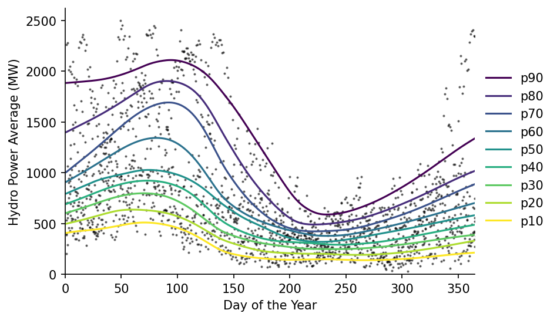
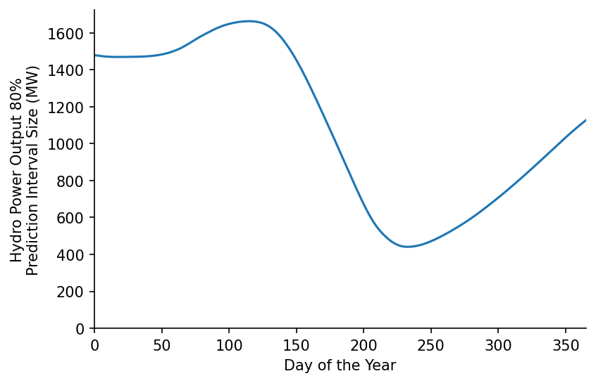

# Quantile Predictions


[](https://notebooks.gesis.org/binder/v2/gh/AyrtonB/Merit-Order-Effect/main?filepath=nbs%2Fug-01-quantile.ipynb)

In this example we'll use power output data from Portugese hydro-plants to demonstrate how the quantile LOWESS model can be used.

<br>

### Imports

```python
import pandas as pd

import matplotlib.pyplot as plt

from moepy import lowess, eda
```

<br>

### Loading Data

We'll start by reading in the Portugese hydro output data

```python
df_portugal_hydro = pd.read_csv('../data/lowess_examples/portugese_hydro.csv')

df_portugal_hydro.index = pd.to_datetime(df_portugal_hydro['datetime'])
df_portugal_hydro = df_portugal_hydro.drop(columns='datetime')

df_portugal_hydro['day_of_the_year'] = df_portugal_hydro.index.dayofyear
df_portugal_hydro = df_portugal_hydro.resample('D').mean()
df_portugal_hydro = df_portugal_hydro.rename(columns={'power_MW': 'average_power_MW'})

df_portugal_hydro.head()
```


<div>
<style scoped>
    .dataframe tbody tr th:only-of-type {
        vertical-align: middle;
    }

    .dataframe tbody tr th {
        vertical-align: top;
    }

    .dataframe thead th {
        text-align: right;
    }
</style>
<table border="1" class="dataframe">
  <thead>
    <tr style="text-align: right;">
      <th></th>
      <th>average_power_MW</th>
      <th>day_of_the_year</th>
    </tr>
    <tr>
      <th>datetime</th>
      <th></th>
      <th></th>
    </tr>
  </thead>
  <tbody>
    <tr>
      <th>2015-01-01</th>
      <td>698.500000</td>
      <td>1</td>
    </tr>
    <tr>
      <th>2015-01-02</th>
      <td>1065.750000</td>
      <td>2</td>
    </tr>
    <tr>
      <th>2015-01-03</th>
      <td>905.125000</td>
      <td>3</td>
    </tr>
    <tr>
      <th>2015-01-04</th>
      <td>795.708333</td>
      <td>4</td>
    </tr>
    <tr>
      <th>2015-01-05</th>
      <td>1141.625000</td>
      <td>5</td>
    </tr>
  </tbody>
</table>
</div>


<br>

### Quantile LOWESS

We now just need to feed this data into our `quantile_model` wrapper

```python
# Estimating the quantiles
df_quantiles = lowess.quantile_model(df_portugal_hydro['day_of_the_year'].values,
                                     df_portugal_hydro['average_power_MW'].values,
                                     frac=0.4, num_fits=40)

# Cleaning names and sorting for plotting
df_quantiles.columns = [f'p{int(col*100)}' for col in df_quantiles.columns]
df_quantiles = df_quantiles[df_quantiles.columns[::-1]]

df_quantiles.head()
```


<div><span class="Text-label" style="display:inline-block; overflow:hidden; white-space:nowrap; text-overflow:ellipsis; min-width:0; max-width:15ex; vertical-align:middle; text-align:right"></span>
<progress style="width:60ex" max="9" value="9" class="Progress-main"/></progress>
<span class="Progress-label"><strong>100%</strong></span>
<span class="Iteration-label">9/9</span>
<span class="Time-label">[00:16<00:02, 1.73s/it]</span></div>


<div>
<style scoped>
    .dataframe tbody tr th:only-of-type {
        vertical-align: middle;
    }

    .dataframe tbody tr th {
        vertical-align: top;
    }

    .dataframe thead th {
        text-align: right;
    }
</style>
<table border="1" class="dataframe">
  <thead>
    <tr style="text-align: right;">
      <th></th>
      <th>p90</th>
      <th>p80</th>
      <th>p70</th>
      <th>p60</th>
      <th>p50</th>
      <th>p40</th>
      <th>p30</th>
      <th>p20</th>
      <th>p10</th>
    </tr>
    <tr>
      <th>x</th>
      <th></th>
      <th></th>
      <th></th>
      <th></th>
      <th></th>
      <th></th>
      <th></th>
      <th></th>
      <th></th>
    </tr>
  </thead>
  <tbody>
    <tr>
      <th>1</th>
      <td>1885.079172</td>
      <td>1400.781601</td>
      <td>1006.972631</td>
      <td>910.768786</td>
      <td>795.474566</td>
      <td>693.000758</td>
      <td>604.221026</td>
      <td>498.095705</td>
      <td>407.170002</td>
    </tr>
    <tr>
      <th>2</th>
      <td>1885.932585</td>
      <td>1406.291952</td>
      <td>1015.762933</td>
      <td>917.073552</td>
      <td>800.254803</td>
      <td>697.120909</td>
      <td>607.520973</td>
      <td>500.673220</td>
      <td>409.021489</td>
    </tr>
    <tr>
      <th>3</th>
      <td>1886.799899</td>
      <td>1411.805229</td>
      <td>1024.541485</td>
      <td>923.369568</td>
      <td>805.008381</td>
      <td>701.225043</td>
      <td>610.814367</td>
      <td>503.239239</td>
      <td>410.866080</td>
    </tr>
    <tr>
      <th>4</th>
      <td>1887.680853</td>
      <td>1417.321378</td>
      <td>1033.310416</td>
      <td>929.659353</td>
      <td>809.738103</td>
      <td>705.316516</td>
      <td>614.104565</td>
      <td>505.797108</td>
      <td>412.694541</td>
    </tr>
    <tr>
      <th>5</th>
      <td>1888.568977</td>
      <td>1422.837956</td>
      <td>1042.075556</td>
      <td>935.951679</td>
      <td>814.455951</td>
      <td>709.409014</td>
      <td>617.404051</td>
      <td>508.358906</td>
      <td>414.485478</td>
    </tr>
  </tbody>
</table>
</div>


<br>

We can then visualise the estimated quantile fits of the data

```python
fig, ax = plt.subplots(dpi=150)

ax.scatter(df_portugal_hydro['day_of_the_year'], df_portugal_hydro['average_power_MW'], s=1, color='k', alpha=0.5)
df_quantiles.plot(cmap='viridis', legend=False, ax=ax)

eda.hide_spines(ax)
ax.legend(frameon=False, bbox_to_anchor=(1, 0.8))
ax.set_xlabel('Day of the Year')
ax.set_ylabel('Hydro Power Average (MW)')
ax.set_xlim(0, 365)
ax.set_ylim(0)
```


    (0.0, 2620.8375)





<br>

We can also ask questions like: "what day of a standard year would the lowest power output be recorded?"

```python
scenario = 'p50'

print(f'In a {scenario} year the lowest hydro power output will most likely fall on day {df_quantiles[scenario].idxmin()}')
```

    In a p50 year the lowest hydro power output will most likely fall on day 228
    

<br>

We can also identify the peridos when our predictions will have the greatest uncertainty

```python
s_80pct_pred_intvl = df_quantiles['p90'] - df_quantiles['p10']

print(f'Day {s_80pct_pred_intvl.idxmax()} is most likely to have the greatest variation in hydro power output')

# Plotting
fig, ax = plt.subplots(dpi=150)

s_80pct_pred_intvl.plot(ax=ax)

eda.hide_spines(ax)
ax.set_xlabel('Day of the Year')
ax.set_ylabel('Hydro Power Output 80%\nPrediction Interval Size (MW)')
ax.set_xlim(0, 365)
ax.set_ylim(0)
```

    Day 115 is most likely to have the greatest variation in hydro power output
    


    (0.0, 1724.0724938300584)




