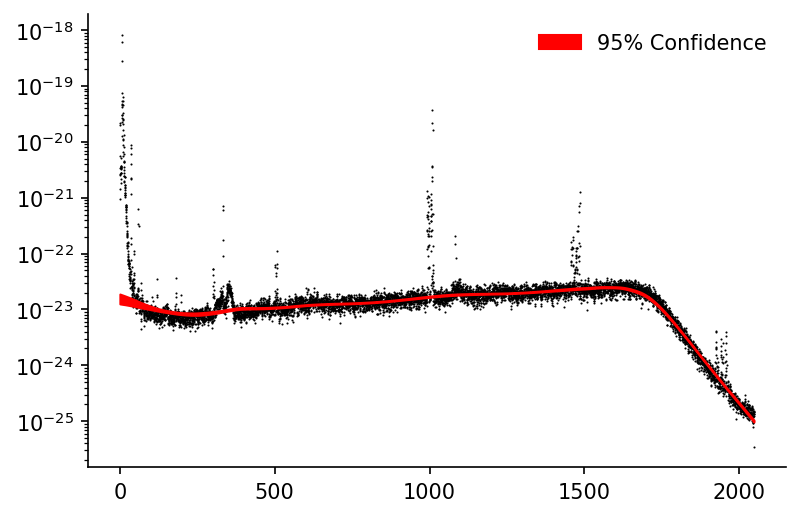
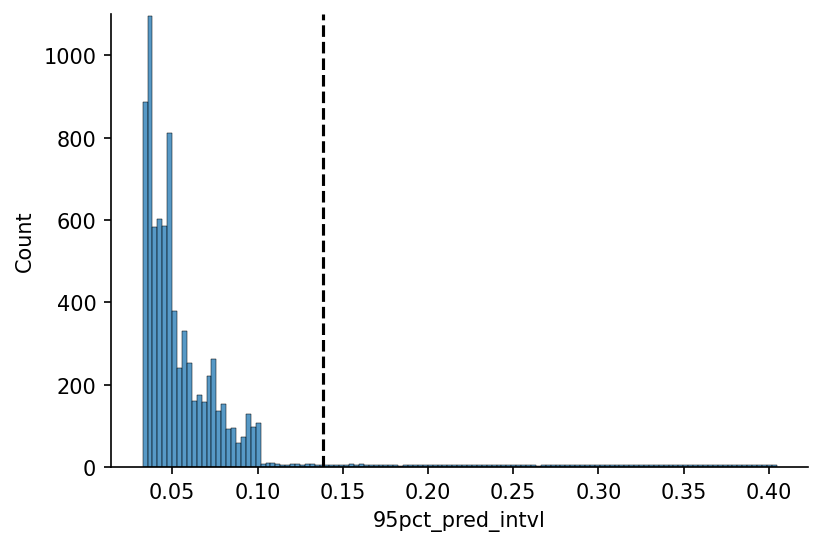

# Bootstrapped LOWESS for Confidence Intervals


[](https://notebooks.gesis.org/binder/v2/gh/AyrtonB/Merit-Order-Effect/main?filepath=nbs%2Fug-02-confidence.ipynb)

This notebook outlines how to use the `moepy` library to generate confidence intervals around the LOWESS estimates, using the famous LIGO gravitationl wave data as an example. 

N.b. I have no expertise of signal processing in this particular context, this is merely an example of how LOWESS confidence intervals can be used to limit the domain of your prediction to where you have greatest certainty in it.

<br>

### Imports

```python
import numpy as np
import pandas as pd

import seaborn as sns
import matplotlib.pyplot as plt

from moepy import lowess, eda
```

<br>

### Loading Data

We'll start by loading the LIGO data in

```python
df_LIGO = pd.read_csv('../data/lowess_examples/LIGO.csv')

df_LIGO.head()
```


<div>
<style scoped>
    .dataframe tbody tr th:only-of-type {
        vertical-align: middle;
    }

    .dataframe tbody tr th {
        vertical-align: top;
    }

    .dataframe thead th {
        text-align: right;
    }
</style>
<table border="1" class="dataframe">
  <thead>
    <tr style="text-align: right;">
      <th></th>
      <th>frequency</th>
      <th>L1</th>
      <th>H1</th>
      <th>H1_smoothed</th>
    </tr>
  </thead>
  <tbody>
    <tr>
      <th>0</th>
      <td>0.00</td>
      <td>2.383528e-18</td>
      <td>2.215686e-20</td>
      <td>3.240000e-18</td>
    </tr>
    <tr>
      <th>1</th>
      <td>0.25</td>
      <td>1.685617e-18</td>
      <td>2.013959e-20</td>
      <td>2.644898e-19</td>
    </tr>
    <tr>
      <th>2</th>
      <td>0.50</td>
      <td>1.242968e-21</td>
      <td>5.518498e-21</td>
      <td>9.000000e-20</td>
    </tr>
    <tr>
      <th>3</th>
      <td>0.75</td>
      <td>6.677796e-22</td>
      <td>2.546120e-21</td>
      <td>4.484429e-20</td>
    </tr>
    <tr>
      <th>4</th>
      <td>1.00</td>
      <td>6.800320e-22</td>
      <td>3.339454e-21</td>
      <td>2.677686e-20</td>
    </tr>
  </tbody>
</table>
</div>


<br>

### Baseline Fit

We'll quickly plot the observed data alongside the smoothed estimate provided in the raw data

```python
fig, ax = plt.subplots(dpi=150)

ax.scatter(df_LIGO['frequency'], df_LIGO['H1'], color='k', linewidth=0, s=1)
ax.plot(df_LIGO['frequency'], df_LIGO['H1_smoothed'], color='r', alpha=1, label='Existing Smoothing')

ax.set_yscale('log')
ax.legend(frameon=False)
eda.hide_spines(ax)
```


<br>

### LOWESS Fit

```python
x = df_LIGO['frequency'].values
y = np.log(df_LIGO['H1']).values

df_bootstrap = lowess.bootstrap_model(x, y, num_runs=500, frac=0.2, num_fits=30)

df_bootstrap.head()
```


<div><span class="Text-label" style="display:inline-block; overflow:hidden; white-space:nowrap; text-overflow:ellipsis; min-width:0; max-width:15ex; vertical-align:middle; text-align:right"></span>
<progress style="width:60ex" max="500" value="500" class="Progress-main"/></progress>
<span class="Progress-label"><strong>100%</strong></span>
<span class="Iteration-label">500/500</span>
<span class="Time-label">[01:37<00:00, 0.19s/it]</span></div>


<div>
<style scoped>
    .dataframe tbody tr th:only-of-type {
        vertical-align: middle;
    }

    .dataframe tbody tr th {
        vertical-align: top;
    }

    .dataframe thead th {
        text-align: right;
    }
</style>
<table border="1" class="dataframe">
  <thead>
    <tr style="text-align: right;">
      <th>bootstrap_run</th>
      <th>0</th>
      <th>1</th>
      <th>2</th>
      <th>3</th>
      <th>4</th>
      <th>5</th>
      <th>6</th>
      <th>7</th>
      <th>8</th>
      <th>9</th>
      <th>...</th>
      <th>490</th>
      <th>491</th>
      <th>492</th>
      <th>493</th>
      <th>494</th>
      <th>495</th>
      <th>496</th>
      <th>497</th>
      <th>498</th>
      <th>499</th>
    </tr>
    <tr>
      <th>x</th>
      <th></th>
      <th></th>
      <th></th>
      <th></th>
      <th></th>
      <th></th>
      <th></th>
      <th></th>
      <th></th>
      <th></th>
      <th></th>
      <th></th>
      <th></th>
      <th></th>
      <th></th>
      <th></th>
      <th></th>
      <th></th>
      <th></th>
      <th></th>
      <th></th>
    </tr>
  </thead>
  <tbody>
    <tr>
      <th>0.00</th>
      <td>-52.522688</td>
      <td>-52.723992</td>
      <td>-52.403880</td>
      <td>-52.518329</td>
      <td>-52.589661</td>
      <td>-52.471483</td>
      <td>-52.530602</td>
      <td>-52.472742</td>
      <td>-52.553386</td>
      <td>-52.521174</td>
      <td>...</td>
      <td>-52.553563</td>
      <td>-52.679811</td>
      <td>-52.508000</td>
      <td>-52.553981</td>
      <td>-52.434621</td>
      <td>-52.602228</td>
      <td>-52.354963</td>
      <td>-52.503137</td>
      <td>-52.571861</td>
      <td>-52.505725</td>
    </tr>
    <tr>
      <th>0.25</th>
      <td>-52.523537</td>
      <td>-52.724512</td>
      <td>-52.404898</td>
      <td>-52.519205</td>
      <td>-52.590425</td>
      <td>-52.472350</td>
      <td>-52.531392</td>
      <td>-52.473654</td>
      <td>-52.554215</td>
      <td>-52.521989</td>
      <td>...</td>
      <td>-52.554409</td>
      <td>-52.680397</td>
      <td>-52.508822</td>
      <td>-52.554718</td>
      <td>-52.435565</td>
      <td>-52.602946</td>
      <td>-52.356110</td>
      <td>-52.503988</td>
      <td>-52.572670</td>
      <td>-52.506609</td>
    </tr>
    <tr>
      <th>0.50</th>
      <td>-52.524386</td>
      <td>-52.725032</td>
      <td>-52.405915</td>
      <td>-52.520080</td>
      <td>-52.591188</td>
      <td>-52.473217</td>
      <td>-52.532181</td>
      <td>-52.474565</td>
      <td>-52.555043</td>
      <td>-52.522803</td>
      <td>...</td>
      <td>-52.555255</td>
      <td>-52.680982</td>
      <td>-52.509644</td>
      <td>-52.555453</td>
      <td>-52.436508</td>
      <td>-52.603663</td>
      <td>-52.357256</td>
      <td>-52.504839</td>
      <td>-52.573478</td>
      <td>-52.507491</td>
    </tr>
    <tr>
      <th>0.75</th>
      <td>-52.525234</td>
      <td>-52.725552</td>
      <td>-52.406931</td>
      <td>-52.520954</td>
      <td>-52.591950</td>
      <td>-52.474084</td>
      <td>-52.532970</td>
      <td>-52.475476</td>
      <td>-52.555870</td>
      <td>-52.523616</td>
      <td>...</td>
      <td>-52.556101</td>
      <td>-52.681567</td>
      <td>-52.510465</td>
      <td>-52.556189</td>
      <td>-52.437451</td>
      <td>-52.604380</td>
      <td>-52.358401</td>
      <td>-52.505690</td>
      <td>-52.574286</td>
      <td>-52.508373</td>
    </tr>
    <tr>
      <th>1.00</th>
      <td>-52.526081</td>
      <td>-52.726071</td>
      <td>-52.407947</td>
      <td>-52.521828</td>
      <td>-52.592713</td>
      <td>-52.474949</td>
      <td>-52.533758</td>
      <td>-52.476386</td>
      <td>-52.556697</td>
      <td>-52.524429</td>
      <td>...</td>
      <td>-52.556946</td>
      <td>-52.682152</td>
      <td>-52.511286</td>
      <td>-52.556923</td>
      <td>-52.438393</td>
      <td>-52.605096</td>
      <td>-52.359546</td>
      <td>-52.506540</td>
      <td>-52.575093</td>
      <td>-52.509255</td>
    </tr>
  </tbody>
</table>
<p>5 rows × 500 columns</p>
</div>


<br>

Using `df_bootstrap` we can calculate the confidence interval of our predictions, the Pandas DataFrame `quantile` method makes this particularly simple.

```python
df_conf_intvl = lowess.get_confidence_interval(df_bootstrap, conf_pct=0.95)

# Plotting
fig, ax = plt.subplots(dpi=150)

ax.scatter(df_LIGO['frequency'], df_LIGO['H1'], color='k', linewidth=0, s=1, zorder=1)
ax.fill_between(df_conf_intvl.index, np.exp(df_conf_intvl['min']), np.exp(df_conf_intvl['max']), color='r', alpha=1, label='95% Confidence')

ax.set_yscale('log')
ax.legend(frameon=False)
eda.hide_spines(ax)
```





<br>

We can see that we capture the middle and higher frequencies fairly well but due to the smaller number of data-points in the low frequency region the LOWESS fit is unable to model it as well. The `frac` could be decreased to improve this but then comes at the cost of processing more inaccurate estimates in the other regions. One way to address this could be to introduce an option where `frac` can be varied for each local regression model.

For now we'll just limit our prediction to the domain where the confidence interval is 'reasonable', we'll start by calculating the 95% confidence interval.

```python
s_95pct_conf_intvl = (df_bootstrap
                      .quantile([0.025, 0.975], axis=1)
                      .diff()
                      .dropna(how='all')
                      .T
                      .rename(columns={0.975: '95pct_pred_intvl'})
                      ['95pct_pred_intvl']
                     )

s_95pct_conf_intvl
```


    x
    0.00       0.404673
    0.25       0.404049
    0.50       0.403448
    0.75       0.402822
    1.00       0.402187
                 ...   
    2047.00    0.077741
    2047.25    0.077827
    2047.50    0.077913
    2047.75    0.077999
    2048.00    0.078085
    Name: 95pct_pred_intvl, Length: 8193, dtype: float64


<br>

We'll now define the 'reasonable' confidence interval threshold, in this case using the value that icludes 95% of the values.

```python
x_max_pct = 0.95

# Plotting
fig, ax = plt.subplots(dpi=150)

hist = sns.histplot(s_95pct_conf_intvl, ax=ax)

y_max = np.ceil(max([h.get_height() for h in hist.patches])/1e2)*1e2
x_max = s_95pct_conf_intvl.quantile(x_max_pct)
ax.plot([x_max, x_max], [0, y_max], linestyle='--', color='k', label='95% Coverage')

ax.set_ylim(0, y_max)
eda.hide_spines(ax)
```





<br>

We'll then only plot our confidence interval when it's in this 'reasonable' range

```python
conf_intvl_idxs_to_keep = (s_95pct_conf_intvl<x_max).replace(False, np.nan).dropna().index

# Plotting
fig, ax = plt.subplots(dpi=150)

ax.scatter(df_LIGO['frequency'], df_LIGO['H1'], color='k', linewidth=0, s=1, zorder=1)
ax.fill_between(conf_intvl_idxs_to_keep, np.exp(df_conf_intvl.loc[conf_intvl_idxs_to_keep, 'min']), np.exp(df_conf_intvl.loc[conf_intvl_idxs_to_keep, 'max']), color='r', alpha=1, label='95% Confidence')

ax.set_yscale('log')
ax.legend(frameon=False)
eda.hide_spines(ax)
```


