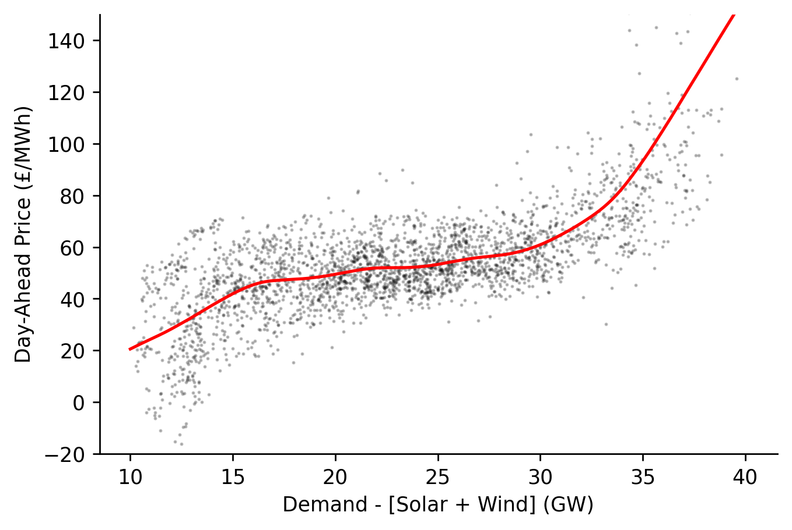

# Marginal Cost Curve for Dispatchable Power in Great Britain


[](https://notebooks.gesis.org/binder/v2/gh/AyrtonB/Merit-Order-Effect/main?filepath=nbs%2Fug-04-gb-mcc.ipynb)

In this example we'll estimate the marginal cost curve over the last two months for dispatchable power in Great Britain using data from Electric Insights.

<br>

### Imports

```python
import numpy as np
import pandas as pd

import matplotlib.pyplot as plt

from moepy import retrieval, eda, lowess
```

<br>

### Data Loading

We'll start by loading in the necessary data from Electric Insights

```python
%%time

current_dt = pd.Timestamp.now()
start_date = (current_dt-pd.Timedelta(weeks=8)).strftime('%Y-%m-%d %H:%M')
end_date = current_dt.strftime('%Y-%m-%d %H:%M')

renaming_dict = {
    'pumpedStorage' : 'pumped_storage',
    'northernIreland' : 'northern_ireland',
    'windOnshore': 'wind_onshore',
    'windOffshore': 'wind_offshore',
    'prices_ahead' : 'day_ahead_price',
    'prices' : 'imbalance_price',
    'temperatures' : 'temperature',
    'totalInGperkWh' : 'gCO2_per_kWh',
    'totalInTperh' : 'TCO2_per_h'
}

df = retrieval.retrieve_streams_df(start_date, end_date, renaming_dict=renaming_dict)

df.head()
```

    Wall time: 7.75 s
    


<div>
<style scoped>
    .dataframe tbody tr th:only-of-type {
        vertical-align: middle;
    }

    .dataframe tbody tr th {
        vertical-align: top;
    }

    .dataframe thead th {
        text-align: right;
    }
</style>
<table border="1" class="dataframe">
  <thead>
    <tr style="text-align: right;">
      <th></th>
      <th>day_ahead_price</th>
      <th>SP</th>
      <th>imbalance_price</th>
      <th>valueSum</th>
      <th>temperature</th>
      <th>TCO2_per_h</th>
      <th>gCO2_per_kWh</th>
      <th>nuclear</th>
      <th>biomass</th>
      <th>coal</th>
      <th>...</th>
      <th>demand</th>
      <th>pumped_storage</th>
      <th>wind_onshore</th>
      <th>wind_offshore</th>
      <th>belgian</th>
      <th>dutch</th>
      <th>french</th>
      <th>ireland</th>
      <th>northern_ireland</th>
      <th>irish</th>
    </tr>
    <tr>
      <th>local_datetime</th>
      <th></th>
      <th></th>
      <th></th>
      <th></th>
      <th></th>
      <th></th>
      <th></th>
      <th></th>
      <th></th>
      <th></th>
      <th></th>
      <th></th>
      <th></th>
      <th></th>
      <th></th>
      <th></th>
      <th></th>
      <th></th>
      <th></th>
      <th></th>
      <th></th>
    </tr>
  </thead>
  <tbody>
    <tr>
      <th>2021-02-01 00:00:00+00:00</th>
      <td>51.99</td>
      <td>1</td>
      <td>68.95</td>
      <td>68.95</td>
      <td>2.9</td>
      <td>4797.759</td>
      <td>175.799988</td>
      <td>5.564</td>
      <td>1.945</td>
      <td>0.465</td>
      <td>...</td>
      <td>27.291009</td>
      <td>0.0</td>
      <td>3.028282</td>
      <td>3.514363</td>
      <td>0.902</td>
      <td>0.0</td>
      <td>1.806</td>
      <td>0.0</td>
      <td>0.018</td>
      <td>-0.050</td>
    </tr>
    <tr>
      <th>2021-02-01 00:30:00+00:00</th>
      <td>54.19</td>
      <td>2</td>
      <td>69.00</td>
      <td>69.00</td>
      <td>2.9</td>
      <td>5149.705</td>
      <td>186.030814</td>
      <td>5.559</td>
      <td>1.963</td>
      <td>0.563</td>
      <td>...</td>
      <td>27.682000</td>
      <td>0.0</td>
      <td>2.903885</td>
      <td>3.447460</td>
      <td>0.902</td>
      <td>0.0</td>
      <td>1.806</td>
      <td>0.0</td>
      <td>0.016</td>
      <td>0.016</td>
    </tr>
    <tr>
      <th>2021-02-01 01:00:00+00:00</th>
      <td>55.07</td>
      <td>3</td>
      <td>75.00</td>
      <td>75.00</td>
      <td>2.9</td>
      <td>5177.972</td>
      <td>189.308716</td>
      <td>5.565</td>
      <td>2.077</td>
      <td>0.680</td>
      <td>...</td>
      <td>27.352000</td>
      <td>0.0</td>
      <td>2.764132</td>
      <td>3.361527</td>
      <td>0.952</td>
      <td>0.0</td>
      <td>1.906</td>
      <td>0.0</td>
      <td>0.018</td>
      <td>0.018</td>
    </tr>
    <tr>
      <th>2021-02-01 01:30:00+00:00</th>
      <td>56.30</td>
      <td>4</td>
      <td>72.00</td>
      <td>72.00</td>
      <td>2.9</td>
      <td>5131.084</td>
      <td>190.891574</td>
      <td>5.563</td>
      <td>2.122</td>
      <td>0.716</td>
      <td>...</td>
      <td>26.879573</td>
      <td>0.0</td>
      <td>2.624037</td>
      <td>3.193860</td>
      <td>0.952</td>
      <td>0.0</td>
      <td>1.906</td>
      <td>0.0</td>
      <td>0.016</td>
      <td>0.016</td>
    </tr>
    <tr>
      <th>2021-02-01 02:00:00+00:00</th>
      <td>56.71</td>
      <td>5</td>
      <td>75.00</td>
      <td>75.00</td>
      <td>2.9</td>
      <td>5105.370</td>
      <td>193.368381</td>
      <td>5.561</td>
      <td>2.134</td>
      <td>0.718</td>
      <td>...</td>
      <td>26.402300</td>
      <td>0.0</td>
      <td>2.417506</td>
      <td>2.934586</td>
      <td>0.926</td>
      <td>0.0</td>
      <td>1.906</td>
      <td>0.0</td>
      <td>0.018</td>
      <td>0.018</td>
    </tr>
  </tbody>
</table>
<p>5 rows × 24 columns</p>
</div>


<br>

We'll quickly visualise the relationship between price and dispatchable load for each half-hour period

```python
df_model = df[['day_ahead_price', 'demand', 'solar', 'wind']].dropna().astype(float)

s_price = df_model['day_ahead_price']
s_dispatchable = df_model['demand'] - df_model[['solar', 'wind']].sum(axis=1)

# Plotting
fig, ax = plt.subplots(dpi=150)

ax.scatter(s_dispatchable, s_price, s=0.5, alpha=0.25, color='k')

ax.set_ylim(-20, 150)
eda.hide_spines(ax)
ax.set_xlabel('Demand - [Wind + Solar] (GW)')
ax.set_ylabel('Price (£/MWh)')
```


    Text(0, 0.5, 'Price (£/MWh)')


<br>

### Marginal Cost Curve Estimation

We're now ready to fit our LOWESS model

```python
x_pred = np.linspace(10, 40, 301)

y_pred = lowess.lowess_fit_and_predict(s_dispatchable.values, 
                                       s_price.values, 
                                       frac=0.25, 
                                       num_fits=25, 
                                       x_pred=x_pred)

pd.Series(y_pred, index=x_pred).plot()
```


    <AxesSubplot:>


<br>

We'll then visualise the estimated fit alongside the historical observations

```python
fig, ax = plt.subplots(dpi=250)

ax.plot(x_pred, y_pred, linewidth=1.5, color='r')
ax.scatter(s_dispatchable, s_price, color='k', s=0.5, alpha=0.25)

ax.set_ylim(-20, 150)
eda.hide_spines(ax)
ax.set_xlabel('Demand - [Solar + Wind] (GW)')
ax.set_ylabel('Day-Ahead Price (£/MWh)')
fig.savefig('../img/latest_gb_mcc.png', dpi=250)
```




