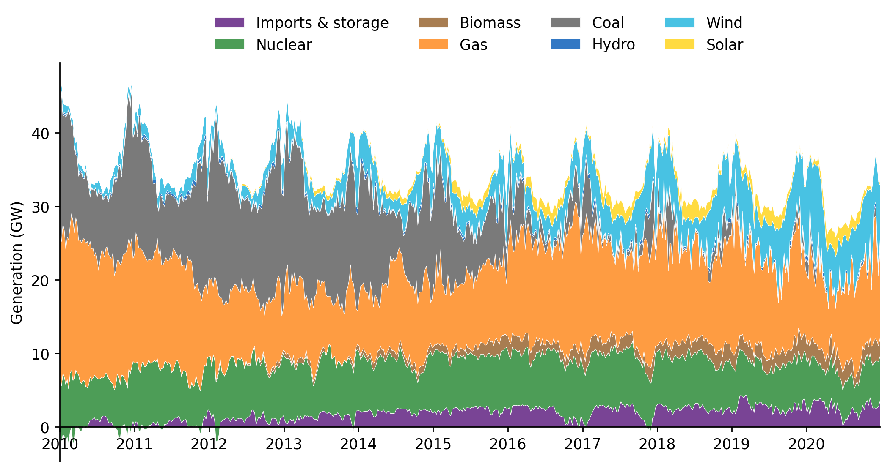
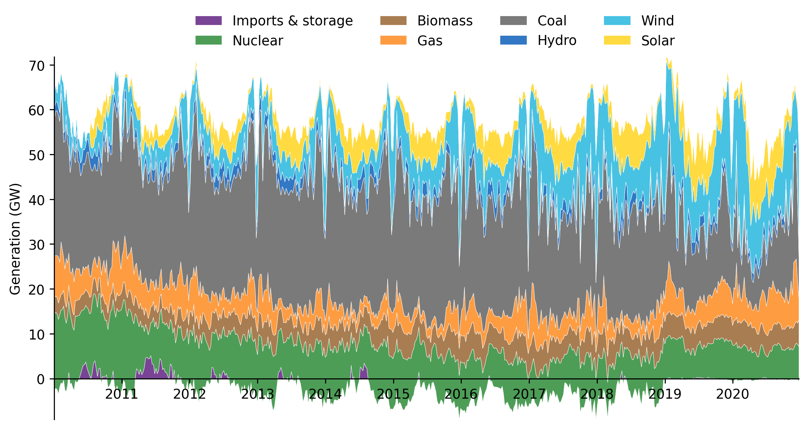

# Data Retrieval


[](https://notebooks.gesis.org/binder/v2/gh/AyrtonB/Merit-Order-Effect/main?filepath=nbs%2Fug-05-data-retrieval.ipynb)

This notebook outlines the retrieval of data from Electric Insights and Energy Charts using the `moepy` library. This data will be used in later user-guide notebooks.

<br>

### Imports

```python
from moepy import retrieval, eda
```

<br>

### Electric Insights

To download data from all of the electric insights streams is as simple as calling `get_EI_data` and specifying the start and end dates. The data will be retrieved in 3 month batches as this is the maximum limit currently allowed by the API, you can change the `freq` parameter to adjust this.

Please save data once downloaded to avoid needless calls to the API.

```python
start_date = '2010-01-01'
end_date = '2020-12-31'

df_EI = retrieval.get_EI_data(start_date, end_date)
df_EI.to_csv('../data/ug/electric_insights.csv')

df_EI.head()
```

    100%|██████████████████████████████████████████████████████████████████████████████████| 45/45 [08:51<00:00, 11.81s/it]
    


| local_datetime            |   day_ahead_price |   SP |   imbalance_price |   valueSum |   temperature |   TCO2_per_h |   gCO2_per_kWh |   nuclear |   biomass |   coal | ...   |   demand |   pumped_storage | wind_onshore   | wind_offshore   |   belgian |   dutch |   french |   ireland |   northern_ireland |   irish |
|:--------------------------|------------------:|-----:|------------------:|-----------:|--------------:|-------------:|---------------:|----------:|----------:|-------:|:------|---------:|-----------------:|:---------------|:----------------|----------:|--------:|---------:|----------:|-------------------:|--------:|
| 2010-01-01 00:00:00+00:00 |             32.91 |    1 |             55.77 |      55.77 |           1.1 |        16268 |            429 |     7.897 |         0 |  9.902 | ...   |   37.948 |           -0.435 | None           | None            |         0 |       0 |    1.963 |         0 |                  0 |  -0.234 |
| 2010-01-01 00:30:00+00:00 |             33.25 |    2 |             59.89 |      59.89 |           1.1 |        16432 |            430 |     7.897 |         0 | 10.074 | ...   |   38.227 |           -0.348 | None           | None            |         0 |       0 |    1.974 |         0 |                  0 |  -0.236 |
| 2010-01-01 01:00:00+00:00 |             32.07 |    3 |             53.15 |      53.15 |           1.1 |        16318 |            431 |     7.893 |         0 | 10.049 | ...   |   37.898 |           -0.424 | None           | None            |         0 |       0 |    1.983 |         0 |                  0 |  -0.236 |
| 2010-01-01 01:30:00+00:00 |             31.99 |    4 |             38.48 |      38.48 |           1.1 |        15768 |            427 |     7.896 |         0 |  9.673 | ...   |   36.918 |           -0.575 | None           | None            |         0 |       0 |    1.983 |         0 |                  0 |  -0.236 |
| 2010-01-01 02:00:00+00:00 |             31.47 |    5 |             37.7  |      37.7  |           1.1 |        15250 |            424 |     7.9   |         0 |  9.37  | ...   |   35.961 |           -0.643 | None           | None            |         0 |       0 |    1.983 |         0 |                  0 |  -0.236 |</div>


<br>

We'll visualise the time-series of output by fuel in the style of [this paper](https://www.sciencedirect.com/science/article/pii/S0301421516307017), the author of which was also a creator of the Electric Insights site.

```python
df_EI_plot = eda.clean_EI_df_for_plot(df_EI, freq='7D')

eda.stacked_fuel_plot(df_EI_plot, dpi=250)
```


    <AxesSubplot:ylabel='Generation (GW)'>





<br>

### Energy Charts

To download fuel generation data from the energy charts site call `get_EC_data` and specify the start and end dates. 

As before, please save data once downloaded.

```python
df_EC = retrieval.get_EC_data(start_date, end_date)
        
df_EC.head()
```

    100%|████████████████████████████████████████████████████████████████████████████████| 576/576 [05:02<00:00,  1.91it/s]
    


| local_datetime            |   Biomass |   Brown Coal |   Gas |   Hard Coal |   Hydro Power |   Oil |   Others |   Pumped Storage |   Seasonal Storage |   Solar |   Uranium |   Wind |   Net Balance |
|:--------------------------|----------:|-------------:|------:|------------:|--------------:|------:|---------:|-----------------:|-------------------:|--------:|----------:|-------:|--------------:|
| 2010-01-04 00:00:00+01:00 |     3.637 |       16.533 | 4.726 |      10.078 |         2.331 | 0     |        0 |            0.052 |              0.068 |       0 |    16.826 |  0.635 |        -1.229 |
| 2010-01-04 01:00:00+01:00 |     3.637 |       16.544 | 4.856 |       8.816 |         2.293 | 0     |        0 |            0.038 |              0.003 |       0 |    16.841 |  0.528 |        -1.593 |
| 2010-01-04 02:00:00+01:00 |     3.637 |       16.368 | 5.275 |       7.954 |         2.299 | 0     |        0 |            0.032 |              0     |       0 |    16.846 |  0.616 |        -1.378 |
| 2010-01-04 03:00:00+01:00 |     3.637 |       15.837 | 5.354 |       7.681 |         2.299 | 0     |        0 |            0.027 |              0     |       0 |    16.699 |  0.63  |        -1.624 |
| 2010-01-04 04:00:00+01:00 |     3.637 |       15.452 | 5.918 |       7.498 |         2.301 | 0.003 |        0 |            0.02  |              0     |       0 |    16.635 |  0.713 |        -0.731 |</div>


<br>

Once again we'll visualise the long-term average output time-series separated by fuel-type

```python
df_EC_plot = eda.clean_EC_df_for_plot(df_EC)
eda.stacked_fuel_plot(df_EC_plot, dpi=250)
```


    <AxesSubplot:ylabel='Generation (GW)'>




