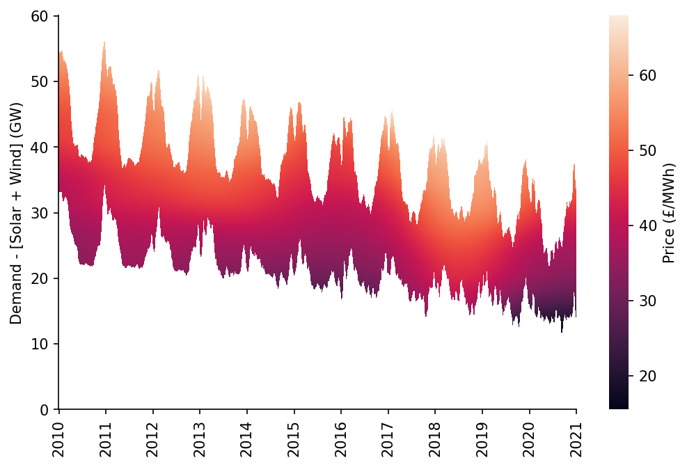

# Estimation of Price Surfaces


[](https://notebooks.gesis.org/binder/v2/gh/AyrtonB/Merit-Order-Effect/main?filepath=nbs%2Fug-06-surface-estimation.ipynb)

This notebook outlines how to use the `lowess.SmoothDates` model to fit a LOWESS estimate where the coefficients change over time.

<br>

### Imports

```python
import pandas as pd
import numpy as np

import matplotlib.pyplot as plt
import seaborn as sns

import pickle

from moepy import lowess, moe, eda, surface
```

<br>

### Data Preparation

We'll first load the data in

```python
df_EI = pd.read_csv('../data/ug/electric_insights.csv')

df_EI['local_datetime'] = pd.to_datetime(df_EI['local_datetime'], utc=True)
df_EI = df_EI.set_index('local_datetime')

df_EI.head()
```


| local_datetime            |   day_ahead_price |   SP |   imbalance_price |   valueSum |   temperature |   TCO2_per_h |   gCO2_per_kWh |   nuclear |   biomass |   coal | ...   |   demand |   pumped_storage |   wind_onshore |   wind_offshore |   belgian |   dutch |   french |   ireland |   northern_ireland |   irish |
|:--------------------------|------------------:|-----:|------------------:|-----------:|--------------:|-------------:|---------------:|----------:|----------:|-------:|:------|---------:|-----------------:|---------------:|----------------:|----------:|--------:|---------:|----------:|-------------------:|--------:|
| 2010-01-01 00:00:00+00:00 |             32.91 |    1 |             55.77 |      55.77 |           1.1 |        16268 |            429 |     7.897 |         0 |  9.902 | ...   |   37.948 |           -0.435 |            nan |             nan |         0 |       0 |    1.963 |         0 |                  0 |  -0.234 |
| 2010-01-01 00:30:00+00:00 |             33.25 |    2 |             59.89 |      59.89 |           1.1 |        16432 |            430 |     7.897 |         0 | 10.074 | ...   |   38.227 |           -0.348 |            nan |             nan |         0 |       0 |    1.974 |         0 |                  0 |  -0.236 |
| 2010-01-01 01:00:00+00:00 |             32.07 |    3 |             53.15 |      53.15 |           1.1 |        16318 |            431 |     7.893 |         0 | 10.049 | ...   |   37.898 |           -0.424 |            nan |             nan |         0 |       0 |    1.983 |         0 |                  0 |  -0.236 |
| 2010-01-01 01:30:00+00:00 |             31.99 |    4 |             38.48 |      38.48 |           1.1 |        15768 |            427 |     7.896 |         0 |  9.673 | ...   |   36.918 |           -0.575 |            nan |             nan |         0 |       0 |    1.983 |         0 |                  0 |  -0.236 |
| 2010-01-01 02:00:00+00:00 |             31.47 |    5 |             37.7  |      37.7  |           1.1 |        15250 |            424 |     7.9   |         0 |  9.37  | ...   |   35.961 |           -0.643 |            nan |             nan |         0 |       0 |    1.983 |         0 |                  0 |  -0.236 |</div>


<br>

Then extract the relevant time-series for our analysis

```python
df_EI_model = df_EI[['day_ahead_price', 'demand', 'solar', 'wind']].dropna()

s_price = df_EI_model['day_ahead_price']
s_dispatchable = df_EI_model['demand'] - df_EI_model[['solar', 'wind']].sum(axis=1)

s_dispatchable.head()
```


    local_datetime
    2010-01-01 00:00:00+00:00    36.902
    2010-01-01 00:30:00+00:00    37.177
    2010-01-01 01:00:00+00:00    36.834
    2010-01-01 01:30:00+00:00    35.810
    2010-01-01 02:00:00+00:00    34.850
    dtype: float64


<br>

### Model Fitting

Before we fit our model we need to create an array of dates which will act as the anchor locations of our time-adapative model, at each of these a separate LOWESS curve will be fitted.

```python
reg_dates_start = '2010-01-01'
reg_dates_end = '2021-01-01'
reg_dates_freq = '13W'

reg_dates = pd.date_range(reg_dates_start,  reg_dates_end, freq=reg_dates_freq)

reg_dates[:5]
```


    DatetimeIndex(['2010-01-03', '2010-04-04', '2010-07-04', '2010-10-03',
                   '2011-01-02'],
                  dtype='datetime64[ns]', freq='13W-SUN')


<br>

We're now ready to fit our model! 

As well as passing in the anchor dates we provide the `dt_idx`, `x`, and `y` arrays from our data. We'll also pass an optional parameter that specifies the number of LOWESS anchor points in the x dimension (reducing the computation required).

```python
smooth_dates = lowess.SmoothDates()

smooth_dates.fit(
    dt_idx=s_dispatchable.index, 
    x=s_dispatchable.values, 
    y=s_price.values, 
    reg_dates=reg_dates, 
    num_fits=15
)
```

    100%|██████████████████████████████████████████████████████████████████████████████████| 45/45 [02:52<00:00,  3.83s/it]
    

<br>

As with any `sklearn` style model once we've used `fit` we're ready to `predict`, unlike standard `sklearn` models however we're returned the prediction of the model surface (as a matrix) rather than a single array.

```python
x_pred = np.linspace(8, 60, 521)
dt_pred = pd.date_range('2010-01-01', '2021-01-01')

df_pred = smooth_dates.predict(x_pred=x_pred, dt_pred=dt_pred)

df_pred.head()
```


|   Unnamed: 0 |   2010-01-01 |   2010-01-02 |   2010-01-03 |   2010-01-04 |   2010-01-05 |   2010-01-06 |   2010-01-07 |   2010-01-08 |   2010-01-09 |   2010-01-10 | ...   |   2020-12-23 |   2020-12-24 |   2020-12-25 |   2020-12-26 |   2020-12-27 |   2020-12-28 |   2020-12-29 |   2020-12-30 |   2020-12-31 |   2021-01-01 |
|-------------:|-------------:|-------------:|-------------:|-------------:|-------------:|-------------:|-------------:|-------------:|-------------:|-------------:|:------|-------------:|-------------:|-------------:|-------------:|-------------:|-------------:|-------------:|-------------:|-------------:|-------------:|
|          8   |      18.9567 |      18.9668 |      18.9769 |      18.9869 |      18.9969 |      19.0069 |      19.0169 |      19.0269 |      19.0368 |      19.0468 | ...   |      5.42077 |      5.41609 |      5.41138 |      5.40666 |      5.40192 |      5.39717 |      5.3924  |      5.38762 |      5.38283 |      5.37802 |
|          8.1 |      19.0524 |      19.0624 |      19.0725 |      19.0825 |      19.0925 |      19.1025 |      19.1124 |      19.1224 |      19.1323 |      19.1422 | ...   |      5.66763 |      5.66297 |      5.65829 |      5.6536  |      5.64889 |      5.64416 |      5.63942 |      5.63467 |      5.6299  |      5.62511 |
|          8.2 |      19.1479 |      19.158  |      19.168  |      19.178  |      19.188  |      19.198  |      19.2079 |      19.2178 |      19.2278 |      19.2377 | ...   |      5.91447 |      5.90984 |      5.90518 |      5.90051 |      5.89583 |      5.89113 |      5.88642 |      5.88169 |      5.87695 |      5.87219 |
|          8.3 |      19.2436 |      19.2536 |      19.2636 |      19.2736 |      19.2835 |      19.2935 |      19.3034 |      19.3133 |      19.3232 |      19.3331 | ...   |      6.16155 |      6.15694 |      6.15231 |      6.14767 |      6.14301 |      6.13834 |      6.13365 |      6.12895 |      6.12424 |      6.11951 |
|          8.4 |      19.3392 |      19.3492 |      19.3592 |      19.3691 |      19.3791 |      19.389  |      19.3989 |      19.4088 |      19.4187 |      19.4286 | ...   |      6.40911 |      6.40453 |      6.39993 |      6.39531 |      6.39068 |      6.38604 |      6.38138 |      6.3767  |      6.37201 |      6.36731 |</div>


<br>

We'll quickly visualise this surface, masking areas where no data was available

```python
# Preparing mask
df_dispatchable_lims = moe.construct_dispatchable_lims_df(s_dispatchable)
df_pred_mask = moe.construct_pred_mask_df(df_pred, df_dispatchable_lims)

# Plotting
fig, ax = plt.subplots(dpi=150, figsize=(8, 5))

htmp = sns.heatmap(df_pred[10:60].where(df_pred_mask[10:60], np.nan).iloc[::-1], ax=ax, cbar_kws={'label': 'Price (£/MWh)'})

moe.set_ticks(ax, np.arange(0, 70, 10), axis='y')
moe.set_date_ticks(ax, '2010-01-01', '2021-01-01', freq='1YS', date_format='%Y', axis='x')

for _, spine in htmp.spines.items():
    spine.set_visible(True)
eda.hide_spines(ax)

ax.set_ylabel('Demand - [Solar + Wind] (GW)')
```

    C:\Users\Ayrto\AppData\Roaming\Python\Python39\site-packages\sklearn\utils\validation.py:63: FutureWarning: Arrays of bytes/strings is being converted to decimal numbers if dtype='numeric'. This behavior is deprecated in 0.24 and will be removed in 1.1 (renaming of 0.26). Please convert your data to numeric values explicitly instead.
      return f(*args, **kwargs)
    


    Text(107.08333333333331, 0.5, 'Demand - [Solar + Wind] (GW)')





<br>

The model is also `pkl` compatible, allowing it to be easily saved for later use

```python
model_fp = '../data/ug/GB_example_model.pkl'

pickle.dump(smooth_dates, open(model_fp, 'wb'))
```

<br>

A separate function - `surface.fit_models` - provides a highly flexible interface for orchestrating several model fits. The fitted models are saved using the name specified as the key in the `model_definitions` dictionary.

```python
model_definitions = {
    'GB_detailed_example_model': {
        'dt_idx': s_dispatchable.index,
        'x': s_dispatchable.values,
        'y': s_price.values,
        'reg_dates_start': '2020-01-01',
        'reg_dates_end': '2021-01-01',
        'reg_dates_freq': '26W', 
        'frac': 0.3, 
        'num_fits': 10,
        'dates_smoothing_value': 26, 
        'dates_smoothing_units': 'W',
        'fit_kwarg_sets': surface.get_fit_kwarg_sets(qs=[0.5])
    }
}

surface.fit_models(model_definitions, '../data/ug')
```

    GB_detailed_example_model:   0%|                                                                 | 0/2 [00:00<?, ?it/s]
      0%|                                                                                            | 0/2 [00:00<?, ?it/s]
     50%|██████████████████████████████████████████                                          | 1/2 [00:48<00:48, 48.47s/it]
    100%|████████████████████████████████████████████████████████████████████████████████████| 2/2 [01:40<00:00, 50.10s/it]
    GB_detailed_example_model:  50%|████████████████████████████                            | 1/2 [01:40<01:40, 100.48s/it]
      0%|                                                                                            | 0/2 [00:00<?, ?it/s]
     50%|██████████████████████████████████████████                                          | 1/2 [00:02<00:02,  2.60s/it]
    100%|████████████████████████████████████████████████████████████████████████████████████| 2/2 [00:05<00:00,  2.59s/it]
    GB_detailed_example_model: 100%|█████████████████████████████████████████████████████████| 2/2 [01:45<00:00, 52.91s/it]
    
