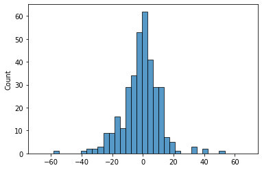

# Merit Order Effect Quantification


[](https://notebooks.gesis.org/binder/v2/gh/AyrtonB/Merit-Order-Effect/main?filepath=nbs%2Fug-07-moe-quantification.ipynb)

This notebook outlines how the `moepy` library can be used to quantify the merit order effect of intermittent RES on electricity prices. Please note that the fitted model and estimated results are less accurate than those found in the set of development notebooks, as this notebook is for tutorial purposes the ones found here are using less data and smooth over larger time-periods to reduce computation time.

<br>

### Imports

```python
import pandas as pd
import numpy as np

import pickle

import seaborn as sns
import matplotlib.pyplot as plt

from moepy import moe
```

<br>

### Data Loading

We'll first load the data in

```python
df_EI = pd.read_csv('../data/ug/electric_insights.csv')

df_EI['local_datetime'] = pd.to_datetime(df_EI['local_datetime'], utc=True)
df_EI = df_EI.set_index('local_datetime')

df_EI.head()
```


| local_datetime            |   day_ahead_price |   SP |   imbalance_price |   valueSum |   temperature |   TCO2_per_h |   gCO2_per_kWh |   nuclear |   biomass |   coal | ...   |   demand |   pumped_storage |   wind_onshore |   wind_offshore |   belgian |   dutch |   french |   ireland |   northern_ireland |   irish |
|:--------------------------|------------------:|-----:|------------------:|-----------:|--------------:|-------------:|---------------:|----------:|----------:|-------:|:------|---------:|-----------------:|---------------:|----------------:|----------:|--------:|---------:|----------:|-------------------:|--------:|
| 2010-01-01 00:00:00+00:00 |             32.91 |    1 |             55.77 |      55.77 |           1.1 |        16268 |            429 |     7.897 |         0 |  9.902 | ...   |   37.948 |           -0.435 |            nan |             nan |         0 |       0 |    1.963 |         0 |                  0 |  -0.234 |
| 2010-01-01 00:30:00+00:00 |             33.25 |    2 |             59.89 |      59.89 |           1.1 |        16432 |            430 |     7.897 |         0 | 10.074 | ...   |   38.227 |           -0.348 |            nan |             nan |         0 |       0 |    1.974 |         0 |                  0 |  -0.236 |
| 2010-01-01 01:00:00+00:00 |             32.07 |    3 |             53.15 |      53.15 |           1.1 |        16318 |            431 |     7.893 |         0 | 10.049 | ...   |   37.898 |           -0.424 |            nan |             nan |         0 |       0 |    1.983 |         0 |                  0 |  -0.236 |
| 2010-01-01 01:30:00+00:00 |             31.99 |    4 |             38.48 |      38.48 |           1.1 |        15768 |            427 |     7.896 |         0 |  9.673 | ...   |   36.918 |           -0.575 |            nan |             nan |         0 |       0 |    1.983 |         0 |                  0 |  -0.236 |
| 2010-01-01 02:00:00+00:00 |             31.47 |    5 |             37.7  |      37.7  |           1.1 |        15250 |            424 |     7.9   |         0 |  9.37  | ...   |   35.961 |           -0.643 |            nan |             nan |         0 |       0 |    1.983 |         0 |                  0 |  -0.236 |</div>


<br>

### Generating Predictions

We'll use a helper function to both load in our model and make a prediction in a single step

```python
model_fp = '../data/ug/GB_detailed_example_model_p50.pkl'
dt_pred = pd.date_range('2020-01-01', '2021-01-01').tz_localize('Europe/London')

df_pred = moe.construct_df_pred(model_fp, dt_pred=dt_pred)

df_pred.head()
```


|   Unnamed: 0 |   2020-01-01 00:00:00+00:00 |   2020-01-02 00:00:00+00:00 |   2020-01-03 00:00:00+00:00 |   2020-01-04 00:00:00+00:00 |   2020-01-05 00:00:00+00:00 |   2020-01-06 00:00:00+00:00 |   2020-01-07 00:00:00+00:00 |   2020-01-08 00:00:00+00:00 |   2020-01-09 00:00:00+00:00 |   2020-01-10 00:00:00+00:00 | ...   |   2020-12-23 00:00:00+00:00 |   2020-12-24 00:00:00+00:00 |   2020-12-25 00:00:00+00:00 |   2020-12-26 00:00:00+00:00 |   2020-12-27 00:00:00+00:00 |   2020-12-28 00:00:00+00:00 |   2020-12-29 00:00:00+00:00 |   2020-12-30 00:00:00+00:00 |   2020-12-31 00:00:00+00:00 |   2021-01-01 00:00:00+00:00 |
|-------------:|----------------------------:|----------------------------:|----------------------------:|----------------------------:|----------------------------:|----------------------------:|----------------------------:|----------------------------:|----------------------------:|----------------------------:|:------|----------------------------:|----------------------------:|----------------------------:|----------------------------:|----------------------------:|----------------------------:|----------------------------:|----------------------------:|----------------------------:|----------------------------:|
|         -2   |                    -18.5313 |                    -18.5192 |                    -18.5074 |                    -18.4956 |                    -18.484  |                    -18.4725 |                    -18.4612 |                    -18.45   |                    -18.4389 |                    -18.428  | ...   |                    -14.4174 |                    -14.4159 |                    -14.4146 |                    -14.4136 |                    -14.4128 |                    -14.4121 |                    -14.4117 |                    -14.4114 |                    -14.4112 |                    -14.4111 |
|         -1.9 |                    -18.2762 |                    -18.2642 |                    -18.2524 |                    -18.2407 |                    -18.2292 |                    -18.2178 |                    -18.2065 |                    -18.1954 |                    -18.1843 |                    -18.1735 | ...   |                    -14.1843 |                    -14.1828 |                    -14.1816 |                    -14.1805 |                    -14.1797 |                    -14.1791 |                    -14.1786 |                    -14.1783 |                    -14.1781 |                    -14.178  |
|         -1.8 |                    -18.0218 |                    -18.0099 |                    -17.9982 |                    -17.9865 |                    -17.9751 |                    -17.9637 |                    -17.9525 |                    -17.9414 |                    -17.9304 |                    -17.9196 | ...   |                    -13.9519 |                    -13.9504 |                    -13.9491 |                    -13.9481 |                    -13.9472 |                    -13.9466 |                    -13.9462 |                    -13.9458 |                    -13.9457 |                    -13.9456 |
|         -1.7 |                    -17.7681 |                    -17.7563 |                    -17.7446 |                    -17.733  |                    -17.7216 |                    -17.7103 |                    -17.6991 |                    -17.6881 |                    -17.6772 |                    -17.6665 | ...   |                    -13.72   |                    -13.7185 |                    -13.7172 |                    -13.7162 |                    -13.7154 |                    -13.7148 |                    -13.7143 |                    -13.714  |                    -13.7138 |                    -13.7137 |
|         -1.6 |                    -17.5151 |                    -17.5033 |                    -17.4917 |                    -17.4802 |                    -17.4688 |                    -17.4576 |                    -17.4465 |                    -17.4355 |                    -17.4247 |                    -17.414  | ...   |                    -13.4887 |                    -13.4872 |                    -13.4859 |                    -13.4849 |                    -13.4841 |                    -13.4835 |                    -13.483  |                    -13.4827 |                    -13.4825 |                    -13.4824 |</div>


<br>

We can now use `moe.construct_pred_ts` to generate a prediction time-series from our surface estimation and the observed dispatchable generation

```python
s_dispatchable = (df_EI_model['demand'] - df_EI_model[['solar', 'wind']].sum(axis=1)).dropna().loc[:df_pred.columns[-2]+pd.Timedelta(hours=23, minutes=30)]

s_pred_ts = moe.construct_pred_ts(s_dispatchable['2020'], df_pred)

s_pred_ts.head()
```


<div><span class="Text-label" style="display:inline-block; overflow:hidden; white-space:nowrap; text-overflow:ellipsis; min-width:0; max-width:15ex; vertical-align:middle; text-align:right"></span>
<progress style="width:60ex" max="23357" value="23357" class="Progress-main"/></progress>
<span class="Progress-label"><strong>100%</strong></span>
<span class="Iteration-label">20970/23357</span>
<span class="Time-label">[01:14<00:00, 0.00s/it]</span></div>


    local_datetime
    2020-01-01 00:00:00+00:00    32.080126
    2020-01-01 00:30:00+00:00    32.627349
    2020-01-01 01:00:00+00:00    32.296901
    2020-01-01 01:30:00+00:00    31.561614
    2020-01-01 02:00:00+00:00    31.078722
    dtype: float64


<br>

We can visualise the error distribution to see how our model is performing

To reduce this error the resolution of the date-smoothing and LOWESS fit can be increased, this is what was done for the research paper and is shown in the set of development notebooks. Looking at 2020 also increases the error somewhat.

```python
s_price = df_EI['day_ahead_price']

s_err = s_pred_ts - s_price.loc[s_pred_ts.index]
print(s_err.abs().mean())

sns.histplot(s_err)
_ = plt.xlim(-75, 75)
```

    8.897118237665632
    





<br>

### Calculating the MOE

To calculate the MOE we have to generate a counterfactual price, in this case the estimate is of the cost of electricity if RES had not been on the system. Subtracting the simulated price from the counterfactual price results in a time-series of our simulated MOE.

```python
s_demand = df_EI_model.loc[s_dispatchable.index, 'demand']
s_demand_pred_ts = moe.construct_pred_ts(s_demand['2020'], df_pred)

s_MOE = s_demand_pred_ts - s_pred_ts
s_MOE = s_MOE.dropna()

s_MOE.mean() # N.b for the reasons previously mentioned this particular value is inaccurate
```


<div><span class="Text-label" style="display:inline-block; overflow:hidden; white-space:nowrap; text-overflow:ellipsis; min-width:0; max-width:15ex; vertical-align:middle; text-align:right"></span>
<progress style="width:60ex" max="35105" value="35105" class="Progress-main"/></progress>
<span class="Progress-label"><strong>100%</strong></span>
<span class="Iteration-label">17199/35105</span>
<span class="Time-label">[01:39<00:00, 0.00s/it]</span></div>


    11.215738750384316


